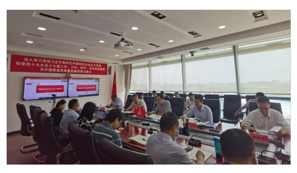

本文档为 2024 CCF BDCI 比赛用语料的一部分。部分文档使用大语言模型改写生成,内容可能与现实情况 不符,可能不具备现实意义,仅允许在本次比赛中使用。 

研究院:创新理论学习机制 提升党建引领作用 发布时间:2021-10-20 发布人:新闻宣传中心 在\#\#\#共产党成立 100 周年的光辉时刻,研究院党委深刻认识到,党的历史是\#\#\#革命、建设和改革的宝贵财富,是引领我 们不断前行的精神灯塔。正如习近平总书记所强调的,\#\#\#共产党正是凭借着持续不断的学习和创新,才能够在风雨兼程中走到 今天,并将继续依靠学习走向更加辉煌的未来。

在这一具有里程碑意义的年份里,研究院党委积极响应党的号召,将学习党史作为加强政治理论学习的重中之重。同时, 正值国企党建工作会召开 5 周年和研究院改革重组 1 周年的双重节点,研究院党委更是将学习党史与总结经验、谋划未来紧密 结合,旨在通过深入学习和反思,为研究院的科技创新和长远发展提供坚强的政治保障和强大的精神动力。

为了提升理论学习的实效性、精准性和积极性,研究院党委进行了一系列创新性实践探索。首先,在提升理论学习实效性 方面,党委注重将党史学习与当前国家发展大局、行业发展趋势以及研究院实际工作紧密结合,通过组织专题学习、研讨会、 交流分享会等形式,引导党员干部深入思考如何将党史学习成果转化为推动研究院高质量发展的实际行动。

其次,在提升理论学习精准性方面,党委根据研究院不同岗位、不同层级的党员干部特点,量身定制学习计划和学习内容。

通过分层次、分类别的学习方式,确保每位党员干部都能够精准掌握党史知识,深刻领悟党的创新理论,并将其内化于心、外 化于行。

最后,在提升理论学习积极性方面,党委积极创新学习形式和学习载体,利用互联网、新媒体等现代技术手段,打造线上 线下相结合的学习平台。通过组织线上直播课、微党课、在线答题等活动,激发党员干部的学习兴趣和参与热情,营造出浓厚 的学习氛围。

通过这一系列的创新性实践探索,研究院党委充分发挥了党建引领作用,有效指导了科技创新工作的开展。党员干部们在 学习党史的过程中,不仅加深了对党的历史、理论和路线方针政策的理解,还更加坚定了理想信念和初心使命。他们纷纷表示, 将把学习成果转化为工作动力和实际行动,为推动研究院科技创新和高质量发展贡献自己的智慧和力量。

展望未来,研究院党委将继续坚持把政治理论学习摆在重要位置,不断创新学习方式和方法,深化党史学习教育成果,以 更加饱满的热情和更加扎实的作风投入到工作中去。同时,研究院党委还将进一步发挥党建引领作用,推动科技创新与党建工 作深度融合,为实现中华民族伟大复兴的\#\#\#梦贡献研究院的智慧和力量。

## 坚持"智库赋能"提升理论学习实效性

在快速变化的时代背景下,理论学习不仅是个人成长的阶梯,更是组织发展的基石。研究院作为集团公司战略决策的智囊 团,其理论学习质量的提升直接关系到集团公司战略方向的准确性和执行力的有效性。因此,"弄懂'为什么学'"成为了提升理论 学习质量的首要目标,这一目标的达成对于将理论学习成果转化为实际指导工作的能力至关重要。

理论学习不仅仅是对知识的掌握,更是对思想深度与广度的拓展。研究院党委通过建立《党委理论学习任务分解台帐》,
紧跟中央和集团公司的最新学习要求,确保学习内容的前沿性和针对性。这一举措不仅要求学习内容的全面覆盖,更强调对核 心精神的深入理解和把握。通过学习习近平总书记的重要讲话精神和中央的重要指示精神,研究院能够准确把握时代脉搏,为 集团公司的决策提供坚实的理论支撑。

理论学习的最终目的是为了更好地指导实践。研究院作为集团公司战略决策的参谋者,其理论学习必须紧密联系实际工作, 确保理论成果的有效转化。通过"院党委出题、各部门揭榜"和"各部门申报、院党委审批"的灵活机制,研究院将理论学习任务细 化为具体的工作项目,明确各部门的职责和任务。这种机制不仅激发了各部门的学习积极性和创造性,还促进了理论学习与工 作实践的深度融合。

为了确保理论学习的实效性,研究院党委提出了"党中央如何要求、各部委如何推动、集团公司如何部署、研究院如何承接" 的解读思路。这一思路明确了理论学习的方向和目标,使得研究院在解读中央和集团公司的重要指示精神时能够有的放矢,精 准对接。通过清晰的解读思路,研究院能够迅速将中央和集团公司的战略意图转化为具体的工作计划和行动方案,为集团公司 的发展提供有力的智力支持。

党委理论学习成果的落地难是许多组织面临的共性问题。研究院党委通过创新学习方式和方法,有效解决了这一问题。一 方面,通过建立任务分解台帐和灵活的揭榜申报机制,将理论学习任务具体化、项目化;另一方面,注重理论学习与实际工作 的结合点,确保学习成果能够真正转化为指导实践的能力。此外,研究院还通过定期评估和反馈机制,对理论学习的成效进行 检验和调整,确保学习成果的持续性和有效性。

综上所述,"为什么学"不仅是提升理论学习质量的目标所在,更是研究院作为集团公司战略决策参谋者的重要使命。通过深 入的理论学习、紧密的实践结合以及清晰的解读思路和创新路径的探索,研究院将不断推动理论学习成果的落地转化,为集团 公司的发展贡献更大的智慧和力量。 

## 坚持"漏斗分级"提升理论学习精准性

在深入探讨如何提升理论学习质量的过程中,"学什么"这一核心问题被研究院党委敏锐地捕捉到,并视为提升学习成效的关 键所在。面对当前理论学习领域普遍存在的"内容多而不精"的困境,研究院党委深刻认识到,这不仅增加了学习者的负担,更导 致了学习压力的层层累积,最终削弱了理论学习的实际效果。

为了从根本上解决这一问题,研究院党委创新性地提出了构建"漏斗型"传达学习分级体系的策略。这一体系的设计灵感源自 于自然界中漏斗的形态,即从上至下逐渐聚焦、精炼的过程,旨在将复杂多样的学习内容通过科学合理的筛选与提炼,转化为 既符合上级精神又贴近基层实际的学习要点。

具体而言,研究院党委首先深入研读并准确理解集团党组的学习要求,确保在宏观层面与集团保持高度一致。随后,在充 分把握集团精神实质的基础上,结合研究院自身的实际情况和发展需求,对学习内容进行第一次"过滤"和"划重点",明确研究院 党委层面的学习重点和方向。这一步骤的关键在于,既要体现集团党组的战略意图,又要突出研究院的特色和重点任务。

接下来,研究院党委进一步将学习要求细化至基层党支部层面。通过深入了解各支部的具体工作情况和党员队伍的实际状 况,研究院党委对学习内容进行了第二次"过滤"和"定制",确保每个支部都能接收到既符合上级要求又贴近自身实际的学习内容。 这一步骤的实施,有效避免了以往"上下一般粗"的传达学习模式,使得学习内容更加精准、更具针对性。

通过"漏斗型"传达学习分级体系的实施,研究院党委不仅解决了学习内容多而不精的问题,还极大地减轻了基层党支部和党 员的学习负担。更重要的是,这一体系促进了学习效果的显著提升。党员们在学习过程中能够更加集中精力、突出重点,从而 更深入地理解和掌握党的理论创新成果和上级的决策部署。同时,这种精准化的学习方式也激发了党员们的学习热情和积极性, 为研究院的各项工作提供了坚实的思想保证和强大的精神动力。

## 坚持"轮值分享"提升理论学习积极性

在新时代的大背景下,面对日新月异的国内外形势和层出不穷的新挑战,理论学习不再仅仅是简单的知识积累,而是成为 推动工作创新、适应时代发展的强大动力。因此,如何高效地学习理论,确保学习质量,成为摆在各级党组织面前的重大课题。

在这一过程中,"怎么学"的问题显得尤为重要,它直接关系到理论学习的成效和深度。传统的理论学习方式往往侧重于单向传授 和被动接受,难以激发学习者的积极性和主动性。面对新时代的新要求,我们必须打破这一固有模式,不断创新理论学习方式, 使学习过程更加生动、有趣、高效。通过引入多样化的学习手段和方法,可以激发学习者的学习兴趣,提高学习效率,从而确 保理论学习取得实效。

在党委层面,我们积极探索并实施了支部轮值分享机制。这一机制的核心在于,根据每期党委中心组学习的主题,由各支 部轮流负责准备学习材料并进行专题分享。具体做法如下:
 主题选定与材料准备:根据党委中心组学习的总体安排,提前确定每期学习的主题。各支部根据主题,自行组织力量收集、
整理学习材料,确保材料的准确性和权威性。

 专题分享与互动讨论:在规定的时间内,由轮值支部选派代表进行专题分享。分享内容应紧密围绕主题,结合实际情况和 具体案例,进行深入浅出的讲解。同时,鼓励与会人员进行互动讨论,提出问题和见解,形成热烈的学习氛围。

 评价打分与反馈改进:分享结束后,全体与会人员通过现场问卷的形式对分享内容进行评价打分。评价指标包括"准确性、
实效性、生动性"等多个方面,以确保评价的全面性和客观性。评价结果将作为评价支部党建工作质量的重要参考,同时 也为今后的改进工作提供有益的依据。

以 9 月 27 日的党委中心组学习为例,无线技术党支部针对"碳达峰、碳中和"这一重要主题进行了专题分享。院党委委员、
各部门(中心)负责人、各党支部书记均参加了此次学习,并通过现场问卷对分享内容进行了全面评价。这种学习方式不仅提 高了学习的针对性和实效性,还增强了各支部之间的交流和合作。

在党支部层面,我们同样注重创新学习方式,强化党员轮值分享机制。结合"三会一课"及主题党日等活动,我们鼓励全体党 员轮流进行领学分享。具体做法如下:
 轮流领学与深度解读:根据活动安排和党员人数,提前制定好轮值表。每位党员在轮到自己领学时,需提前做好准备,确 保分享内容的深度和广度。领学过程中,要注重结合自己的学习和工作实际,进行深入的解读和剖析。

 分享效果评价与激励:分享结束后,支部党员通过打分、讨论等形式对分享效果进行评价。评价结果将作为党员民主评议 等工作的参考依据,同时也可作为表彰先进、激励后进的重要手段。

通过这一机制的实施,我们发现党员的学习积极性得到了显著提高,学习成效也更加明显。大家纷纷表示,这种学习方式 不仅让他们更加深入地理解了理论知识,还增强了他们的责任感和使命感。

确定"怎么学"是提升理论学习质量的重要手段。面对新形势新挑战,我们必须不断创新理论学习方式,打造符合时代要求的 学习机制。通过支部轮值分享机制和党员轮值分享机制的实施,我们不仅激发了学习者的积极性和主动性,还提高了学习的针 对性和实效性。未来,我们将继续深化这一机制的建设和完善工作,为推动理论学习取得更大成效而努力奋斗。

站在新的历史起点上,研究院作为\#\#\#联通集团公司的"新三者"——即科技创新的引领者、产业合作的推动者、数字生态的构建 者,承载着前所未有的使命与责任。作为集团级党建示范区,研究院不仅要在党的理论学习中树立标杆,更要将理论学习成果 转化为推动改革创新的强大动力,以高质量的理论学习引领高质量的发展实践。

研究院将深入学习贯彻习近平新时代\#\#\#特色社会主义思想,特别是关于科技创新、数字经济发展等重要论述,通过定期举 办专题研讨会、读书班、在线学习平台等多种形式,增强学习的系统性和实效性。同时,鼓励党员干部结合工作实际,开展"学 思践悟"活动,将理论学习成果转化为指导实践、推动工作的强大武器。

面对数字化转型的浪潮,研究院将积极汲取国内外先进企业的改革创新经验,结合\#\#\#联通的实际情况,勇于探索、敢于突 破。通过设立创新实验室、孵化器等平台,鼓励科研人员围绕 5G、大数据、云计算、人工智能等前沿技术开展攻关,不断推出 具有自主知识产权的核心技术和产品。同时,加强与高校、科研机构及产业链上下游企业的合作,构建开放共赢的创新生态, 共同推动通信技术的迭代升级和产业升级。

研究院将充分发挥科技创新在企业发展中的核心驱动作用,围绕\#\#\#联通全面数字化转型的战略目标,聚焦关键领域和核心 技术,集中力量攻克一批"卡脖子"难题。通过实施科技兴企战略,不断提升企业的核心竞争力,为\#\#\#联通在数字经济时代抢占 制高点、赢得主动权贡献力量。同时,注重科技成果的转化应用,推动新技术、新产品、新服务快速进入市场,满足人民群众 对美好数字生活的向往。

面对数字化转型过程中可能出现的各种困难和挑战,研究院将始终保持昂扬的斗志和坚定的信心。通过加强团队建设、完 善激励机制、优化资源配置等措施,不断提升科研人员的创新能力和攻坚克难的能力。同时,建立健全风险防控机制,加强对 科研项目的全过程管理和监督,确保科研活动规范有序、高效推进。在攻坚克难的过程中,研究院将始终秉持"咬定青山不放松" 的奋斗精神,不断攀登科技高峰、创造新的辉煌。

在全面数字化转型的征程中,研究院将充分发挥自身优势,为\#\#\#联通贡献"三度三有"力量。即:在科技创新上要有深度、
有广度,不断推动技术突破和产业升级;在产业合作上要有力度、有温度,积极构建开放共赢的产业生态;在数字生态构建上 要有高度、有远见,引领数字经济健康发展。通过"三度三有"的共同努力,研究院将为\#\#\#联通的全面数字化转型提供坚实的支 撑和强大的动力。