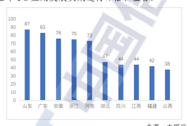
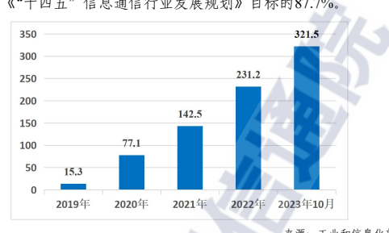
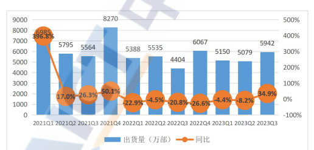
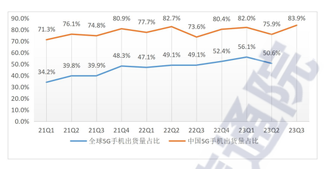
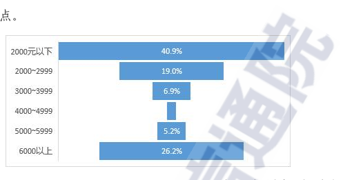
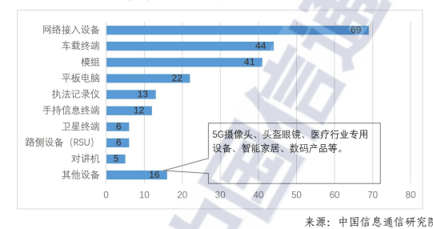
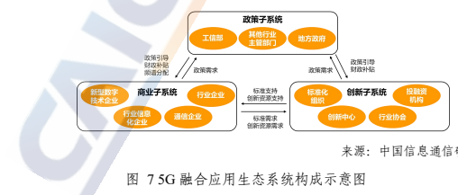
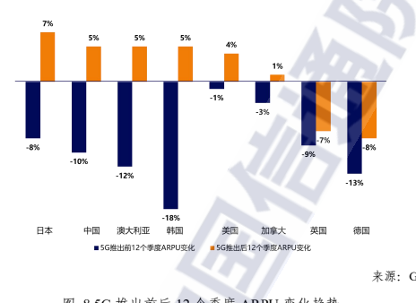
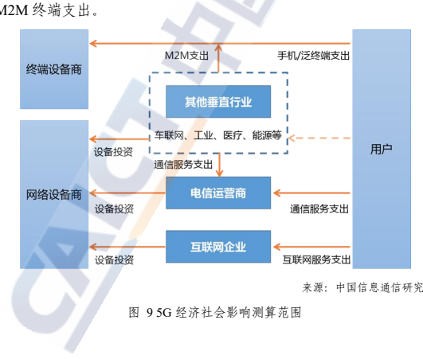

No.202323 中国 5G 发展和经济社会影响 白皮书
(2023 年)
中国信息通信研究院 2023年12月 版权声明 本白皮书版权属于中国信息通信研究院,并受法律保 护。转载、摘编或利用其它方式使用本白皮书文字或者观 点的,应注明"来源:中国信息通信研究院"。违反上述声明 者,本院将追究其相关法律责任。

# 前 言

今年我国经济呈现波浪式发展、曲折式前进特征,外部环境动 荡不安,国内面临有效需求不足、社会预期偏弱、风险隐患较多等 挑战,因此切实增强经济活力,巩固和增强经济回升向好态势是未 来长期工作重点。5G 作为支撑经济社会高质量发展的关键基础设施,
"一业带百业"的重要作用不断彰显,为推动各行各业现代化发展 提供基础支撑作用,是增强经济活力、推动经济实现量质齐升的重 要驱动力。

今年以来我国 5G 在网络建设、用户增长、产业发展、应用创新 等方面取得积极成效,为 5G 释放对经济社会发展的叠加倍增作用提 供坚实支撑。2023 年 1-10 月我国新增 5G 基站 90.3 万个,提前完成 60 万个年新增目标,5G 基站在移动基站总数占比近三成。5G 用户 渗透率、5G 流量占比均超四成,第三季度 5G 手机出货量同比增长 34.9%,推动数字消费潜能充分释放。个人应用创新发展,裸眼 3D、
大模型等提升优化个人用户体验。虚拟电厂、无人机等新兴业态萌 芽发展,对实体经济提质增效的带动作用逐步凸显。行业应用趋向 规模发展态势,加速从单环节向全流程覆盖、从外围环节向核心环 节渗透,彰显赋能赋智作用。

随着 5G 逐步迈入规模发展期,5G 对经济社会高质量发展的带 动效应进一步增强。本报告测算了 2023 年 5G 的经济社会影响,预 计 2023 年 5G 将直接带动经济总产出 1.86 万亿元,直接带动经济增 加值约 5512 亿元,分别比 2022 年增长 29%、41%,间接带动总产 出约 4.24 万亿元,间接带动经济增加值约 1.55 万亿元,分别比 2022 年增长 22%、22%。推动 5G 规模化发展是一项长期性、复杂性的系 统工程,需根据 5G 发展的阶段性特征和内在需求,持续夯实网络基 础能力、增强技术标准创新能力、提升产业生态支撑能力,以扩大 有效益的投资、激发有潜能的消费、加快数实融合为着力点,推动 构建现代化产业体系,为全面建设社会主义现代化国家、增强经济 回升态势提供有力支撑。

2023 年是中国信息通信研究院发布《中国 5G 发展和经济社会 影响白皮书》的第四年。本白皮书以向社会各界展示 5G 商用发展趋 势为核心内容,重点梳理 2023 年 5G 商用的进展、成绩、经济社会 影响,为社会各界深入了解 5G 产业发展提供有价值的参考。白皮书 仍有很多不足之处,望各界批评指正。

|                                        | 目                                                                                                                                                              |
|----------------------------------------|-----------------------------------------------------------------------------------------------------------------------------------------------------------------|
| 一、中国 5G 逐步迈向高质量发展         |                                                                                                                                                                 |
|                                        | (一)政策体系逐步完备                                                                                                                                            |
|                                        | (二)网络建设持续向深远迈进 .                                                                                                                                    |
|                                        | (三)标准研制进入 5G-Advanced 阶段 .                                                                                                                             |
|                                        | (四)手机出货量实现正增长                                                                                                                                        |
|                                        | (五)行业应用生态稳步壮大                                                                                                                                        |
|                                        | (六)融合应用规模发展                                                                                                                                            |
| 二、5G 持续释放对经济社会赋能作用 .    |                                                                                                                                                                 |
|                                        | (一)5G 助力数字化投资稳中提质                                                                                                                                   |
|                                        | (二)5G释放数字消费市场潜能 ...                                                                                                                                  |
|                                        | (三)5G 变革数智化生产新模式 .                                                                                                                                   |
|                                        | (四)5G 激发新兴业态萌芽发展 .                                                                                                                                   |
|                                        | (五)5G 推动社会治理精准化发展 .                                                                                                                                 |
| 三、凝心聚力推动 5G 繁荣发展 .         |                                                                                                                                                                 |
|                                        | (一)提升网络供给能力,夯实数字经济发展底座 .                                                                                                                     |
|                                        | (二)推动技术标准演进,厚植产业创新发展动力 .                                                                                                                     |
|                                        | (三)带动产业生态繁荣,增强产业数字化供给水平                                                                                                                     |
|                                        | (四)加速个人应用创新,驱动数字消费提质升级 .................................................................................................................. 27 |
|                                        | (五)促进应用规模发展,发挥数实融合溢出效应 .                                                                                                                     |
| 附件:5G 对经济社会影响的测算方法说明 . |                                                                                                                                                                 |

# 图 目 桑

| 图 1全国 5G 政策发布数量 top 省份 .              |
|--------------------------------------------------|
| 图 2 我国 5G 基站建设数量(单位:万 )              |
| 图 3 2021Q1-2023Q3 国内 5G 手机出货量            |
| 图 4 2021Q1-2023Q3 全球/国内 5G 手机出货量占比 . |
| 图 5 2023 年 1-10 月国内 5G 手机价格分布         |

图 6 2023 年 1-10 月国内 5G 非手机终端上市新产品分布 图 75G 融合应用生态系统构成示意图 图 85G 推出前后 12 个季度 ARPU 变化趋势 图 95G 经济社会影响测算范围 .

## 一、中国 5G 逐步迈向高质量发展

2023年是5G商用的第五年,也是5G进入规模化发展的关键期。

我国持续加强政策支持力度,激发产业各方发展活力,稳步推进网 络建设、技术标准研制、产业生态发展和融合应用复制推广,充分 发挥 5G"一业带百业"和对经济发展的放大、叠加、倍增作用,培 育壮大经济社会发展新动能。

## (一)政策体系逐步完备

中央政府持续深入推进 5G 应用"扬帆"行动计划,加快 5G 应 用规模化发展。2023 年 2 月,中共中央、国务院印发《数字中国建 设整体布局规划》,规划提出打通数字基础设施大动脉,加快 5G 网 络与千兆光网协同建设,为数字中国建设夯实网络基础。2023 年 4 月,工业和信息化部、文化和旅游部联合发布《关于加强 5G+智慧 旅游协同创新发展的通知》,围绕网络建设、应用创新、产业生态构 建三大领域提出发展目标和九大任务,推动 5G+智慧旅游规模发展。

2023 年 8 月,工信部发布《关于推进 5G 轻量化(RedCap)技术演 进和应用创新发展的通知(征求意见稿)》,推动 5G RedCap 技术演 进、产业研发及产业化,进一步促进 5G 应用规模化发展。

各地积极推动 5G 发展,围绕网络建设、应用创新、产业培育出 台并落实各项政策举措。根据中国信通院统计,截至 2023 年 8 月底, 各省市共出台各类 5G 扶持政策文件 980 个,其中省级 163 个,市级 455 个,县级 362 个。在分布区域方面,中东部省份在 5G 政策发布 数量和政策覆盖率方面较为领先,其中山东、广东、安徽、河南以 及湖北五个省份均实现政策全覆盖,浙江、山西、江西等地政策覆 盖率超过 90%。在政策特点方面,一是跨部门协同联动推进,各地 通信主管部门积极联合地方文旅、能源、医疗等部门协同出台 5G 应 用政策,凝聚行业力量;二是丰富完善财政政策工具,加强资金投 入保障,如天津依托海河产业基金,引导社会资本参与 5G 网络建设、
终端研发和行业融合应用;三是强化政策评估总结,量化考核政策 成效,如上海、重庆构建 5G 应用发展考核标准体系和发展监测评价 体系,对全市 5G 应用发展实效进行评估和监督。

来源:中国信息通信研究院 图 1 全国 5G 政策发布数量 top 省份

## (二)网络建设持续向深远迈进

5G网络建设超额完成年新增目标。我国已完成全国所有地级市、
县城城区的5G网络覆盖,年度新建5G基站数超额完成。根据工信部 数据,截至2023年10月底,已建设开通5G基站累计达到321.5万个, 占我国移动基站总数的28.1%。其中,2023年1-10月我国新增5G基站 达90.3万个,超额完成60万的年新增目标;每万人基站数达22.8个1,

已达到《"十四五"信息通信行业发展规划》目标的87.7%。

来源:工业和信息化部
图 2 我国 5G 基站建设数量(单位:万)
共建共享持续深化。我国5G共建共享基站超150万个2,推动构建 高效绿色、建设集约的低碳通信网络。2023年5月,中国移动、中国 联通、中国电信、中国广电联合宣布在新疆启动全球首个5G异网漫 游试商用,进一步提升我国5G网络共建共享水平,高效推动偏远地 区5G网络覆盖。

以多频组网模式提升网络覆盖广度。中国联通在2022年11月获批 将900MHz频段频谱资源重耕用于5G网络,截至2022年底,已完成17 万3900MHz 5G基站。2023年8月,中国电信获批重耕800MHz频段资 源用于5G网络,积极开展约25万个800MHz 5G基站集采工作4。截至

1 人口数按 141175 万计算 2 https://news.youth.cn/gn/202304/t20230428_14488190.htm,工信部:5G 网络已覆盖全国所有地级市、县城 城区 3 https://www.sohu.com/a/606250739_128075,中国联通:本年度部署 17 万个 900M 低频基站 4 https://www.c114.com.cn/news/117/a1244028.html,中国电信启动 800M 5G 基站集采:预估 25 万站
2023年6月,中国移动和中国广电共完成57.8万700MHz 5G基站建设5, 进一步提升农村及偏远地区网络覆盖。

5G行业虚拟专网形成规模发展态势。5G行业虚拟专网建设数量 稳步提升,截至2023年9月虚拟专网总数达2.6万个,2023年上半年新 增总数超过5000个。同时,5G行业虚拟专网的定制化、模块化成为 主旋律,基站、核心网、边缘计算及网络运维等定制化产品持续涌现, 网络支撑能力进一步提升。电信运营商纷纷发布5G行业虚拟专网的 演进体系,提出场景化的5G行业虚拟专网产品及解决方案,满足千 行百业业务部署的差异化需求。

## (三)标准研制进入 5G-Advanced 阶段

5G-Advanced(5G-A)在 5G 向 6G 演进过程中起到承上启下的作 用,预计包含 R18、R19 和 R20 三个版本。当前 R18 的大部分工作 已经完成,预计将于 2024 年年中完成标准冻结。R18 主要围绕现网 能力升级、增强行业适配能力、新方向探索三方面持续演进。在现 网能力升级方面,为满足宽带实时交互、大上行传输、高频谱效率、
高能耗效率、大覆盖等需求,R18 研究了上行 MIMO 增强、非地面 网络、网络节能、XR 增强等技术,增强网络宽带能力和运营效率。

在增强行业适配能力方面,R18 进一步降低轻量级 UE 复杂度、研究 了侧行链路数据承载能力增强、低功率 UE 唤醒信号和接收机提高 终端能耗效率等技术,满足行业应用发展需求。在新方向探索方面, 聚焦探索与推进空口引入人工智能机制和全双工等技术,初步完成

5 https://www.chinamobileltd.com/sc/ir/sse_filings/sca230811.pdf,《中国移动有限公司 2023 年半年度报告》
了生命周期管理的研究和特征用例的评估。总的来看,5G-A 将为 5G 在个人应用和行业应用的发展定义新目标、提供新能力,释放 5G
对经济社会发展的叠加倍增作用。

## (四)手机出货量实现正增长

我国 5G 手机需求回升,渗透率高于全球平均水平。2023 年我 国经济逐渐呈现企稳向好的发展态势,5G 手机市场需求也在缓慢回 升。根据中国信通院数据,2023 年 1-10 月 5G 手机出货量达 1.88 亿 部,同比增长 8.9%。得益于 5G 网络质量持续优化、个人应用场景 不断丰富,5G 手机渗透率维持较高水平,实现大规模普及。根据中 国信通院数据,2023 年 1-10 月,国内市场 5G 手机出货量占比达 81.9%,较 2022 年提高 3.1 个百分点。根据 Omdia 数据,2023 年上 半年全球 5G 手机出货量占比为 53.4%。

来源:中国信息通信研究院 图 3 2021Q1-2023Q3 国内 5G 手机出货量

来源:中国信息通信研究院、Omdia 图 4 2021Q1-2023Q3 全球/国内 5G 手机出货量占比 6
我国 5G 手机出货规模约占全球市场四成。依托我国较完备的产 业链供应链和大市场优势,国产 5G 手机持续推陈出新、机型不断丰 富,刺激消费者购买热情。根据中国信通院数据,截至 2023 年 10 月,国内 5G 手机机型累计达 895 款,其中 1-10 月新上市 184 款。 根据 Omdia 数据,2023 年上半年,全球 5G 手机出货量 2.856 亿部, 我国厂商市场份额占比达 43.1%。在全球 5G 手机出货量 TOP10 中, 我国厂商占据八席,维沃、OPPO、小米、荣耀位居第三至第六位。

我国 5G 手机产品布局日趋完善,实现不同消费人群的全覆盖。

当前国内在售 5G 手机实现多品牌、全价格段的覆盖,为消费者提供 多样化选择,其中高端(6000 元以上)和中低端价格段(3000 元以 下)手机是市场主流。具体来看,2000 元以下占比为 40.9%,较上 年同期下降 1.9 个百分点;2000-3000 元价位占比 19.0%,较上年同 期下降 5.7 个百分点;3000-6000 元价位的市场份额较小,较上年同 期下降 0.7 个百分点;6000 元以上占比 26.2%,较上年同期提高 9.8

来源:中国信息通信研究院

图 5 2023 年 1-10 月国内 5G 手机价格分布
5G 手机新增异网漫游、卫星通信等功能,持续提升用户体验。

在中国运营商启动全球首个 5G 异网漫游试商用后,制造企业加快 5G 手机升级速度,提供硬件支持能力,小米、OPPO、维沃、摩托 罗拉等厂商均推出支持异网漫游功能的 5G 手机。截至 2023 年 10 月,国产 5G 手机中已有 73 款支持异网漫游功能。卫星通信因款式 少、价格高等原因难以进入大众消费市场,今年华为推出了首款集 成卫星电话功能的手机,拉开手机搭载卫星电话功能和卫星互联网 功能的序幕。

## (五)行业应用生态稳步壮大

1.行业终端逐步趋向专业化、精细化发展 5G 行业终端差异化供给能力持续提升。随着 5G 与各行业融合 程度不断加深,应用场景不断拓展,催生多样化、定制化的行业终 端以满足行业个性化需求。5G 行业终端类型持续扩大,根据中国信 通院数据,截至 2023 年 10 月,国内 5G 非手机终端累计上市产品 608 款,其中 1-10 月新上市产品 234 款,同比增长 59.2%,超过同 期 5G 手机新机型数量。新上市终端除无线 CPE、网关、平板电脑、
车载终端等传统类型外,5G 摄像头、直播平板、医疗专用终端、5G
音视频执法记录仪等创新产品不断涌现。

来源:中国信息通信研究院
图 6 2023 年 1-10 月国内 5G 非手机终端上市新产品分布
5G 模组产业化进程加速。根据中国信通院数据,截至 2023 年 10 月,国内 5G 模组累计上市产品达 134 款,其中 1-10 月新上市产 品 41 款,已在工业、交通、医疗、金融、教育等领域实现落地应用。 应用逐步实现规模化发展和 5G 行业模组分级分类策略推动 5G 通用 模组价格持续降低至 300 元左右,相比刚上市降价幅度达 70%,极 大促进 5G 行业终端规模化部署。

5G RedCap 产业生态初具雏形,具备商用条件。2022 年底,我 国 IMT-2020(5G)推进组完成 5G RedCap 各项关键技术试验,华为、
中兴、中信科移动、紫光展锐、翱捷科技等制造企业相继完成关键 技术功能和外场性能验证,奠定坚实的技术基础。2023 年以来,产 业各方积极推动 5G RedCap 芯片、模组、终端上市,并联合行业企 业围绕电力、工业、视频监控等重点行业完成 5G RedCap 试商用现 场验证。当前,中国移动、中国联通、鼎桥、移远通信、广和通、
美格智能、利尔达等企业相继发布 5G RedCap 模组,为 5G RedCap 在行业的推广奠定了基础。

2.行业平台高效支撑融合应用规模化发展 5G 行业应用运营管理和行业业务平台"双轮驱动"。在运营管 理平台方面,目前运营商推出 5G 网络及终端连接管理平台,使行业 用户能够感知、管理 5G 行业应用网络。同时,电网、石化等行业用 户联合运营商实现行业入驻部署 5G 行业应用管理平台,按照统一格 式收集运营商 5G 网络、终端的数据,实现自主管理。在行业业务平 台方面,运营商、互联网企业面向城市、园区等多用户并发的 5G 行 业应用场景,构建统一的能力底座,供不同主体调用能力,建成通 用行业业务平台,如中国移动的 OneCity、OnePark 等平台,面向智 慧城市、智慧园区提供基础能力底座。此外,ICT 企业、行业企业 或集成商面向钢铁、石化、有色等不同行业特色化场景,充分整合 行业的自有模型和算法,构建实现业务融合的特色平台,供特定用 户使用。

## (六)融合应用规模发展

1.5G 个人应用市场平稳向好 我国 5G 用户渗透率超四成,夯实个人应用市场底座。根据工信 部数据,截至 2023 年 10 月底,我国 5G 移动电话用户达 7.54 亿户, 较 2022 年末净增 1.94 亿户,5G 用户渗透率达 43.7%,较 2022 年末 提升 10.4 个百分点。根据 GSMA 数据,截至 2023 年 9 月底,全球 5G 用户达到 14.3 亿户,在移动用户中渗透率为 16.6%。

技术创新驱动 5G 服务能力提升,持续丰富个人创新应用。产业 各方围绕 5G VoNR (Voice over NR)、超高清视频通话、XR、AI、裸 眼 3D 等领域持续深耕 5G 个人应用,不断提升用户体验。5G 新通 话带来个人应用全新发展机遇。5G 新通话依托 AI、XR、数字人等 新技术,从可视化和实时交互两方面逐步提升用户体验。一是基于 VoNR 终端提供的视频通话能力,通过网络增强音视频 AI 智能处理 能力,提升新通话的可视化服务体验。二是基于原生 IMS(IP
Multimedia Subsystem)数据通道能力全面升级终端和网络,支持云 端到用户、用户到用户间各类型数据实时交互能力,在音视频通话 基础上打造全新交互服务体验。裸眼 3D 带来沉浸式、立体式用户体 验。裸眼 3D 可帮助用户在不借助外置设备的情况下,体会 3D 观看 的鲜活立体视觉效果。依托 5G 网络的高速率、低时延特性,可在手 机、平板等移动终端设备上实现裸眼 3D 的显示技术,充分发挥裸眼 3D 感知性、沉浸感、交互性等特点,为用户带来无穿戴、立体式、
可互动的全新体验。

2.5G 行业应用渗透率稳步提升 5G 持续扩大与各行业领域融合广度。根据工信部数据,5G 行 业应用已融入97个国民经济大类中的 67个,应用案例数超 9.4万个, 在工业、采矿、电力、港口、医疗等行业实现规模复制,在水利、
建筑、纺织等领域积极开展 5G 应用探索,"5G+工业互联网"在建 项目超 7000 个,中国移动 5G 智慧工厂项目超 4000 个,中国联通 5G 智慧工厂项目达 3500 个6,有力推动新型工业化高质量发展。"绽 放杯"5G 应用征集大赛数据显示,参赛项目已从第一届的 300 余个 增长到近 4.6 万个。

5G 推动行业应用走深向实。一是 5G 在港口、油气、医疗、车 联网、农业、文旅等重点行业渗透率不断提升,其中港口、油气等 行业集中度较高的行业渗透率已超过百分之五十,有力推动行业数 字化转型升级。二是 5G 逐步深入重点行业核心环节。在工业领域, 5G 应用从局部试点辅助生产逐渐进入全厂区覆盖、深入生产核心环 节的阶段,如实现 PLC 南向控制、推出智能堆叠码垛机器人等。在 港口行业,5G 技术升级大型工程机械装备,实现封闭场景下机械装 备的无人化操作。在电力行业,涌现配电自动化、精确负荷控制等 应用。

行业产品服务逐步向数字化转型产品升级演进。5G 产品服务的 创新与行业应用场景紧密结合,运营商先满足细分市场的定制需求, 再提炼出通用需求方向设计产品服务,其产品服务也逐渐由传统网 络产品向数字化转型产品升级拓展与演进。目前电信运营商的行业 产品服务,按其通用化及数字化程度大致可分为专网产品、数字化

6 http://www.news.cn/fortune/2023-11/02/c_1129953806.htm,我国迎来 5G 规模化应用关键期
集成服务和行业数字化产品三大类。其中,专网产品可根据企业规 模和时延带宽保障等 SLA 要求,提供差异化、定制化的专网服务。

数字化集成服务根据企业的个性化定制化需求,围绕企业业务战略 和数字化转型战略,提供包含顶层设计、咨询规划、ICT 基础设施 建设、数字化管理及应用等一系列数字化转型解决方案。行业数字 化产品瞄准行业通用发展需要,为行业某一类或某几类应用场景提 供较为通用的数字化解决方案,实现业务快速上线部署。

行业应用生态逐渐繁荣,支撑产业稳健发展。一是信息通信企 业、垂直行业企业、行业协会、标准化组织、投融资机构等主体积 极参与 5G 融合应用生态系统建设。根据"绽放杯"5G 应用征集大 赛的公开数据,行业企业牵头参赛的项目比例已从第一届的不到 1%
增长至第五届的近 10%,行业解决方案商牵头参赛的项目占比约为 25%。二是依托行业协会积极推进企业交流、加快产业融合、激发 创新合力。工业和信息化部指导成立的 5G 应用产业方阵,通过举办
"绽放杯"5G 应用征集大赛、设立 5G 创新中心、促进融合应用标 准落地实施等推动 5G 与各行业融合。

来源:中国信息通信研究院

## 二、5G 持续释放对经济社会赋能作用

5G 作为支撑经济社会数字化、网络化、智能化转型的关键新型 基础设施,是国民经济的基础性、先导性和引领性产业,为推进产 业结构优化升级、构建双循环新发展格局、助力经济高质量发展注 入强劲动能。2023 年 5G 迈入规模化发展的关键期,对经济社会发 展的赋能作用进一步增强。预计 2023 年 5G 将直接带动经济总产出 1.86 万亿元7,直接带动经济增加值约 5512 亿元,分别比 2022 年增 长 29%、41%8;间接带动总产出约 4.24 万亿元,间接带动经济增加 值约 1.55 万亿元,分别比 2022 年增长 22%、22%9。其中,5G 流量 消费快速提升、5G 手机销售额回暖、以及垂直行业应用的迅速增长, 带动直接经济产出和经济增加值实现快速上涨,极大拓展移动通信 市场的发展空间。

## (一)5G 助力数字化投资稳中提质

5G 激发长期、大规模的投资需求,稳定投资水平。一是撬动基 础电信企业对 5G 网络的直接投资。面对日益增长的个人用户规模和 流量消费需求,基础电信企业对 5G 网络及相关配套设施投资水平保 持基本平稳。根据基础电信企业公开财报显示,中国移动预计 2023 年对 5G 网络资本开支达 830 亿元,中国电信预计 2023 年移动网络

7 具体测算方法见附件。

8 《中国 5G 发展和社会经济影响白皮书(2022)》依据发布时对全年数据的保守估计,对 2022 年 5G 带动 的经济总产出和经济增加值进行了估测。本白皮书在测算 2023 年 5G 带动的经济总产出和经济增加值的增 长率时,依据 2022 年的全年数据对其进行了重新核算,重新核算的数据比《中国 5G 发展和社会经济影响 白皮书(2022)》略小,因此增长率核算结果偏大一些。

9 间接带动经济总产出和经济增加值的增长率测算方法同上。
投资为 315 亿元。二是带动各行业企业对数字化转型的投资。5G、
云计算、人工智能、大数据等数字技术加速融入经济社会全领域, 带动数字经济蓬勃发展,各行业抢抓数字化转型的发展机遇,不断 加大在数字化技术、产品和服务等方面投资,数字化逐渐成为基础 电信企业收入重点方向。根据中国移动半年报数据,截至 2023 年 6 月,中国移动 5G 行业应用案例签约数累计超 2.5 万个,带动 DICT
10项目签约金额达 209 亿元,同比增长 28%。根据中国联通半年报数 据,截至 2023 年 6 月,中国联通 5G 行业应用累计项目数超 2 万个, 签约金额达 62 亿元。根据中国电信半年报数据,截至 2023 年 6 月, 中国电信 5G 行业应用案例新签约数约 6 千个,同比增长近 80%, 累计超 2 万个。

## (二)5G 释放数字消费市场潜能

5G 激发信息消费潜能持续扩大。一是 5G 刺激移动流量消费增 长。根据工信部数据,2023 年 1-10 月移动互联网累计流量达 2456 亿 GB,同比增长 14.8%;其中,5G 流量占比已达 45%,预计年底 将近 50%。1-10 月,三家基础电信企业完成移动数据流量业务收入 5429 亿元,同比增长 0.5%,在电信业务收入中占比为 38.3%,拉动 电信业务收入增长 0.2 个百分点,稳住行业营收基本盘。同时,5G
对移动 ARPU(每用户平均收入)产生积极影响,根据 GSMA 数据, 在 5G 推出之前,我国移动 ARPU 在 12 个季度内下降了 10%,5G
推出后,我国移动 ARPU 发展显著逆转,在 12 个季度内增长 5%。

10 DICT 是指 DT(Data Technology)与 IT、CT 融合。
二是 5G 手机终端消费增速由负转正。根据中国信通院统计数据, 2023 年第三季度国内市场 5G 手机出货量同比增长 34.9%。由于 5G
手机高端机型畅销,预计今年将带动终端消费收入增长超 30%。

来源:GSMA
图 8 5G 推出前后 12 个季度 ARPU 变化趋势
5G 促进新型消费类应用和产业成长,培育未来增长点。随着 5G
网络热点区域覆盖能力逐步提升,智能终端算力持续提升,个人创 新应用层出不穷,其中,裸眼 3D 为用户提供无穿戴的立体式、沉浸 式交互体验,当前裸眼 3D 核心技术已基本成熟,裸眼 3D 笔记本、 显示器、平板等产品相继发布,裸眼 3D 有望成为推动 5G 个人消费 类应用蓬勃发展的驱动力之一。大模型能力嵌入 5G 手机将带来全新 用户体验,制造企业积极推动在 5G 手机上搭载人工智能大模型,为 用户提供智能化、个性化服务。2023 年维沃发布了搭载蓝心大模型 的 vivo X100,成为行业首批百亿大模型在终端调通的手机。联发科 发布一款天玑 9300 旗舰 5G 生成式 AI 移动芯片,支持终端运行 10 亿、70 亿、130 亿、最高可达 330 亿参数的 AI 大语言模型。

## (三)5G 变革数智化生产新模式

以 5G 为代表的新一代信息技术加速融入生产各环节,推动生产 设备广泛连接、生产流程优化重塑、生产管理高效协同,大大激发 数字化生产潜力,打破传统生产模式,提高资源配置效率和生产质 量。

5G 支撑制造业高端化、智能化转型升级。一是依托 5G 网络大 带宽、低时延、高可靠特性,与人工智能、云计算、大数据等数字 技术在视觉检测、远程协作、智能巡检、远程运维等应用场景深入 融合,助力制造业企业提质增效。如 5G+视觉检测提升质量检查和 缺陷识别的效率、准确率及检测精度,并结合人工智能算法和采集 数据不断提升模型的鲁棒性,提高检测作业标准化水平。5G+远程 协作可基于 AR 眼镜实现跨地域、实景式交互,专家可通过现场实 时画面远程指导现场人员进行设备的安装、检查、诊断和维修工作, 有效提高设备维修和辅助装配的工作效率。目前这些应用已在制造 企业形成规模化发展态势,产业各方积极推动相关技术产品、解决 方案标准化、规模化推广。二是通过 5G 网络对生产要素进行广泛连 接,对生产数据进行全面采集,打破信息交互壁垒,由单一管控转 向生产线和供应链的协同制造,充分发挥数据要素价值,构建数据 驱动的新型生产范式,实现生产柔性化、智能化升级。如 5G 工厂依 托 5G 网络推动企业办公、生产管理、监控预警、工业控制等网络互 通,实现 IT 和 OT 深度融合,激活各环节、各设备的生产数据潜力, 驱动生产制造流程持续改进和提升,为企业精细化管理、精准化决 策提供支持。目前 5G 全连接工厂在汽车、家电、装备制造、电子等 行业已取得积极进展,随着未来形成一批成效显著、易规模复制的 示范项目,将会推动 5G 全连接工厂释放更大经济价值。

5G 带动能源生产模式创新,推动能源行业高质量发展。一是通 过对开采设备进行智能化改造,利用 5G 网络的大带宽和低时延能力 实现对开采设备的远程控制、协同作业等,提升能源生产效率和质 量,降低作业劳动强度,提升作业安全水平。如在自然条件恶劣的 煤矿采掘面部署 5G 网络,对掘进机、采煤机、牙轮钻机等设备进行 实时监测和远程控制,实时传输传感数据、视频信息和参数控制信 号,实现采掘面的无人或少人作业,在极端天气下可进行不间断作 业,有效提升煤矿生产效率,降低作业人员劳动强度,避免高噪音 和煤尘对作业人员伤害。同时根据监测设备的工作状态、分析运行 数据,优化设备的运行模式和工作参数,降低设备能源损耗、提高 运行效率。二是通过将巡检机器人、无人机等移动化智能化安防设 备接入 5G 网络,代替巡检人员巡逻值守,将回传的声音、图片、视 频等信息传输至巡检系统进行智能识别和分析,有效提升巡检效率 和准确率,降低巡检人员安全风险和人力成本。如传统电力巡检主 要依靠人力监测,效率低、周期长且作业安全风险高,利用 5G+无 人机、5G+机器人可实现电力巡检少人化、无人化和智能化,在巡 检过程中对设备状态、环境安全、人员行为进行实时监测和预警, 将"事后"追踪转变为"事前"预警和"事中"告警,提高巡检效 率和灵活性,降低人工误差和事故风险。

5G 创新仓储运输的生产经营模式,提升自动化、智能化水平。

一是 5G 为港口的垂直运输环节、水平运输环节和集装箱理货环节提 供优质的无线网络连接能力,实现港口的全面感知和广泛互联,结 合人工智能、大数据、物联网、云计算等数字技术赋能智慧港口建 设,提高港口安全水平和运营效率,创新港口生产运营模式。如在 垂直运输环节,利用 5G 网络实现岸桥吊、龙门吊等吊车设备的远程 控制,作业人员可在中控室远程控制多台吊车吊具完成精准移动和 集装箱灵活抓举等操作,提升货物运转效率、改善作业环境,同时 无线连接也方便吊车机动灵活进行转场作业。在水平运输环节,5G
助力无人集卡高效完成港口的无人化水平移箱作业,实现集卡自主 避障、精准停靠、动态路径规划等功能,提升集卡作业效率和安全 水平。二是 5G 赋能智慧仓储,依托 5G 网络实现对货物、设备、人 员的全流程追踪、定位、信息采集和管理,实现仓储环境向全面数 据化、可视化、智能化升级,提升货物入库、拣选、盘点、搬运、
分拣等环节自动化、柔性化水平,提高物流生产运营效率。如 5G+
码垛机器人可替代作业人员精准识别不同尺寸、不同种类的货箱并 完成自动取、放、码垛等工作,充分利用垛位提高储存密度,优化 仓库空间利用率,避免人工疲劳、误操作等因素影响,大幅提升生 产效率和准确率,降低人工成本。

## (四)5G 激发新兴业态萌芽发展

随着 5G 不断拓展与实体经济融合深度和广度,驱动传统产业转 型升级,辐射带动相关行业融合发展,催生新产业新业态新模式, 将开拓广阔发展前景、释放巨大经济价值。

5G 直播赋能千行百业释放价值新空间。5G 网络的高速率、大 带宽、低时延特性为高清直播业务提供有力支撑和保障,打破地域 和时间限制,为用户提供画面清晰、不间断、无卡顿的实时视听体 验,创新传统媒体传播手段,提升媒体传播的实时性和互动性,推 动 5G 直播的新型业务深度赋能文旅、商贸、体育等行业,催生"直 播+"经济新模式,释放全新价值空间。近年来,随着 5G 网络覆盖 范围逐渐扩大、网络能力不断提升,5G 直播在文旅行业的应用逐渐 扩散,创新文化和旅游产品的表达形式、展现内容和营销手段,构 建"人、货、景"一体化、沉浸式的直播新平台和产业新生态,为 文旅产业全面复苏带来全新发展机遇。如 5G 慢直播逐渐兴起,新疆 伊犁的巍巍雪山、贵州丹寨的云海杜鹃、塔克拉玛干沙漠的长河落 日在慢直播的镜头下通达世界各个角落,依托 5G 大上行速率、
AR/VR、4K/8K 高清视频等为游客提供足不出户却身临其境的沉浸 式、多视角游览体验,全面提升游客参与感、交互感和同场感,5G
慢直播以全新的媒介形式为游客提供千人千面的游览体验。

5G 拓展无人机产业发展新空间。无人机是推动低空经济发展的 重要力量,以低空空域为依托,以低空飞行活动为牵引,可以辐射 带动相关行业融合发展,催生新场景、新模式、新服务和新业态, 蕴含广阔的发展前景和巨大的经济价值。5G 网络可以帮助无人机实 现网络连接,突破传统通信距离限制,同时结合北斗高精度定位和 通感一体化技术为无人机设备提供精确定位、实时监测、航线规划 记录等服务,实现对无人机设备的数字化管理运营,推动在航拍、 巡检、勘探、配送等多个领域的创新应用,促进空域资源的高效利 用。如 5G+无人机已在深圳、上海、南京、杭州等城市开展低空配 送业务,配送品类包括餐饮、药品、水果生鲜、数码产品等,在部 分商圈已实现多条航线的常态化运营,实现高效稳定、绿色低碳配 送,有效补充城市即时物流运输运力,拓展数智化消费场景。未来 随着政策环境和技术演进不断完善,5G+无人机将加速向应急保障、
工业、交通、城市管理等更广泛领域拓展,充分释放空地一体的立 体化空间潜力,助力低空经济高质量发展。

虚拟电厂提升电力系统稳定性和灵活性,助力电力产业智能化 转型发展。虚拟电厂基于 5G 网络大带宽、低时延特性和网络切片、
MEC 等技术,通过搭建"云-边-端"一体化架构整合协同电力系统 内的分布式资源,实现海量数据的实时感知和可控负荷的精准调控。

在社会经济高速增长、极端天气频次增多的局面下,社会用电负荷 持续攀升,电力供应愈发紧张,迫切需要整合分布式电力资源、挖 掘需求侧潜力。虚拟电厂通过调动用电企业参与电力市场和电网运 行的日常管理,对各企业分散的电力资源进行集中管理和协同调度, 避免对电力基础设施的额外投资,维持电力供需平衡,实现电力系 统运行的灵活性、可靠性、经济性大幅提升,保障电力能源的绿色 高效供应。除运营商和电网公司外,虚拟电厂模式创新性的引入第 三个参与主体聚合商,作为主要电力需求方的聚合商具备感知、采 集、上报和分析用电设备运行数据的能力,可在用电高峰时段响应 电网公司调配进行"削峰填谷",形成多方参与、合作共赢的发展模 式,提升电网整体运行效率和经济效益。

## (五)5G 推动社会治理精准化发展

随着小康社会全面建成,人民群众对优质公共服务、社会公平 和自身全面发展等方面的需求进一步提升。5G 构筑了人、物、环境 以及社会之间的交互通道,与人民群众的幸福感和获得感紧密相连, 助力社会生活更加智能、便捷、普惠,切实满足人们对美好生活的 高质量需求。

1.5G 提升社会治安治理效能 5G 助力打造广覆盖、全时域、快速响应的社会治理综合防控体 系。一是整合应用资源,构筑资源共享的城市治安管理新局面。5G
促进整合城管协同、社会治理等各级应用平台的资源数据,促进城 市运行的精准感知、突发事故的快速处理、应急管理的统一指挥等 问题的高效协同,对于异常情况诸如打架斗殴、人群聚集等情况进 行不间断的监控和预警,全面提升城市综合治理能力,保障城市安 全。二是增强交通执法能力,提升技术融合的道路交通管理新能力。

一方面,5G 通过赋能道路感知设备的监控能力,结合现代传感器、
AI 算法、边缘计算等技术,实现了多路数据的拟合处理,提高了非 现场交通管理水平,增强了道路交通安全与车辆通行效率。另一方 面,在高速公路场景下,5G 网络能够快速准确地传输大量的数据, 及时将路况信息、视频监控信息等回传至高速公路监控系统,可增 强管理部门及时了解路况,对交通事故开展早期预警和紧急救援, 并对交通违法行为进行监测和干预。

2.5G 加强自然灾害应急能力现代化水平 5G 助力构建完备的自然灾害应急管理体系。在极端降水及洪涝 灾害等条件下,存在隐患点位发现不及时、隐患区域存在监测盲区 等问题,依托 5G、无人机、高清摄像头等可及时掌控灾情风险变化, 开展监测预警与救援救助行动。一是增强自然灾害的监测预警能力, 5G 网络支持大规模感知设备进行实时的图片和视频数据传输,对隐 患点位进行全天候监测,收集汛涝相关的水情、气象、视频等数据 信息进行智能分析与科学研判,及时掌握汛涝实时态势与未来的变 化趋势,为预警评估、预案实施和救灾救援提供有力支撑。二是 5G
网络保障应急救援指挥前后方高效联动,增强无人机等探查设备的 视频传输能力,并结合 AI 图像分析等技术,为灾害现场开展态势感 知、损失评估以及人员搜救等活动提供实时依据,提高应急指挥救 援能力和效率。三是 5G 已成为构建应急通信网络的重要载体,综合 运用 5G 无线通信、卫星通信、窄带集群等技术,可以快速构建应急 通信网络,解决交通中断、通讯中断、电源中断情况下的重特大灾 害应急通信需求。

3.5G 助力打造生态环境保护新模式 5G 助力持续完善科学精准的自然生态监管体系。一是依托 5G
网络的实时高效连接能力,促进构建科学规范的自然环境监测和治 理体系。在 5G 网络的支持下,利用物联网、人工智能、大数据等技 术,可以实现将微型空气监测站、高清视频监控设备、无人机监测 等监测数据相结合,搭建集监测、监管、统计、分析与研判于一体 的环境监测监管体系,可以实现"远距离、大范围、全方位"的实 时高清动态监测,有效应对环境的污染定位和溯源分析,持续提升 科学应对林火监测、生态监控与管护、生态多样性等的效能,为推 动自然环境质量持续向好、抵御灾害风险能力持续提升提供坚实基 础。二是依托 5G 网络大带宽、低时延特性,通过视频直播方式开展 自然生态区的动植物科普宣传活动,提升群众对自然生态区的资源 状况、动植物状态、人类活动等的直观了解,增强对濒危动植物受 森林火灾、水质变化、病虫害和生物入侵等的意识和认知,为自然 生态保护奠定坚实的基础。例如在可可西里国家级自然保护区腹地、 国家一级保护动物藏羚羊集中迁徙产仔主要地区的卓乃湖,通过建 设 5G 专网首次实现了 5G 远程实时监控、直播卓乃湖藏羚羊产仔的 盛况,不仅提升生物监控保护能力,还提高群众生态保护意识,促 使科技服务生态文明建设迈上新台阶。

## 4.5G 促进社会公共服务能力建设提质增效

5G 全面赋能医疗健康领域数智化转型升级。一是推动医疗健康 服务便民惠民,5G 在急诊急救、医疗诊断、健康管理等环节开展广 泛应用,推动智慧医疗快速发展。如在健康管理环节,通过 5G+可 穿戴设备实现对患者生命体征和健康状况进行实时、连续、长周期 的监测、分析、管理和预警,催生健康服务新模式,推动健康管理 逐步深入日常生活,促进培养健康的生活方式和行为习惯,提升人 民群众全生命周期的健康水平。二是推动医疗教育资源普惠化、均 等化,通过开展 5G 远程医疗教学应用,促进跨科室、跨院区、跨门 诊的教学协同应用普及,有效提升医务人员的业务能力和工作效能, 助力实现医疗同质化发展。5G 结合 AR/VR 技术为临床医疗教学构 建沉浸式教学环境,医务人员可通过虚拟手术实现对医疗临床操作 过程的具象化操作,实现理论学习和实践教学的有效衔接,提升医 务人员技能培训效率。三是提升医院运营管理及服务能力,推动智 慧医院建设。依托 5G 网络,围绕人员服务、车辆管理、安防管理、
能耗管理等方面开展数字化管理平台建设,实现医疗系统端到端全 方位多维度的数据感知和综合态势分析,促进面向医务人员的"智 慧医疗"、面向患者的"智慧服务"、面向医院管理的"智慧管理" 的高效运转,全面提升管理和服务向便捷化、智能化、高效化发展。

5G 持续拓宽智慧交通应用新场景。一是推动道路交通实现安全 高效运转。通过部署 5G、C-V2X 网络、路侧智能化设备等,实现车
-路(V2I)、车-人(V2P)、车-云(V2N)等的信息交互和共享。一方 面,交管部门可全面掌控道路交通情况并及时采取动态措施,通过 通行诱导、信号灯管控等方式,提升路网运行效率。另一方面,实 现安全预警、超速警告、逆行警告、红灯预警、行人预警等安全手 段在交通参与者中广泛应用,有效降低交通事故发生率,保障行人 及车辆安全。二是促进城市轨道交通智慧运营。以 5G、大数据、云 边协同等技术为基础,通过部署路基设备、车载终端设备等,提供 信号灯信息推送、事件提醒、主动安全预警、轨道周边状况实施获 取等应用场景的信息服务,显著提高地铁运营效率、车站安全保障 水平和乘客服务质量,提供安全、高效的绿色出行方式。

## 三、凝心聚力推动 5G 繁荣发展

今年以来,我国经济社会全面恢复常态化运行,生产生活秩序 加速恢复,产业升级稳步推进,经济总体回升向好态势明显。同时 也应看到外部发展环境依旧面临严峻挑战,全球经济复苏乏力、通 胀水平高企、主要经济体货币政策紧缩外溢效应突出,不稳定不确 定因素显著增多。5G 与人工智能、云计算、大数据等技术结合,构 建经济社会快速可靠流通的信息"大动脉",释放数字技术对经济发 展的放大、叠加、倍增作用,推动经济实现质的有效提升和量的合 理增长。当前我国 5G 已进入规模化发展的关键期,正由技术驱动向 多技术融合创新转变,由政策扶持向市场牵引转变,由供给方创造 需求向供需高效联动转变。未来建议坚持市场导向,深刻认识和把 握产业发展的阶段性特征,凝聚产业合力,持续提升网络供给能力、
引导技术标准创新演进、带动产业生态繁荣发展、推动融合应用规 模发展,为助力新型工业化发展、构建现代化产业体系提供有力支 撑。

## (一)提升网络供给能力,夯实数字经济发展底座

持续增强网络供给能力,形成"适度超前、以建带用、以用促 建"的良好发展模式,提升数字基础设施能力。一是以优化网络体 验为核心,重点提升住宅小区、旅游景点、博物馆、重点航道、重 点交通枢纽及干线沿线等城市地区重点场景的 5G 网络覆盖深度,利 用低频段频率加快推进农村、海洋及偏远地区的 5G 网络覆盖广度。

二是持续深化网络基础设施共建共享,推动运营商在网络规划、网 络建设、网络优化等方面加强衔接协同,推进通信管孔、杆塔、站 址、机房等通信设施资源与市政、交通、电力、公安等行业基础设 施共建共享和融合发展,促进 5G 网络集约高效、绿色低碳发展。三 是推动 5G 行业虚拟专网高质量发展,构建 5G 行业虚拟专网端到端 网络监测和评估体系,建立各行业网络质量标准,持续提升 5G 行业 虚拟专网的业务承载能力。

(二)推动技术标准演进,厚植产业创新发展动力 随着 5G 发展进入 5G-A 新阶段,应加速推动 R18、R19 国际标 准研制,深化 5G 与行业应用的融合标准研究,推动移动通信产业持 续创新发展和升级。一是推动 R18 标准如期冻结,前瞻布局 R19 立 项研究,围绕无源物联、通感一体、XR 增强、天地一体等新技术方 向积极开展标准化工作,为 5G-A 产业创新引领发展奠定坚实基础。

二是推动 5G 行业应用标准向细分场景发展,随着 5G 不断深入探索 在重点行业的融合应用,高价值及成熟场景逐步显现,加快推动通 用类细分场景端到端 5G 应用解决方案的标准研制,有助于推进 5G
应用规模化发展进程。三是通过推动融合设备标准研制,实现行业 装备的 5G 原生化和既有设备的融合改造,支撑 5G 融合应用深入拓 展。

(三)带动产业生态繁荣,增强产业数字化供给水平 提升技术产品供给能力,加快推动 5G 产业体系逐步成熟,充分 发挥各市场主体创新活力,构建产业链上下游企业、大中小企业协 同发展的繁荣产业生态。一是提升 5G 增强技术产品供给能力,加大 5G 低时延高可靠、时间敏感网络(TSN)、高精度定位等技术产品 研发,加快提升 5G RedCap 产业综合能力,持续增强 5G 中频及毫 米波产业韧性。二是增强产业创新能力,通过龙头企业带动产业链 上下游企业融通发展、协同创新,加快网络切片、边缘计算、芯片 模组、仪器仪表等技术产品成熟,发展壮大面向行业应用的 5G 终端、
网络、平台、系统集成等领域产业集群。三是加快构建行业融合产 品体系,推动 5G 与产业机器人、数控机床、煤矿机等大型行业机械 和控制系统的融合,形成可规模推广的 5G 应用、网络及终端融合产 品体系。四是充分发挥中小企业推动 5G 规模化发展的生力军作用, 推动促进产业链"链主"上下游大企业通过明确创新需求、共享创 新资源、开放应用场景、开展技术咨询等方式,带动中小企业开展 5G 融合应用创新。

## (四)加速个人应用创新,驱动数字消费提质升级

依托 5G 个人应用在网络建设、用户数、流量等方面的规模基础, 充分挖掘个人应用需求,培育孵化大幅提升用户感知体验的"杀手 级"应用。一是深化新型消费终端创新推广,推动裸眼 3D 移动终端 加速产业化和普及,推动 VR/AR 终端设备轻量化、便携化演进,持 续丰富面向个人用户的终端类型和产品形态。二是强化丰富多元的 5G 数字化内容供给,推动生成式人工智能技术和 5G 融合赋能数字 内容产业,提升内容生产效率,促进内容创作、制作、分发、展示 等环节的数字化、智能化演进升级,为用户提供丰富、动态、可交 互的极致体验。三是持续推动 5G 个人应用多元化、规模化发展,加 速 5G 新通话、超高清视频通话、5G 消息等应用创新发展,优化用 户体验,加快推动个人应用实现从量变到质变。

## (五)促进应用规模发展,发挥数实融合溢出效应

坚持需求和问题导向,以各行业实际发展需求为着力点,分业 分类施策,梯度式导入 5G 增量类应用、替换类应用、变革类应用, 实现 5G 应用从局部试点、小规模示范到"从 1 到 N"的规模化发展。 一是双管齐下拓展 5G 融合应用广度和深度,持续拓展制造、采矿、 电力、港口等先导行业融合应用规模,推动 5G 向研发设计、生产制 造、经营管理等核心关键环节拓展,提升赋能价值。二是加快应用 复制推广,充分发挥"绽放杯"5G 应用征集大赛的平台作用,积极 宣传 5G 相关应用典型案例,探索积累并逐步推广一批可复制可推广 的经验模式,助力 5G 应用落地推广。三是推动形成一批成熟的应用 解决方案,发挥行业龙头企业带头作用和行业解决方案商的综合优 势,先行先试,不断迭代,加快形成与 5G 深度融合、有商业价值的 行业应用解决方案。

## 附件:5G 对经济社会影响的测算方法说明

本报告采用国民经济核算的生产法测算 5G 对经济社会影响。

1.测算范围的说明 在测算范围上主要考虑三大部门的收入增长情况。对于电信运营 商,主要考虑其通信服务收入,包括来自用户的通信流量支出和其他 垂直行业的通信服务支出。对于互联网企业,主要考虑其信息服务收 入,包括来自用户在移动视频、网络游戏等典型业务上的支出。对于 设备制造商,考虑两类收入,一类是网络设备收入,主要是来自电信 运营商、互联网企业以及其他垂直行业的网络设备投资,另一类是终 端设备收入,主要是来自用户的手机/泛终端支出和其他垂直行业的

来源:中国信息通信研究院

## 2.测算模型的说明

本报告主要采用两类模型进行测算。在直接经济社会贡献方面, 本报告针对纳入测算范围的三大部门测算各个部门在 2023 年的收入 增长情况,然后根据各部门的增加值率计算其经济贡献。在间接经济 社会贡献方面,本报告基于 2017 年国家投入产出表测算各部门经济 活动的间接拉动系数,结合前述直接经济贡献测算结果,得到 5G 对 经济社会的间接拉动效应。

中国信息通信研究院 地址:北京市海淀区花园北路 52 号 邮编:100191 电话:010-62302051

传真:010-62304980 网址:www.caict.ac.cn