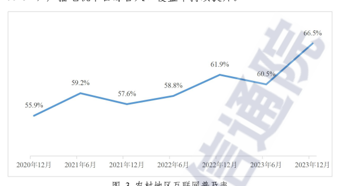

No.202402 数字乡村发展实践白皮书
(2024 年)
中国信息通信研究院 2024年06月 版权声明 本白皮书版权属于中国信息通信研究院,并受法律保护。

转载、摘编或利用其它方式使用本白皮书文字或者观点的, 应注明"来源:中国信息通信研究院"。违反上述声明者,本 院将追究其相关法律责任。

# 前 言

习近平总书记深刻指出,"没有信息化,就没有现代化""没有 农业农村现代化,就没有整个国家现代化"。数字乡村是立足于我国 新时代农业农村发展现状而作出的重要战略部署,是伴随网络化、信 息化和数字化在农业农村经济社会发展中的应用,以及农民现代信息 技能的提高而内生的农业农村现代化发展和转型进程,既是乡村振兴 的战略方向,也是建设数字中国的重要内容。

2018 年中央 1 号文件《中共中央 国务院关于实施乡村振兴战略 的意见》首次明确提出"实施数字乡村战略"以来,我国数字乡村建 设开始全面提速,数字技术与农业农村现代化各领域融合的广度和深 度不断拓展,信息、人才、技术、资本等要素资源加快向乡村流动集 聚,新型的乡村数字经济体系和乡村数字治理体系逐步形成。总体上, 我国近年来数字乡村发展取得了重要进展,但是复杂性和艰巨性并没 有根本改变。当前,我国正处于从全面脱贫向乡村振兴迈进的开局阶 段,人口多、底子薄、大国小农仍然是我国的基本国情农情,数字乡 村建设统筹不够、基础薄弱、供给不足、区域差异等问题仍然存在, 数字乡村建设如何有效以新质生产力增强发展新动能,推动我国乡村 振兴战略高效实施,是一个需要持续探索、不断深化的过程。

近年来,中国信息通信研究院充分发挥智库作用和平台优势,系 统支撑国家数字乡村政策制定、试点实施、平台搭建、宣传推广等工 作,深入开展数字乡村发展理论、发展路径及建设模式等方面研究, 为数字乡村战略实施提供有力支撑。本白皮书对于我国数字乡村发展 进程和发展状况进行了系统梳理和总结,并对未来发展提出了展望和 建议,希望能够为社会各界提供一些借鉴和参考。

|                                                                                                                                    | 目 录                                                                                                                                                                     |
|------------------------------------------------------------------------------------------------------------------------------------|---------------------------------------------------------------------------------------------------------------------------------------------------------------------------|
| 一、背景内涵…………………………………………………………………………………………………………………………………………………………………………………………………………………………………………………………………………………………………………………… 1 |                                                                                                                                                                           |
|                                                                                                                                    | (一)时代背景                                                                                                                                                              |
|                                                                                                                                    | (二)概念内涵                                                                                                                                                              |
| 二、发展态势………………………………………………………………………………………………………………………………… 6                                                                    |                                                                                                                                                                           |
|                                                                                                                                    | (一)政策体系"四梁八柱"基本形成…………………………………………………………………………………………………………………………………………………………………………………………………… 6                                                                |
|                                                                                                                                    | (二)以试点为引领带动"盆景"向"风景"转变 …………………………………… 10                                                                                                                  |
|                                                                                                                                    | (三)数字技术供给能力不断增强                                                                                                                                              |
|                                                                                                                                    | (四)数字乡村发展生态初步形成                                                                                                                                              |
|                                                                                                                                    | (五)农民数字素养与技能持续提升 .                                                                                                                                          |
| 三、主要特征 .                                                                                                                     |                                                                                                                                                                           |
|                                                                                                                                    | (一)县域成为数字乡村建设主战场 .                                                                                                                                          |
|                                                                                                                                    | (二)产业与治理成为数字乡村建设主领域                                                                                                                                      |
|                                                                                                                                    | (三)不同经济地带呈现差异化发展 .                                                                                                                                          |
|                                                                                                                                    | ( 四 ) 数字乡村整体仍然处于建设初期                                                                                                                                       |
| 四、探索实践 .                                                                                                                     |                                                                                                                                                                           |
|                                                                                                                                    | (一)智慧农业,数字技术融合应用为农业转型升级提质赋能 .................................................................................................................. 21 |
|                                                                                                                                    | (二)数字经济,乡村新产业、新业态加速形成                                                                                                                                   |
|                                                                                                                                    | (三)数字治理,打通乡村治理"最后一公里"发展模式日渐成熟                                                                                                                     |
|                                                                                                                                    | (四)数字服务,推进城乡基本公共服务更加普惠优质 .                                                                                                                           |
|                                                                                                                                    | ( 五 ) 数字文化, 乡村网络文化供给与服务形式丰富多样 .......................................................................................... 30                         |
|                                                                                                                                    | (六)绿色乡村,数字技术促进农业农村生态宜居水平不断提升 ............. 32                                                                                                    |
| 五、发展展望 .                                                                                                                     |                                                                                                                                                                           |
|                                                                                                                                    | (一)以试点为突破探索更多经验模式                                                                                                                                          |
|                                                                                                                                    | (二)数字乡村发展生态更加繁荣                                                                                                                                              |
|                                                                                                                                    | (三)数字设施资源与应用加速汇聚融合 .                                                                                                                                      |
| (四)数字乡村与智慧城市协调发展                                                                                                     |                                                                                                                                                                           |
|                                                                                                                                    | (五)数字乡村建设有效促进共同富裕 .                                                                                                                                        |
| 六、实施建议                                                                                                                       |                                                                                                                                                                           |

(一)转变发展思想,全面提升各主体数字化发展意识.............................. 36 (二)加强统筹谋划,推进数字乡村全域全链条发展.................................. 37 (三)重视基础能力,持续推进基础设施建设和数据要素融合应用.......... 38 (四)注重实践创新,探索数字乡村新型发展模式...................................... 40 (五)加强标准研究,指引规范数字乡村建设.............................................. 41

# 图 目 录

图 1 数字乡村建设总体框架 .

图 2 省级层面数字乡村相关政策文件数量(个).

图 3 农村地区互联网普及率 .

表 目 录 /
表 1 数字乡村相关国家政策 .

表 2 数字乡村重点领域相关国家支持政策 .

## 一、背景内涵 (一)时代背景

习近平总书记指出,"当今世界,信息技术创新日新月异,数字 化、网络化、智能化深入发展,在推动经济社会发展、促进国家治理 体系和治理能力现代化、满足人民日益增长的美好生活需要方面发挥 着越来越重要的作用。"随着数字技术快速发展,经济社会各领域的 数字化已成为大势所趋。新时代新征程,全面推进乡村振兴,需要用 好数字技术,以数字化赋能推进城乡融合发展,整体带动农业农村现 代化发展,促进农业全面升级、农村全面进步、农民全面发展。

党的十八大以来,习近平总书记高度重视发挥互联网在脱贫攻坚 中的作用,就实施网络扶贫行动作出一系列重要指示批示。党的十九 届六中全会决议强调,党始终把解决好"三农"问题作为全党工作重 中之重,实施乡村振兴战略,加快推进农业农村现代化。互联网信息 技术的广泛应用,为弥合数字鸿沟、让贫困地区群众共享数字红利作 出重要贡献,为全面推进数字乡村建设奠定基础。作为网络扶贫行动 的升级版,数字乡村建设既是乡村振兴的战略方向,也是建设数字中 国的重要内容。网络扶贫行动与数字乡村建设的接续实施,为打赢脱 贫攻坚战提供了新路径、新手段、新动能,为高质量推进乡村振兴赋 予了无限生机和活力。

自数字乡村战略实施以来,中央网信办等部门统筹推进数字乡村 建设,充分发挥信息化对乡村振兴的驱动引领作用,推进数字乡村建 设取得显著成效,网络基础设施不断夯实、城乡数字鸿沟进一步缩小, 1 乡村数字经济有效推动农村地区转型升级、增强市场活力,乡村数字 治理体系更加健全、更多政务服务事项下沉至基层办理,数字技术推 动教育、医疗等更多优质公共服务资源向基层延伸拓展。良好的发展 基础推动我国数字乡村建设从网络设施不平衡转换到数字应用水平 不均衡的阶段。

党的二十大在擘画全面建成社会主义现代化强国宏伟蓝图时,对 全面推进乡村振兴和建设数字中国、农业强国进行了重要部署。当前,
"三农"工作重心历史性转向全面推进乡村振兴,我国数字乡村发展 基础由信息基础设施建设走向数字服务应用。数字乡村建设的推进, 将加快培育"三农"新质生产力,提升数字化治理能力,整体带动和 提升农业农村现代化发展,为全面推进乡村振兴提供强大动力;数字 乡村建设的推进,将加速农业农村各领域数字化转型进程,为建设数 字中国奠定了坚实基础,进一步推进和拓展了中国式现代化;数字乡 村建设的推进,将加快推动以信息化为重要支撑的农业农村现代化, 促进农业高质高效,为全面加快建设农业强国提供强有力支撑;数字 乡村建设的推进,将有助于农民群众适应经济社会数字化转型的新要 求,提升数字素养,不断激发乡村发展的内生动力,拓宽农民增收致 富渠道,为持续巩固拓展脱贫攻坚成果提供有力支撑。

## (二)概念内涵

全面建设社会主义现代化国家,最艰巨最繁重的任务仍然在农村。

我国农村经济主要以农业生产和相关产业为主,发展水平和经济收入 较低;同时,农村人口老龄化、空心化严重,受教育水平偏低,信息 技术使用性数字鸿沟逐渐凸显。数字乡村正是立足新时代国情农情, 为了服务党和国家"实施乡村振兴战略"重大战略决策而提出的,伴 随着信息化在农业农村现代化发展进程中逐步内生和发展演进,既是 乡村振兴的战略方向,也是建设数字中国的重要内容。其概念最早出 现于 2018 年中央一号文件《中共中央 国务院关于实施乡村振兴战略 的意见》,同年中共中央、国务院印发《乡村振兴战略规划(2018 
-2022 年)》,两份文件中均提出"实施数字乡村战略",偏重于 互联网、物联网、信息终端设备等信息基础设施在农村地区的建设及 应用。2019 年,中共中央办公厅、国务院办公厅印发《数字乡村发 展战略纲要》,对数字乡村的概念提出明确定义,对数字乡村发展作 出战略部署。数字乡村的概念逐步清晰化、具体化,从关注信息基础 设施发展到数字技术与农业、农村、农民"三农"各领域的深度融合。

2021-2022 年,中央网信办等部门印发《数字乡村建设指南 1.0》《数 字乡村发展行动计划(2022-2025 年)》等文件,2024 年,中央网信 办部门印发修订后的《数字乡村建设指南 2.0》。数字乡村的概念更 为丰富,同时体现了数字乡村概念是动态、变化的,其所包含的内容 会根据不同地区有所侧重,根据发展的不同阶段不断将信息技术赋能 农村发展的新模式、新应用纳入数字乡村建设内容之中。

乡村不同于农村,是与城市相对应的地理空间概念,具有自然、
社会、经济特征的地域综合体,兼具生产、生活、生态、文化等多重 功能,数字乡村可以看作为缩小版的数字中国,必须服务于我国乡村 振兴"产业兴旺、生态宜居、乡风文明、治理有效、生活富裕"的总 要求,因此数字乡村建设具有几个方面的广泛性。一是建设对象的广 泛性。数字乡村在建设过程中要服务的对象包括农业、农村、农民三 个方面,涉及的建设主体包括各级政府、农村群众、社会企业、民间 组织等。二是涵盖领域的广泛性。数字乡村的建设涵盖生产、生活、
治理、服务、生态等各领域,包括智慧农业、乡村网络文化、乡村数 字治理、数字惠民服务、乡村数字经济新业态等多方面的建设内容。

三是技术应用的广泛性。数字乡村建设过程中,5G、物联网、大数 据、云计算、人工智能等新技术得到广泛而深入地应用,促进农业生 产提质增效、提高农民生活水平、改善农村生活环境。

图 1 数字乡村建设总体框架 总体来看,从组织实施上,我们认为数字乡村工作统筹更多在省 和地市一级,建设主战场在县域,应用主要在乡镇和村域。从建设内 容上,数字乡村建设符合"2624"总体框架,即夯实数字基础设施和数 据资源"两大基础",协同智慧农业、数字经济、数字治理、数字服 务、数字文化、绿色乡村"六大领域"建设,强化数字服务与运营、 网络信息安全屏障"两大能力",优化政策机制、产业生态、技术基 础、数字人才等"四大环境"。

数字乡村建设基于数字基础设施和数据资源两大基础。其中,数 字基础设施主要包括通信基础设施以及广播电视基础设施,为数字乡 村建设提供通信等数字化转型基础支撑能力。数据资源主要指农业农 村领域的各类基础数据以及生产生活数据,通过建设统一的大数据平 台,打破数据分割和系统孤岛壁垒,实现跨部门、跨区域、跨行业的 数据资源互联互通。

数字乡村的建设内容涵盖六大领域。数字乡村的建设领域覆盖农 业农村的方方面面,与农民群众生产生活息息相关,结合乡村振兴、 数字中国等国家战略,我们认为数字乡村的建设内容可以概括为智慧 农业、数字经济、数字治理、数字服务、数字文化、绿色乡村等六大 领域。其中,产业振兴是乡村振兴的重中之重,以智慧农业和数字经 济为重点的乡村产业数字化发展是数字乡村建设的关键,对应"产业 兴旺"的要求;数字治理是数字乡村建设的组织和管理保障,主要内 容包括互联网+基层治理、智慧党建、线上村务公开以及智慧应急等 内容,对应"治理有效"的要求;数字服务是数字乡村建设的重要内 容,主要包括"互联网+教育""互联网+医疗"等内容,对应"生活 富裕"的要求;数字文化是数字乡村建设的重要基石、乡村发展内生 动力的重要源泉,主要包括乡村网络文化阵地、乡村文化资源数字化、
乡村数字文化创作等内容,对应"乡风文明"的要求;绿色乡村是数 字乡村建设的内在要求,主要包括农业绿色生产、乡村绿色生活、乡 村生态保护等内容,对应"生态宜居"的要求。

数字乡村的建设需要四大发展环境和两大关键能力。数字乡村建 设离不开良好的发展环境,主要包括政策机制、产业生态、技术基础 和数字人才等四个方面。此外,数字乡村健康发展还离不开提高数字 服务与运营、网络信息安全保障等两大能力。其中,数字服务与运营 能力主要指利用数字技术和平台,为数字乡村各领域提供、维护和优 化服务的综合能力。网络信息安全保障能力是指数字乡村各领域建设 过程中,确保信息安全、防止数据泄露、维护系统的完整性、确保数 据和系统的可用性以及保护用户隐私的综合能力。

## 二、发展态势 (一)政策体系"四梁八柱"基本形成

数字乡村顶层设计不断完善、相关支持政策相继出台。自实施数 字乡村战略以来,数字乡村制度供给不断推进,2019 年 5 月,中共 中央办公厅、国务院办公厅印发《数字乡村发展战略纲要》,对我国 数字乡村建设作了战略性分阶段部署,明确了未来 15 年的中远期发 展目标。2022 年 1 月,中央网信办等十部门印发《数字乡村发展行 动计划(2022-2025 年)》,对"十四五"时期数字乡村发展作出了 细化工作安排。这两份文件构成了我国数字乡村建设的顶层部署方案, 是我国当前阶段数字乡村建设的总指引。此外工业和信息化部、农业 农村部、科技部、商务部、中国人民银行等相关部委都在国家层面加 大了对数字乡村基础设施建设、智慧农业、农村电商、普惠金融、信

# 息化人才等政策支持力度。

表 1 数字乡村相关国家政策

| 印发部门   |                                        |
|------------|----------------------------------------|
| 发布       |                                        |
| 时间       |                                        |
|            | 政策文件                               |
|            | 政策内容                               |
| 中共中央办 |                                        |
| 2019       |                                        |
| 年         |                                        |
| 公厅       |                                        |
| 国务院     |                                        |
|            | 数字乡村发展战略                       |
| 5          |                                        |
| 月         |                                        |
|            | 纲要                                   |
| 办公厅     |                                        |
|            | 关于全面推进乡村                       |
| 中共中央   |                                        |
| 国         |                                        |
| 2021       |                                        |
| 年         |                                        |
| 务院       |                                        |
|            | 振兴加快农业农村                       |
| 2          |                                        |
| 月         |                                        |
|            | 现代化的意见                           |
|            | 设。                                   |
|            | 关于实现巩固拓展                       |
| 中共中央   |                                        |
| 国         |                                        |
|            | 脱贫攻坚成果同乡                       |
| 2021       |                                        |
| 年         |                                        |
| 务院       |                                        |
|            | 村振兴有效衔接的                       |
| 3          |                                        |
| 月         |                                        |
|            | 意见                                   |
| 中央网信办 |                                        |
| 2021       |                                        |
| 年         |                                        |
| 7          |                                        |
| 部门       |                                        |
|            | 数字乡村建设指南                       |
| 7          |                                        |
| 月         |                                        |
|            | 1.0                                    |
|            | 乡村建设时借鉴使用。                   |
| 中央网络安 |                                        |
| 2021       |                                        |
| 年         |                                        |
| 全和信息化 |                                        |
|            | 《"十四五"国家                         |
| 12         |                                        |
| 月         |                                        |
|            | 信息化规划》                           |
|            | 之一。                                 |
| 委员会     |                                        |
|            | 《"十四五"数字                         |
| 国务院     |                                        |
| 2022       |                                        |
| 年         |                                        |
| 1          |                                        |
| 月         |                                        |
|            | 经济发展规划》                         |
|            | 同优化城乡公共服务。                   |
|            | 数字乡村发展行动                       |
| 中央网信办 |                                        |
| 2022       |                                        |
| 年         |                                        |
| 等         |                                        |
| 10         |                                        |
| 部门       |                                        |
| 1          |                                        |
| 月         |                                        |
|            | 计划(2022-2025                        |
|            | 年)                                   |
|            | 荣发展。                               |
| 中共中央、 |                                        |
| 2022       |                                        |
| 年         |                                        |
| 国务院     |                                        |
|            | 关于做好2022年全                       |
| 2          |                                        |
| 月         |                                        |
|            | 面                                     |
|            | 推进乡村振兴重                         |
|            | 升农机装备研发应用水平,加快发展设施农 |

着力发挥信息技术创新的扩散效应、信息和 知识的溢出效应、数字技术释放的普惠效 应,加快推进农业农村现代化。 强化现代农业科技和物质装备支撑,构建现 代乡村产业体系。深入推进电子商务进农村 和农产品出村进城。吸引城市各方面人才到 农村创业创新,参与乡村振兴和现代农业建 加快推进脱贫地区乡村产业、人才、文化、 生态、组织等全面振兴,支持农产品流通企 业、电商、批发市场与区域特色产业精准对 接,搭建用工信息平台,培育区域劳务品牌。 提出了数字乡村建设的总体参考架构以及 若干可参考的应用场景,供各地区推进数字

信息化规划》

将"数字乡村发展行动"作为十大优先行动

经济发展规划》

统筹推动新型智慧城市和数字乡村建设,协 推动农业生产信息化水平稳步提升,乡村

4G 深化普及、5G 创新应用,农业生产经营

数字化转型明显加快,智慧农业建设取得初 步成效,培育一批"叫得响、质量优、特色 显"的农村电商产品品牌,乡村网络文化繁

2 月

关于做好2022年全

面 推进乡村振兴重

大力推进种源等农业关键核心技术攻关,提

点工作的意见 业。大力推进数字乡村建设。推进智慧农业

发展,促进信息技术与农机农艺融合应用。

提出了数字乡村标准体系框架,明确了"十

四五"时期数字乡村标准化建设目标、建设

| 中央网信办   |                  |
|--------------|------------------|
| 2022         |                  |
| 年           |                  |
| 等           |                  |
| 4            |                  |
| 部门         |                  |
|              | 数字乡村标准体系 |
| 8            |                  |
| 月           |                  |
|              | 建设指南         |
|              | 障。             |
|              | 关于做好二〇二三 |
| 中共中央、   |                  |
| 2023         |                  |
| 年           |                  |
| 国务院       |                  |
|              | 年全面推进乡村振 |
| 2            |                  |
| 月           |                  |
|              | 用场景研发推广。 |
|              | 兴重点工作的意见 |
| 中共中央、   |                  |
| 2023         |                  |
| 年           |                  |
| 国务院       |                  |
|              | 数字中国建设整体 |
| 2            |                  |
| 月           |                  |
|              | 布局规划         |
| 中央网信办   |                  |
| 2024         |                  |
| 年           |                  |
| 6            |                  |
| 部门         |                  |
|              | 数字乡村建设指南 |
| 4            |                  |
| 月           |                  |
|              | 2.0              |

内容和建设路径,为标准化建设引领数字乡 村高质量发展、助力乡村全面振兴提供了保 深入实施数字乡村发展行动,推动数字化应

布局规划

深入实施数字乡村发展行动,以数字化赋能 乡村产业发展、乡村建设和乡村治理。

2.0

面向省、市、县三级相关政府部门,适用于 指导县域数字乡村建设、运营和管理。

来源:中国信息通信研究院整理

| 印发部门   |                                        |
|------------|----------------------------------------|
| 发布       |                                        |
| 时间       |                                        |
|            | 政策文件                               |
|            | 政策内容                               |
|            | 《数字农业农村                         |
| 农业农村部 |                                        |
| 2019       |                                        |
| 年         |                                        |
| 等         |                                        |
| 2          |                                        |
| 部门       |                                        |
| 12         |                                        |
| 月         |                                        |
|            | 发展规划(2019                         |
|            | —2025                                  |
|            | 年)》                                 |
|            | 《关于加强农业                         |
|            | 科技社会化服务                         |
| 科技部等   |                                        |
| 7          |                                        |
| 部         |                                        |
| 2020       |                                        |
| 年         |                                        |
| 门         |                                        |
| 7          |                                        |
| 月         |                                        |
|            | 体系建设的若干                         |
|            | 意见》                                 |
|            | 《关于扩大农业                         |
|            | 农村有效投资                           |
| 中央农办等 |                                        |
| 7          |                                        |
| 2020       |                                        |
| 年         |                                        |
| 部门       |                                        |
|            | 加快补上"三农"                         |
| 7          |                                        |
| 月         |                                        |
|            | 领域突出短板的                         |
|            | 意见》                                 |
|            | 《关于加强县域                         |
| 商务部等   |                                        |
| 17         |                                        |
| 2021       |                                        |
| 年         |                                        |
| 部门       |                                        |
|            | 商业体系建设                           |
| 6          |                                        |
| 月         |                                        |
|            | 新基建,创新农产品电商销售机制和模式。 |
|            | 促进农村消费的                         |

表 2 数字乡村重点领域相关国家支持政策

对新时期推进数字农业农村建设的总体思 路、发展目标、重点任务作出明确部署。 提出加快构建开放竞争、多元互补、协同高 效的农业科技社会化服务体系。 提出智慧农业和数字乡村建设工程,加快农 业农村大数据工程建设,开展农业物联网、

大数据、区块链、人工智能、5G 等新型基

础设施建设和现代信息技术应用。 提出实施"数商兴农"工程,发展农村电商

2024 年)

|              | 意见》             |
|--------------|--------------------|
| 工业和信息   |                    |
|              | 《5G               |
|              | 应用"扬帆"         |
|              | 行动计划           |
| 2021         |                    |
| 年           |                    |
| 化部等       |                    |
| 7            |                    |
| 部门         |                    |
| 7            |                    |
| 月           |                    |
|              | (2021-2023        |
|              | 年)》             |
|              | 《社会资本投资     |
| 农业农村部   |                    |
| 2022         |                    |
| 年           |                    |
| 6            |                    |
| 月           |                    |
|              | 农业农村指引       |
|              | (2022             |
|              | 年)》             |
|              | 《关于金融支持     |
|              | 全面推进乡村振     |
| 中国人民银   |                    |
| 2023         |                    |
| 年           |                    |
| 行等         |                    |
| 5            |                    |
| 部门         |                    |
|              | 兴                 |
|              | 加快建设农         |
| 6            |                    |
| 月           |                    |
|              | 业强国的指导意     |
|              | 数字普惠金融水平。 |
|              | 见》               |
|              | 《关于恢复和扩     |
| 国家发展改   |                    |
| 2023         |                    |
| 年           |                    |
| 革委         |                    |
|              | 大消费的措施》     |
| 7            |                    |
| 月           |                    |
|              | (20               |
|              | 条)               |
|              | 力。               |
|              | 《关于推动农村     |
| 中央财办等   |                    |
| 8            |                    |
| 2023         |                    |
| 年           |                    |
| 部门         |                    |
|              | 流通高质量发展     |
| 8            |                    |
| 月           |                    |
|              | 的指导意见》       |
| 国家发展改   |                    |
| 2024         |                    |
| 年           |                    |
| 革委、国家数 |                    |
|              | 同富裕实施方案     |
|              | 数字经济促进共     |
| 1            |                    |
| 月           |                    |
| 据局         |                    |

提出要加强数字乡村与 5G 融合应用,提升

乡村治理和公共服务信息化水平。 鼓励社会资本参与建设数字乡村和智慧农 业,支持参与数字乡村建设行动,引导平台 企业、物流企业、金融企业等各类主体布局 乡村,支持数字乡村标准化建设。 鼓励金融机构运用新一代信息技术因地制 宜打造惠农利民金融产品与服务,提升农村 提出"促进农村消费",明确了开展绿色产 品下乡、完善农村电子商务和快递物流配送 体系、推动特色产品进城、大力发展乡村旅

游等4项举措,旨在加强农村消费市场建设,

更好满足农村居民消费需求,释放消费潜 提出加快推进数字乡村建设,实施农村电商 高质量发展工程,推进"数商兴农"和"互

联网+"农产品出村进城工程。

同富裕实施方案

加快乡村产业数字化转型步伐,加大农村数 字人才培养力度,提升乡村数字治理水平。

来源:中国信息通信研究院整理

地方政府积极落实国家工作部署,有序推进数字乡村建设。在国 家政策指引下,各地区因地制宜建设数字乡村。24 个地区在 2023 年 省委一号文件中部署数字乡村相关工作。28 个地区相继出台数字乡 村政策文件(行动计划、实施方案、年度工作要点等),并建立省级 数字乡村发展统筹协调机制,统筹协调、整体推进的工作格局基本形 成。20 多个地区开展省级试点示范工作,探索数字乡村建设新模式 新方法。11 个地区研究制定数字乡村相关领域地方标准,规范有序 推进数字乡村建设。首批国家数字乡村试点地区中大部分地区出台了 数字乡村建设实施方案,形成了较为完善的工作机制和政策体系。

图 2 省级层面数字乡村相关政策文件数量(个)
来源:中国信息通信研究院整理

## (二)以试点为引领带动"盆景"向"风景"转变

多年来"平台+大屏"似乎成了我国农村地区信息化建设的标配, 一些地区建设了数字农业项目、农产品扫码溯源平台、农村信息化服 务网站,但是多呈现出功能性不足、实施效果不明显,好看不好用的 盆景现象突出。我国当前仍然是一个农村人口占多数的农业大国,大 国小农的基本国情没有改变,必须充分认识其复杂性和艰巨性,坚持 以点带面,先行先试。

试点工作是我国推动数字乡村发展的"前哨站""侦察岗"。2020 年 10 月,中央网信办会同农业农村部、国家发展改革委、工业和信 息化部、科技部、市场监管总局、国务院扶贫办在全国选取 117 个县
(市、区),覆盖全国 31 个省(自治区、直辖市)和新疆生产建设 兵团,部署开展首批国家数字乡村试点工作。从开展数字乡村整体规 划设计、完善乡村新一代信息基础设施、探索乡村数字经济新业态、 探索乡村数字治理新模式、完善"三农"信息服务体系、完善设施资 源整合共享机制、探索数字乡村可持续发展机制等方面,实施试点建 设。2024 年 3 月,第二批国家数字乡村试点部署开展,探索不同区 域条件下数字乡村发展路径和方法,打造一批有特色、有亮点的发展 样板,挖掘一批可复制、可推广的典型模式。国家层面试点开展的同 时,全国各地积极通过开展区域型试点探索本地区发展模式,至今已 经有山东、河南、四川等 20 余个地区同步开展省级数字乡村试点。

从试点效果看,试点地区的信息基础设施建设、农业生产信息化、数 字治理效能等均高于全国平均水平,先一步形成了数字技术与农业农 村各领域各环节深度融合的局面,探索出一批具有示范引领作用的典 型做法经验。

点上的突破牵引面上的协作推广,数字乡村区域协作开始推进。

上海、江苏、浙江、安徽签订《长三角地区数字乡村 E 起建协议书》,
以共研共建共享为目标,着力打造区域一体化协同发展样板。新疆、 陕西、甘肃、青海、宁夏和新疆生产建设兵团联合发布《西北地区数 字乡村发展联合倡议书》,聚合要素资源、形成优势互补,共同推进 西北地区数字乡村建设,探索联合发展的"西北模式"。浙江率先启 动建设数字乡村引领区,为全国先行探路,探索形成浙江创新、全国 共享的数字乡村建设模式。依托东西部协作机制,多个东西部省份协 作开展数字乡村建设行动,在乡村产业合作、劳务对接、人才交流、 资源互补等方面探索发展路径。广东、广西在协作县选取有条件打造 升级农文旅融合项目点,通过财政资金投入、企业投资、政企合作等 形式,以点为基、串点成线、连线成片,打造乡村振兴示范带。

## (三)数字技术供给能力不断增强

信息基础设施建设成效显著,为全面推进乡村振兴、加快农业农 村现代化提供了坚实网络支撑。在通信基础设施方面,我国已实现全 部行政村通宽带,通光纤、通 4G 比例均超过 99%,基本实现农村城 市"同网同速",贫困地区通信难等问题得到了历史性解决。截至 2023 年底,我国农村网民规模达 3.26 亿,农村地区互联网普及率达 到 66.5%。农村地区信息沟通及视频娱乐类应用普及率与城市网民基 本持平,互联网医疗、在线教育等数字化服务供给持续加大,促进乡 村地区数字化服务提质增效。在无线网络覆盖方面,5G 加速向农村 延伸,截至 2023 年 6 月底,我国 5G 基站累计达到 293.7 万个,并启 动全球首个 5G 异网漫游试商用,5G 网络覆盖所有县城城区、96%以 上的乡镇镇区和 80%行政村,实现"县县通 5G",广电 5G 网络正 式开通运营,700MHz 5G 网络已实现乡镇以上区域连续覆盖、热点 农村区域全部覆盖。在宽带接入方面,截至 2023 年底,全国农村宽带 用户总数达 1.92 亿户,全年净增 1557 万户,比上年增长 8.8%,增速较城 市宽带用户高 1.3%,农村地区宽带 FTTH 接入端口和 FTTH 用户数 比例均超过城市。在广播电视基础设施方面,截至 2023 年底,农村 广播节目综合人口覆盖率 99.7%,农村电视节目综合人口覆盖率

99.8%,广播电视节目综合人口覆盖率持续提升。

图 3 农村地区互联网普及率 来源:中国信息通信研究院整理 数字技术应用不断成熟,物联网、人工智能、卫星遥感、5G 等 推动"三农"数字化转型。新一代信息技术的应用,逐步改变着传统 农业生产、改造着传统农村治理结构。据 2023 年农业农村部监测数 据显示,全国农业生产信息化率达 27.6%。物联网是传统农业转型中 数据的重要来源,目前我国已经初步形成窄带物联网(NB—IoT)、 4G 和 5G 多网协同发展的格局,移动物联网终端连接数超过 18.45 亿 户,成为全球主要经济体中首个实现"物超人"的国家。人工智能在 "三农"领域应用潜力巨大,在农业生产优化、病虫害预测和防控、 乡村政务服务等领域均有应用。遥感技术为农业生产提供实时准确地 表信息,如播种面积、作物长势、土壤养分、病虫害监测与预报、灾 情监测和评估、产量预测等。同时,还在耕地保护、宅基地管理、农 村普惠金融、农业保险等领域发挥越来越重要的作用。截至 2023 年 6 月底,共有在轨运行遥感卫星近 200 颗,为农业生产提供了多样化 的服务产品。5G 网络通过高速、低延迟和大带宽特性,实现实时的 数据处理和传输,使得数字技术在乡村社会治理方面的应用更加高效 和精准。

## (四)数字乡村发展生态初步形成

数字乡村建设主体持续壮大,产业生态不断繁荣,已形成政产学 研用深度融合的数字乡村发展生态。科研院所、高校、农业产业化龙 头企业、基础电信企业、科技企业、信息服务企业等各类市场主体相 继进入农业农村领域,不断加大科研和资本投入,专用于农业农村的 数字化产品不断投放市场,如农业领域的各类传感器、机器人、农机 装备等,一些卡脖子技术在持续攻关。在数字经济和乡村治理领域建 设了各种类型的互联网平台,在数字乡村各领域积极探索新模式、新 应用。各类市场主体不断加强协作,推进产业链、人才链、创新链有 机对接,2019 年开始,各地数字乡村产业协会、联盟、学院等组织 不断涌现,各市场主体间协同合作,整合政策、技术、金融、人才、
平台、服务等各类要素,通过开展理论研究、技术创新、经验交流、
资源对接,以及发布数字乡村建设新技术新产品新应用优秀方案及案 例等形式,为区域农业农村各领域数字化发展赋能。目前我国已形成 了国家、省、市、县、乡村农业科技系统多级联动的科技创新体系, 在财政支持、机构设置、人员配置等方面形成纵向涉农科技成果转化 支撑链条。农业农村部面向农业农村数字化应用创新需求,开展国家 数字农业创新应用基地、农业农村信息化示范基地建设,重点推动技 术创新和智能装备应用,推动相关领域共性关键标准与通用技术规范 的制修订,并不断加强信息技术示范指导。

政府加强引导,多元社会主体协同探索数字乡村发展路径,形成
"政府引导+多元主体参与"的数字乡村发展模式。在国家数字乡村 试点建设、"万企兴万村"行动等共同推动下,基础电信企业、数字 技术企业、互联网企业等多元市场主体积极探索,在数字乡村发展领 域推出一系列新模式、摸索出一系列新实践。其中,数字乡村试点建 设过程中,诸多试点地区坚持多元共建、资源共享,通过盘活各领域 技术资源、资金资源,为试点地区数字乡村建设赋能,因地制宜探索 出一批特色化、差异化的数字乡村发展路径。"万企兴万村"行动通 过广泛动员数字产业领域重点民营企业等社会力量深度参与数字乡 村发展,鼓励市场主体把握数字化探索主动权,助力乡村解决数字化 发展中的重点难点问题,深入推动数字乡村发展提档升级。与此同时, 涉农主体积极探索与科技型企业合作,通过第三方科技企业助力在乡 村数字化治理、智慧农业、乡村数字经济、乡村数字普惠服务、乡村 数字文化、智慧绿色乡村等应用场景因地制宜推出数字化应用工具。 

## (五)农民数字素养与技能持续提升

政企协同发力开展培训,全民数字素养与技能不断提升。2018 至 2023 年,中央组织部、农业农村部连续 6 年开展农村实用人才带 头人农业农村电子商务专题培训班,共培训电商骨干人才 3000 余人, 培育农村电商相关高素质农民超 2 万人。2021 至 2023 年,中央网信 办连续 3 年举办数字乡村专题培训班,累计培训各地区网信干部、试 点地区基层干部和乡村产业带头人 1320 余人。农业农村部连续 7 年 组织开展全国农民手机应用技能培训活动,截至 2023 年底累计受众 超过 1.95 亿人次,近三年培训人次均保持在 4000 万以上,促进手机 应用与农民生产生活深度融合。中国联通作为全国农民手机培训联盟 单位,与中央农广校携手,连续 7 年通过线上、线下的方式开展培训, 助力培育"新农人",推动实现乡村人才振兴。中国电信各省分公司 纷纷开展数字乡村建设培训班,对基层数字乡村工作人员和村民进行 数字技能培训。

强化人才帮扶举措,多元力量纷纷参与共建数字乡村。国家乡村 振兴局指导清华大学牵头成立乡村建设高校联盟,启动实施"百校联 百县兴千村"行动,引导数字化人才参与乡村建设。目前,已推动 105 所高校与 130 个县建立结对关系,拟在 1111 个行政村开展驻村服 务。从 2019 年 6 月起,阿里公益遴选 26 位资深员工担任"乡村振兴 特派员",奔赴全国 20 多个欠发达县域,充分发挥阿里的生态、技 术力量,聚合平台资源,打通线上线下渠道,成为企业与乡村沟通的 桥梁,探索和落地互联网和乡村振兴结合的新模式。中国联通以"乡 村振兴特派员"形式对乡村开展人才帮扶,截至当前,全国已有 45004 人的"乡村振兴特派员"队伍,参与数字乡村服务运营。北京、四川、 福建、江苏等省份纷纷探索政产研合作发展新模式,组织数字化人才 下乡开展帮扶,组织专家、企业领导前往乡村进行调研交流,共话乡 村产业数字化转型发展道路,推进智慧农业、分子育种等研发及成果 转化。

数字技术的应用丰富了农民角色,不断拓宽农民增收渠道。随着 数字技术在农村的不断普及,农民的身份也发生转变,各地开始涌现 出一批数字新农人,手机成为"新农具"、数据成为"新农资"、直 播成为"新农活"。直播带货、内容电商等日益成为助力推动农业农 村发展的新引擎,推动"原生态""手工劳作""慢生活"成为独具 竞争力的标签,助力农业生产自然景观、文化价值等属性变现,促进 产业链向"微笑曲线"两端延伸。我国每年返乡入乡创业人员达上千 万人,超半数通过各种形式学习掌握了一定数字技能,在数字农业、
乡村旅游、农村电商等领域就业创业。全国农村网络零售额由 2015 年底的 3530 亿元增长至 2023 年底的 2.5 万亿元,规模总体扩大 7.1 倍;2023 年,全国农产品网络零售额 5870.3 亿元,同比增长 12.5%,
极大地带动农民收入增长,拓宽农民增收渠道。

## 三、主要特征 (一)县域成为数字乡村建设主战场

县域是我国经济发展的战略基石,数字乡村发展战略实施为县域 创新发展提供广阔空间。从政策导向来看,党中央国务院高度重视并 大力支持县域经济发展。2022 年 5 月,中共中央办公厅、国务院办 公厅印发《关于推进以县城为重要载体的城镇化建设的意见》,明确 提出以县域为基本单位推进城乡融合发展,发挥县城连接城市、服务 乡村作用,增强对乡村的辐射带动能力。2024 年中央一号文件中,
"县域"一词出现了 13 次,与"县"相关的表述多达 32 处,极大提 升了县域对于乡村振兴的重要性。从行政架构来看,县级在党的组织 结构和国家政权结构中,属于承上启下的关键环节,上接地市、省级 管辖,下管乡镇村,资源配置和社会治理功能齐全。据统计,县域占 国土面积的 90%以上,人口占全国的 70%以上。以县域为单位统筹推 进数字乡村发展建设,可克服地市因管辖范围广而可能出现的资源分 配不到位等问题,也可以弥补乡镇一级人员、财政等资源不足的局限 性。从具体实践来看,当前各地数字乡村建设形成了省层面统筹协调 资源,市县层面加强数字乡村建设工作落地执行的格局。各地以国家 级、省级数字乡村试点工作为抓手,因地制宜探索数字乡村发展模式。

根据近期数字乡村项目中标情况不完全统计,从招标主体来看,80% 的招标单位为政府,20%的招标单位为企业。政府中,99%的招标单 位均为县域层面,其中县级层面、镇级层面、村级层面招标单位数量 分别占到 41%、38%、20%。 

## (二)产业与治理成为数字乡村建设主领域

乡村振兴关键是产业振兴,基层治理是国家治理基石。市场主体 充分利用数字技术赋能乡村产业发展和乡村治理,加快构建引领乡村 产业振兴的数字经济体系,构建适应城乡融合发展的数字治理体系, 加快数字乡村建设步伐。从国家数字乡村试点优秀案例来看,国家数 字乡村首批试点遴选出 44 个优秀案例,涵盖了乡村数字基础设施、
智慧农业、乡村新业态、乡村治理数字化、乡村数字惠民服务等领域, 其中智慧农业、乡村治理数字化、乡村新业态三个领域优秀案例数量 分别为 17 个、13 个、8 个,合计占比接近九成。从第六届数字中国 建设成果展览会数字乡村主题展展品分布来看,主题展设置乡村数字 基础设施、乡村产业数字化、乡村数字文化、乡村治理数字化、乡村 数字惠民服务、乡村数字化人才等板块,汇集了各地区、各部门和有 关企事业单位、社会组织选送的 101 件展品,其中乡村产业数字化和 乡村治理数字化两个板块展品数量达到 61 件,占比达到六成。从全 国数字乡村创新大赛作品分布来看,2023 年全国数字乡村创新大赛 设置了乡村数字基础设施、涉农资源整合共享、粮食安全与智慧农业、
乡村新产业新业态、乡村治理数字化等八个赛道,共征集了 809 件作 品,其中乡村治理数字化、粮食安全与智慧农业、乡村新产业新业态 三个赛道作品占比分别为 30.2%、23.6%、17.2%,合计占比超过七成。 

## (三)不同经济地带呈现差异化发展

我国区域间自然禀赋、经济基础差异大,不同区域之间的数字 乡村建设呈现出不同的发展模式。我国东部地区经济基础好、地势平 坦,乡村发展多依托产业、资本,注重数据的融通共享,显现出集群 化效应。例如,浙江省德清县立足县域 300 余项省级以上改革试点的 集成优势以及地理信息、人工智能等数字产业发展的先行优势,深入 推进数字乡村集成改革,探索建立"1+1+N"的数字乡村整体架构(1 个数字乡村标准化规范+1个多跨协同乡村一体化智能化平台+N个涉 农场景功能),打造"农村电商+数字农业园区+产业数据汇集"的数 字产业融合发展新模式。中部地区以山地,平原,丘陵地形为主,农 民多为"亦工亦农"状态,注重乡村文化、产业特色挖掘,积极探索 新业态引领。例如,江西省井冈山市探索了"1423"数字乡村建设路径, 即编制"数字乡村一张图",完善乡村新基建、数字产业、数字治理、
信息服务"四大体系",建立资源共享、可持续发展"两项机制", 坚持"精准化"智能化"数字化"发展方向,创新推出"互联网+微 警务"与"井冈山全域一张图"相结合的"红色治理工作法",积极 探索以"井冈好物"为代表的"直播+乡村振兴"产业发展模式。西 部地区经济基础较差,以高原、山地和盆地为主,侧重于以特色农业、
公共服务为突破口带动数字乡村整体发展。例如,新疆吉木乃县依托 高山草原,围绕饲料生产、养殖管理、生产管理、供应链金融、产业 大数据等关键环节,形成冰川牛羊产业数据"一张图",打造了一批 高质量绿色有机农畜产品生产基地。西藏米林县通过实施"互联网+
医疗健康",推进医共体建设,有效整合县、乡、村三级医疗卫生资 源,基本实现基层医疗机构与大医院服务"同质化",有效解决了边 境村民看病难问题。

## (四)数字乡村整体仍然处于建设初期

尽管我国数字乡村发展水平不断提升,但是同快速推进的工业化、
城镇化相比,总体上仍处于建设初期。一方面,随着农业农村消费、
生产与生活领域的数字化水平持续提升,交易与生产领域数字化的加 快推进,对农村地区通信网络的速度、带宽、稳定性有了新的更高要 求。同时,我国城乡居民网民规模差距依然显著,大多数农村居民对 于数字世界的认知和信息消费内容仍停留在简单的社交娱乐方面,在 工作学习、线上商业等方面的数字经济活动参与均显著落后于城镇居 民。另一方面,数字赋能效应仍待加强,农业产业数字经济占产业增 加值的比重仍然靠后,整体水平未达到服务业的 25%、工业的 45%;
电子商务销售商主要集中在发达城市地区,县域电子商务零售额占全 国比例仅为约三分之一;农村地区在智慧社区、智慧交通、数字家庭 等方面尚未形成趋势化的应用。

四、探索实践 (一)智慧农业,数字技术融合应用为农业转型升级提

## 质赋能

数字技术提升农业生产效率和保障能力。通过数据、模型、算力 等对农业生产全环节进行精准调控、精准作业、精准管理,有效降低 农业生产中的不可控风险,提升管理水平和农业生产效率。江苏南京 浦口区通过生产、流通、消费全环节数字化,打造青虾订单生产、透 明供应、信任消费的产业体系,节省养殖人工成本 15%以上,节约仓 储加工物流配送成本 20%以上,养殖收益增加 15%以上。同时,通过 无人驾驶拖拉机、无人机等智能农机装备,让耕作更加规范化、标准 化,提高作物种植密度和产量、降低能耗和使用成本。重庆市渝北区 建成全国首个丘陵山地数字化无人果园,利用智能农机装备对果树进 行智能化监测、精准化管护。

数字技术优化提升农业全产业链。通过现代信息技术装备对农业 进行全方位的改造升级,有效解决传统农业生产产业链延伸有限、成 品附加值低、产业竞争力弱等问题,极大提升农业全产业链整体经营 效率。在运营模式上,数字技术推动线上合作模式逐渐成熟,将农业 生产全产业链关键环节串联起来,构建并优化了农产品全链条数字化 运营体系;在供应端,数字技术在农产品的生产、采摘、运输、销售、
配送全链条应用,有效降低农产品全程追溯监管成本,并实现全链条 闭环式安全管控;在销售端,电商平台将线上资源整合优势与线下客 户渠道资源融合打通,增强了农产品与消费者偏好匹配度。同时,农 业全产业链的数字化升级,将促进一、二、三产业融合发展,使农业 与科技、文化、旅游等领域融合发展。山东省肥城市五埠村依托互联 网大力发展"休闲农业+乡村旅游",年均接待游客达 50 多万人次, 带动周边各类农副产品销售达 1000 多万元。

数字技术助力重构农业生产关系。依托数字技术可以有效发挥市 场在乡村资源配置中的决定性作用。农业产业化龙头企业以"平台+
农户"的方式,联合农民合作社和家庭农场、小农户,构建农业产业 化联合体,实现优势互补、风险共担、利益共享,与各类农业经营主 体建立契约型、分红型、股权型等合作方式,探索出了"订单收购+
分红""农民入股+保底收益+按股分红"等一系列新型生产组织模式。 通过这种新型的农业生产关系,农业龙头企业实现了对散落在单个农 户的耕地的整合,指导农户科学化、标准化种植,农产品统一收购、
品牌化销售,提高了农业产量、增加了农民收入,农民变成了新农人, 手机变成了新农具。

农业数据资源开发利用深入发展。我国农业农村大数据正与农业 产业全面深度融合,已成为现代农业新型资源要素。农业农村部开展 水稻、大豆、油料、棉花、茶叶、苹果、天然橡胶、糖料蔗等 8 个重 要农产品全产业链大数据中心建设试点,加快建设农业农村部地理信 息公共服务平台、农业农村大数据平台和国家农业遥感应用与研究中 心等农业农村大数据平台,建立全国农业农村数据目录,推动各类数 据关联上图、汇聚入库、共享开放。各地积极构建涉农数据共享流通 机制或信息服务站点整合共享机制,探索打通涉农数据壁垒,推动数 据开放共享。宁夏回族自治区平罗县建设数字乡村"一张图"系统, 整合智慧农业、盐碱地改良等各类应用平台,汇聚数字产业、土地资 源交易、盐碱地变化趋势等各类数据资源,实现信息查询、可视化展 示、物联网监控、遥感监测和宏观决策。浙江省安吉县构建安吉白茶 产业大脑数字化管理体系,完成全县 20.06 万亩茶园的确权登记,并
"一对一"设立茶园数字身份证,通过"全产业链数字化一张图",
实现对白茶产区分布、茶园位置、茶园面积、所属主体、种植品种等 的精细化管理,运用区块链技术对茶叶生产流程各环节赋唯一码,让 茶叶数据从"茶园到茶杯"实现全面流通。

## (二)数字经济,乡村新产业、新业态加速形成

农村电商服务体系基本形成。一是电商与农业融合水平进一步加 深,从初期的销售端网络化逐渐向流通端、生产端的数字化、智能化 推进。阿里巴巴、京东、拼多多等头部电商平台,通过打通农产品供 应链,改造乡村产业链,推进电商与农业深度融合。北京市平谷区依 托阿里巴巴、盒马鲜生、抖音等互联网企业,加强平谷大桃品牌建设 和特色营销,2022 年实现网络销售额占比达 20.5%,全区大桃种植户 累计增收 1.7 亿元。二是农村物流体系进一步完善,根据国家邮政局 数据,截至 2023 年 5 月底,"快递进村"工程已覆盖 31 个省 32.9 万个建制村,覆盖率 67.1%。2014 年以来,商务部会同财政部、国家 乡村振兴局(原国务院扶贫办)共同开展电子商务进农村综合示范, 累计支持 1489 个县,支持地区累计建设县级电子商务公共服务中心 和物流配送中心超 2800 个,村级电商服务站点 15.9 万个。三是农村 电商模式更加多样。各地大力发展农产品电商直采、定制生产等模式, 通过建设农副产品直播电商基地,助农直播影响力不断加深,以淘宝、
抖音、快手为主的农村直播电商迅猛发展,淘宝直播的"村播计划" 启动以来,超过 11 万农民主播在淘宝累计开展直播 330 万场,带动 农产品上行超过 150 亿元。

乡村新业态蓬勃发展。互联网平台具有集聚能力强、覆盖范围广 等优势,可以将分散的乡村旅游资源、农业资源聚集起来,开展互联 网乡村运营,强化线上推广、品牌建设和数字化赋能,带动乡村旅游 领域多样化的创新创业。休闲娱乐、文化创意与乡村旅游、民俗文化、
现代农业等紧密结合,促使创意农业、认养农业、都市农业、健康养 生、创意民宿等新业态开始兴起,让乡村文化旅游变得更加"触手可 及"的同时,开辟了乡村旅游发展的新空间。一些地方积极探索互联 网乡村运营的利益联结机制,搭建数字乡村运营大数据平台、在线合 作经营管理系统等方式,实现利益联结机制运行过程透明化,让入股 村民的资金、劳动等要素投入记载清晰,收益实时可见,增强农民参 与乡村振兴的积极性和分享乡村发展成果的获得感。

(三)数字治理,打通乡村治理"最后一公里"发展模式 日渐成熟 智慧党建平台广泛应用,乡村基层党建管理效率和科学化水平不 断提升。各地智慧党建平台普遍具备党务管理、新媒体宣传、网络教 育等功能,推动基层党组织党务、学习、活动、监督、管理、宣传等 工作线上线下相结合,实现党建管理的科学化、规范化、标准化。据 统计,超过 90%的国家数字乡村试点地区通过党建信息平台实现党员 管理、党员教育、党组织活动等线上开展。湖南省韶山市构建"智慧 党建"平台,开发建设了集党务、政务、村务、商务于一体的"映山 红"党建 APP,通过支部建在网上、党员连在线上,实现党员在线学 习、在线管理、在线服务。贵州省黔西市在化屋村建立智慧党建平台, 为党员学习、党建宣传、数据统计、档案管理等提供了高效的信息化 通道,让化屋村党务工作管理更加高效。

"互联网+政务服务"向乡村延伸覆盖,全国一体化政务服务平 台在农村的服务效能不断提升。各地依托一体化政务服务平台,不断 提升政务服务事项"网上办""掌上办""自助办"比例,实现让数 据多跑路、让群众少跑腿。截至 2022 年底,国家电子政务外网已实 现县级行政区域 100%覆盖、乡镇覆盖率超过 96%。中央网信办、农 业农村部联合开展的 2022 年全国数字乡村建设情况网络问卷调查结 果显示,参与调查的农村居民中,67.4%的受访者选择通过网上形式 办理社保缴费、生育登记、经营许可等相关政务事项,其中超过 80%
认为"办事效率提升"。安徽省依托"皖事通办"平台建设"三农" 服务专区,实现涉农政务服务事项 100%全程网办。福建省上杭县在 闽政通 APP、微信等平台同步上线"杭好办"县级政务服务轻应用, 推出资讯、服务和互动三大功能,提供 60 余项政务服务网上办理服务。

村务管理智慧化水平不断提升,有力保障落实村民自治和农村基 层民主建设。全国各地积极探索通过互联网平台开展村务财务信息公 开、村民在线议事、在线监督、村容村貌维护等。近两年,我国农业 农村基础数据管理平台不断完善,全国农村集体资产监督管理平台上 线试运行,已汇聚全国农村承包地、集体土地等各类数据;农村宅基 地管理信息平台建设稳步推进,已有 105 个农村宅基地制度改革试点 县(市、区)建设了宅基地数据库。据调查显示,92.1%的受访者通 过网上形式了解"三务"公开事项,其中超过 70%认为"村务管理更 加透明"。四川等地方在推进"积分制""清单制"的过程中,积极 运用互联网技术和信息化手段,促进积分制管理模式更精准,清单管 理更透明。沈阳市辽中区全面建立农村集体经济"三资(资金、资产、 资源)"监管网络平台,成为完善农村集体经济基层治理、推动农村 产权制度改革以及发展壮大农村集体经济的有效载体。

"互联网+基层治理"行动深入实施,以数据驱动公共服务和社 会治理水平不断提高。各地在数字乡村建设过程中,积极推进基层社 会治理数据资源建设和开放共享,为农村预防风险、化解矛盾、打击 犯罪和保障农村居民安全等提供有力支撑。截至 2022 年底,全国基 层政权建设和社区治理信息系统已覆盖全国超50万个村委会、超11.3 万个居委会,实现行政村(社区)的基础信息和统计数据"一口报"。 一些地区探索开展"数字乡村一张图""一网五治",打造了一批乡 村"智治"新模式。重庆市巴南区积极构建以"巴小智"乡村治理数 字化平台为支撑的乡村数字治理体系,形成了数字赋能联网、联巡、
联调、联育的"四联共治"基层综合治理经验。在智慧平安乡村建设 方面,各地在关爱农村留守老人和儿童、防范溺水意外事故等方面成 效显著。湖南省双牌县通过在农村水域安装周界入侵报警和全景监控 系统,对辖区内重点危险水域全天候、无缝隙的信息化监管,守护了 群众的人身安全。

乡村智慧应急能力明显增强,完善的灾害应急管理体系有力维护 村民生命财产安全。各地应用新一代信息技术,对突发事件的事前预 防、事发应对、事中处置和善后恢复进行管理和处置,实现灾情有效 预防、应急事件迅速解决、应急资源高效利用。从全国范围看,老少 边及欠发达地区县级应急广播体系建设工程深入实施,近 60%的国家 数字乡村试点地区建成使用风险感知预警平台、应急指挥平台等,重 大自然灾害突发事件应急响应效率明显提升。应急广播国家级平台已 经投入试运行,并与已建设的省级平台完成对接,截至 2022 年底, 市县平台已经超过 1300 个,已建成村级应急广播站超 26.4 万个,部 署应急广播终端超 139 万个。云南省石林县改造升级"村村通、户户 响"大喇叭终端设备 1 万余件,建成公共应急智慧广播体系,实现突 发森林火情、灾害预警等 35 类应急信息域内居民全覆盖。浙江省杭 州市临安区上线"地质灾害精密防治"数字化应用,建立健全线上线 下联动的隐患全域调查、风险自动监测、灾情协同处置等机制,从源 头防范地质灾害风险。福建省上杭县依托省、市、县数据资源平台的 成果和机制,建设县级数字乡村大数据综合管理平台,汇聚 34 个部 门 347 项政务服务约 1 亿条数据,在数据共享应用基础上,开发上线
"杭好办"小程序,整合建设 60 余项政务服务,提供网上办事服务 事项 7563 项,为公众和公职人员提供了高效、便捷的政务服务,有 力提升了数字化营商环境。

(四)数字服务,推进城乡基本公共服务更加普惠优质
"互联网+教育"不断深化。我国不断推进教育数字基础设施建 设,全国义务教育学校联网率已达 100%,基本实现出口带宽 100M
以上。教育部已建成上线国家智慧教育公共服务平台,中西部许多农 村边远地区利用平台资源实施"双师课堂",提升了教学质量和水平。 同时,全国各地以"三个课堂"为载体,深入推进城乡优质教育资源 共享,乡村学校数字化水平显著提升。数字乡村试点地区积极探索乡 村教育数字化应用场景,逐渐形成了一批可复制、可推广的做法经验。 宁夏回族自治区吴忠市利通区充分利用数字技术赋能五育教育,构建 中小学生综合评价体系,为学生"德智体美劳"全面发展搭建平台, 打造数字校园,促进教育数字化转型,有效解决了农村学校发展不均、
师资结构性短缺、优质教育资源不足等问题;安徽金寨县、河南临颍 县利用数字技术建设智慧学校,以教育数字化赋能乡村教育优质均衡 发展。

"互联网+医疗健康"持续拓展。我国深入推进现代信息技术与 传统医疗健康服务相融合,目前国家全民健康信息平台已基本建成, 初步实现了国家、省、市、县平台的联通全覆盖。据调查显示,89.1%
的农村居民对在线预约诊疗、查询医疗知识等线上医疗服务的认可度 较高。国家卫生健康委积极完善省、市、县、乡、村五级远程医疗服 务网络,县级远程医疗覆盖率达到 90%以上,持续推动优质医疗资源 下沉,提升乡村医疗服务的普惠性、通达性和高效性。各地不断探索 "互联网+医疗健康"发展新模式,例如,西藏自治区米林县充分发 挥珠海对口援藏医疗优势,引进先进远程医疗信息化设备,推动实现 乡镇卫生院、村级卫生室远程医疗全覆盖,有效解决边境村看病难问 题;宁夏回族自治区盐池县以"互联网+"为手段,以卫生信息数据 互联互通为基础,通过构筑"一张网"、建好"两大库",建立基本 公共卫生管理、家庭医生、医卫联动等六大信息平台,不断提升医疗 卫生服务质量,进一步解决老百姓看病就医"难、繁、贵、远"四大 难题。

智慧养老更加便捷深化。我国注重深化智慧养老服务平台建设应 用,推动养老服务更加精准化、均等化。各地针对农村老年群体健康 监测、医疗护理、报警呼救等迫切服务需求,探索打造了"无围墙养 老院""虚拟养老院"等智慧养老新模式,提供高效便捷的养老服务。

河南省临颍县积极探索先进信息技术和养老服务相结合的新模式,建 设了临颍县社会福利中心(颍川护理院),着力提升养老运营管理能 力与养老服务的数字化水平,推动传统养老服务的智慧化升级;江苏 省张家港市依托统一的数字化管理平台,以"互联网+24 小时养老服 务热线"为支点,打造"没有围墙的养老院",为老年人提供统一规 范、便捷高效的居家养老服务,目前服务总人数超 10 万余人,累计 服务 1276 万余人次。

"互联网+人社"逐步覆盖。我国积极探索以社保卡为载体的居 民服务"一卡通"方式,应用领域不断扩大,服务流程持续优化。截 至 2024 年 3 月,全国电子社保卡领用人数达 9.86 亿,特别是在农村 地区实现快速推广应用,为农村居民提供了参保登记、社保缴费及查 询、待遇认证及领取等多项便民服务,目前全国 31 个省(区、市)
均可通过社保卡发放惠民惠农财政补贴资金。

数字普惠金融加快普及。银行保险机构不断优化传统金融业务模 式,充分融合互联网技术与使用场景,增大对广大农户、新型农业经 营主体的金融服务供给,数字普惠金融服务可得性和便利性不断提升。 农村电商、移动出行和移动支付平台的快速发展,移动支付业务已经 渗透到农村方方面面。中国人民银行深入实施金融科技赋能乡村振兴 示范工程,打造 270 余个惠农利民数字金融样板,超过 85%的银行业 金融机构开展涉农服务。各地纷纷因地制宜探索普惠金融新模式,例 如,贵州省毕节市金沙县积极探索实践农村金融大数据赋能农业产业 发展普惠金融新模式,有效解决了农民群体在产业经营过程中缺资金 的难题。同时,加快推进适应县域农村经济发展需要的金融服务创新, 引导各银行业金融机构推进金融服务产品和服务方式的创新,更好地 为"三农"发展、乡村振兴提供金融支持。 

(五)数字文化,乡村网络文化供给与服务形式丰富多样 乡村网络文化阵地不断夯实。当前,我国网络文化新业态层出不 穷,"三农"题材网络文化繁荣发展,县级融媒体中心等互联网新媒 体成为乡村地域文化挖掘和传播的重要渠道,不断满足农村居民日益 增长的精神文化需求。各地依托县级融媒体中心,积极探索和打造展 现当地乡村特色、风土人情和农村居民文化习惯的优质网络文化内容, 目前,全国经批准的县级融媒体中心(县级广播电视台)已达 2104 个。广大农村居民积极参与网络文化作品创作、供给和传播,"村晚"
"村 BA""村超"等特色鲜明、充满活力的乡村文体活动通过直播、
短视频等平台在国内外引发强烈反响。"扫黄打非""清朗"等专项 整治行动、"网络普法进乡村"等宣传活动与基层文化阵地建设深度 融合,重庆市创新打造网信普法试点村,打通网信普法"最后一公里",
积极营造清朗网络文化空间。

基层公共文化网络设施数字化服务水平逐步提升。近年来,我国 不断出台政策加快基层公共文化设施数字化转型升级,建成一批乡村 数字图书馆、乡村旅游网上展馆、乡村文化网上展馆等。"十四五" 以来,各地依托国家公共文化云建设公共文化云基层智能服务端,内 蒙古、西藏、新疆等边疆民族地区和福建、广东等东部地区基层单位 已开展部署应用,极大地丰富了农村优质文化产品和服务供给。2023 年 7 月,全国首家乡村智慧图书馆在湖北省武汉市江夏区星明村建成 投入使用,以数字化引领农村群众阅读新风尚。各地不断加大乡村网 络文化服务人才挖掘和培育力度,2021 年以来,文化和旅游部持续 实施"乡村网红"培育计划,开展地方特色文旅资源专题推介活动, 话题访问量突破亿次,"乡村网红"成为乡村文化振兴的代言人。

数字化助推乡村传统文化焕发新活力。我国积极推进各地乡村依 托数字技术对乡村文物、非物质文化遗产、传统村落等文化资源进行 数字化保护、挖掘和传播。我国非遗记录工程自 2013 年起,累计支 持对超过 2000 名国家级非遗代表性传承人开展记录,用数字多媒体 手段记录和留存代表性传承人所承载的独特技艺和文化记忆。中国传 统村落数字化建设持续推进,中国传统村落数字博物馆以全景漫游、 三维实景、音视频等方式全方位展现了中国传统村落的独特价值和文 化魅力,目前数字博物馆已收集整理超过 6800 个中国传统村落基本 信息,完成了 31 个省份超过 1000 个村落数字单馆建设。2023 年, 各地实施"云上民族村寨"工程,运用 VR/AR 等数字化技术展现民 族特色村寨建筑、历史文化等场景,助力民族特色产业数字化发展和 民族文化活态传承。

(六)绿色乡村,数字技术促进农业农村生态宜居水平

## 不断提升

数字化推动绿色农业高质量发展。近年来,各地加快农业数字化 转型升级,农村产业发展和资源环境保护工作协同推进。通过数字化 技术打造农业生产监测"净空、净土、净水"的生态环境,各地农产 品绿色有机认证体系加快建设,高质量农产品供给能力不断增强, 2023 年第一次国家农产品质量安全例行检测合格率为 97.5%,绿色、
有机和地理标志农产品数量累计超过 6.3 万个,农业绿色食品的品牌 效应不断扩大。物联网、大数据等数智化技术推动农业向精细化稳步 前进,精准灌溉、精准施肥、智慧养殖等场景监测能力显著提升,2022 年全国农田灌溉水有效系数提升至 0.572,同比增长 0.7%。在"双碳" 目标愿景下,应用数字技术减少农业系统碳排放成效显著,农业各领 域产生的硫化物、PM2.5 等污染物和二氧化碳排放持续下降。新疆维 吾尔自治区阿勒泰吉木乃县发展以小麦为重点的有机产业,在有机农 产品种植区、生产车间、包装车间、粮仓等安装监测探头,搭建农业 环境气象监测及农田小气候监测、病虫害监测等数字化软硬件监测设 施,建成农作物重大病虫疫情乡村监测网点多个,实现了全县农区监 测预警全覆盖,为有机农产品从种植、加工到销售的全产业链溯源管 理提供数字化技术保障。

农村人居环境治理进入数字化时代。数字技术和信息化平台为农 村人居环境治理提升提供了强大支撑。各地加快建设农村人居环境信 息化管理平台,发挥 5G、AI、无人机、高清视频等技术优势,完善 人居环境数字化监测体系布局。中国电信携手江西省搭建"5G+长效 管护平台",对垃圾治理、污水监测等五大模块实现人居环境治理工 作统一调度,已在江西临川、赣州等地上线。创新打通农民参与农村 人居环境数字化路径,赋能农民群众发挥主体作用,农村居民通过"全 国农村人居环境"微信公众号、"随手拍"小程序、移动终端 APP
等渠道反映困难问题和意见建议,充分激发农民群众参与农村人居环 境治理和保护的内生动力,开启农村人居环境治理共建、共管、共治、
共享的新格局。

以数字赋能促乡村生态保护监管实效再提升。近年来,各地以数 字化技术助力农村生态环境整治和污染防控成效明显。全国按照"村 庄、县域、省域"三个层面定期开展生态环境质量监测,在村庄层面 部署 500 个重点监控村庄和 2500 个一般监控村庄,开展环境空气、
生态状况、污水处理等项目,2022 年全国农村生活污水治理率超过 31%,同比增长 10.7%。全国农业面源污染环境监测"一张网"逐步 完善,在长三角地区开展农业面源污染监测评估试点。目前,在全国 建设 16 个国家农业绿色发展观测试验站,重点对耕地土壤环境质量、
农田地膜残留等国控点开展例行监测,2022 年全国农膜回收率稳定 在 80%以上,受污染耕地安全利用率超过 90%。 

## 五、发展展望 (一)以试点为突破探索更多经验模式

国家、省级数字乡村试点工作纵深推进,各试点地区结合发展 实际,聚焦问题导向、需求导向、目标导向、效果导向,在乡村数字 经济、数字治理、数字公共服务、数字文化、智慧绿色乡村等重点领 域探索出可复制、可推广的经验模式,打造出一批有特色、有亮点的 发展样板,摸索出不同区域条件下数字乡村发展的路径、方法,带动 数字乡村高质量发展。后发地区充分借鉴试点经验,因地制宜推进制 度、机制、模式和技术创新,全国数字乡村建设"以点带面"发展格 局快速形成。

## (二)数字乡村发展生态更加繁荣

全产业链上下游协同创新能力不断增强,重点领域关键核心技 术、基础前沿技术加快突破,产业布局不断优化,产业链供应链韧性 持续提升。数字乡村"政产学研用"多方参与、优势互补、融合发展 的生态体系加速构建,各类要素在生产、分配、流通、消费各环节有 机衔接、高效配置,金融科技赋能作用充分发挥,激发各类主体内生 动力和创新活力,实现对数字乡村产业链、供应链、价值链的优化升 级和融合融通,初步构建起数字乡村多元共建共享新格局。

## (三)数字设施资源与应用加速汇聚融合

网信、农业农村、邮政、商务、供销、工信等多部门协同的农 业农村设施资源整合机制不断健全,农村信息服务站点整合共享有序 推进,线上线下相结合的农村信息服务体系初步建立。已有分散建设 的涉农信息系统逐步打通,各类涉农数据加快汇聚,县域层面农业农 村数据资源加快与气象、水利、市场监管、自然资源、生态环境、交 通运输等数据进行整合对接,基座统一、资源共享、协同一体的农业 农村大数据平台体系逐渐形成。数字技术在农业生产和农村生活场景 中的典型应用加速涌现,网站、APP、小程序等数字化工具由"条块" 分割向协作耦合转变,单领域应用向综合集成平台融合演进。

## (四)数字乡村与智慧城市协调发展

城市农村"同网同速"打破了城乡传统发展界限,有力畅通了 城乡要素双向流通渠道,推动土地、资金、人才、技术等各类资源要 素快捷流动、配置效率持续提升。未来必须统筹发展数字乡村和智慧 城市,逐步形成共建共享、互联互通、各具特色、交相辉映的数字城 乡融合发展格局,以综合性、集成性、系统性平台为支撑,充分激活 城乡数字基础设施效能,着力推进城乡数字化应用场景拓展融合,推 动实现包括乡村在内的全域智慧化,在数字空间领域率先实现城乡协 同发展。

## (五)数字乡村建设有效促进共同富裕

随着数字技术在"三农"领域的深度融合应用,区域、群体、基 本公共服务等方面差距不断缩小。数字乡村东西部协作持续加强,以 信息流带动技术流、资金流、人才流、物资流,区域间信息"大动脉" 加快打通。农民数字素养与技能大幅提升,区别于传统农民的"新农 人"不断涌现,利用手机设备、智能农机装备等"新农具",把电商 直播、智慧农业、文旅宣传等作为"新农活",农民实现由"身份" 到"职业"的转型。农村基本公共服务不断优化,教育、医疗、养老、 社会保障等城市优质资源和服务持续向农村延伸。数字乡村建设推动 中国特色的社会主义乡村振兴实践持续深化,不远的将来,农业将成 为有奔头的产业、农民将成为有吸引力的职业,农村将成为安居乐业 的美丽家园。

六、实施建议 (一)转变发展思想,全面提升各主体数字化发展意识 构建多部门参与的发展模式,解决跨部门重点难点问题。数字乡 村作为乡村振兴的战略方向和数字中国的重要内容,需要全社会各部 门、各行业、各单位、相关个人的广泛参与。建议以地方网信部门、
农业农村部门"双牵头",积极主动争取发展改革、工信、财政等部 门支持,发动社会力量广泛参与。不断优化省、市、县三级数字乡村 建设工作机制,市级承担承上启下落实属地责任,做好区域协调、督 促检查、经验总结等工作,县级压实"一把手"主体责任,省、市、 县三级共同发力推进地方数字乡村建设,形成工作合力。

引导多元力量参与,构建共建共享新格局。数字乡村的可持续发 展,必须依赖市场化的多元主体广泛参与,建议各地区大力推进政产 学研用多方协同共建机制的建设,成立跨行业、跨区域数字乡村协会、 联盟等组织,充分调动企业、科研单位、社会组织等社会主体的积极 性,建议政府部门发挥引导作用,供场景、给机会,调动行业协会、 市场主体广泛参与的积极性。电信企业、互联网企业履行社会责任, 做好数字乡村建设的"主力军",在探索智慧农业、数字乡村应用场 景方面主动作为。通过组织举办数字乡村创新大赛、数字乡村主题展 览等活动,聚焦智慧农业、农村电商、农文旅融合等重点领域,进一 步挖掘新的应用场景需求,推广优秀产品和解决方案,搭建政府企业 合作共建平台。

提升全民数字素养与技能,调动农民群体积极性。数字乡村建设 必须以人民为中心,建立与乡村人口知识结构相匹配的数字乡村发展 模式。建议相关部门组织举办各种类型的数字乡村建设工作培训班, 面向各地区广大基层干部,邀请数字乡村相关领域专家授课,持续提 升基层干部的理解认识和能力水平。持续开展人才帮扶,引导高校人 才和社会力量参与数字乡村建设,补齐乡村建设人才短板,依托"乡 村振兴特派员"为乡村建设注入活力,持续开展农民手机应用技能等 课程培训,促进农民数字素养与技能提升。通过举办论坛、比赛、发 布报告、推广典型案例等方式,不断提升农民群众对数字乡村建设的 认识度和参与度,充分利用融媒体和全媒体手段,全方位、多渠道及 时总结宣传推广数字乡村建设成果、典型模式和先进人物,营造全社 会共同关注、广泛参与的良好氛围。

(二)加强统筹谋划,推进数字乡村全域全链条发展 强化统筹协调,形成工作合力。推动数字乡村发展,是一项系统 工程,既需要各司其职、各负其责,更需要凝聚共识、形成合力。应 充分发挥数字乡村发展统筹协调机制作用,加强协调联动、政策统筹、 资源汇集,在资金、项目、政策、人才等方面共同发力。建议各地区 加强前瞻性思考、全局性谋划,聚焦区域内数字乡村发展基础及未来 发展趋势,推动以产业和治理为核心推动力的发展方式,向生态、文 化、公共服务等多领域拓展,统筹推进乡村数字基础设施、数字经济、
数字化治理、数字化公共服务等数字乡村各领域协同发展。

完善评价考核体系,以考核促发展。绩效考核在我国各行业领域 发展中一直发挥着指挥棒、风向标、助推器作用,深刻影响和塑造着 党员干部的政绩观和发展观。结合当前数字乡村发展基础和发展任务, 建议各级部门研究制定数字乡村发展考核评价体系,将数字乡村建设 工作情况纳入党委和政府实施乡村振兴战略实绩考核,通过考核评价 帮助各地充分了解区域数字乡村发展情况,助力厘清各地数字乡村发 展定位、找准发展方向,以考核促进各地数字乡村发展。

深化试点示范建设,拓展应用场景。进一步总结提炼首批试点建 设经验和典型模式,编制国家数字乡村试点优秀案例,为各地推进数 字乡村建设提供参考借鉴,不断深化试点成果应用。在做好前期调查 研究的基础上,聚焦乡村基础设施、产业、治理、公共服务等重点领 域,分类开展第二批国家数字乡村试点,持续探索数字乡村发展新模 式。有序推进省级数字乡村试点示范工作,鼓励有条件、有需求的地 区逐步扩大试点范围,探索全域推进模式,不断拓展乡村数字化应用 场景。

## (三)重视基础能力,持续推进基础设施建设和数据要 素融合应用

夯实乡村基础设施数字底座。乡村数字基础设施是数字乡村的 发展基础,建议持续深化电信普遍服务,鼓励面向有条件有需求的乡 村,有序推进 5G、千兆光纤网络等高质量网络建设。完善农业产业 园区、农产品生产基地等农业生产场景的物联网覆盖,建立 NB-IoT、
4G 和 5G 协同发展的移动物联网综合生态体系。打造"多站合一、
一站多用"的农村信息服务站点发展模式,为乡村居民提供政务、生 产、生活等领域便捷化智慧化信息服务。结合智慧广电乡村工程,对 农村有线广播系统和有线电视网络进行升级改造,全面提升乡村广播 电视数字化、网络化、智能化水平。

推进传统基础设施数字化升级。传统基础设施数字化、智能化改 造升级是一项长期性、系统性工作,建议分级分类有序推进农村公路、
水利、电力、冷链物流等基础设施数字化、智能化改造。完善农村公 路基础设施数据库和养护管理数字化系统,构建农村公路数字化综合 监管体系,加快实现农村公路"一张图"管理。加快农村水利工程智 慧化、水网智能化,扎实推进数字孪生农村供水工程建设。有条件地 区稳步推进农村智能配电网建设。推动国家骨干冷链物流基地、区域 性农产品冷链物流设施、产地冷链物流设施等数字化建设和升级。

激活农业农村数据要素。数据要素作为新质生产力的重要组成部 分,必将推动乡村生产生活、经济发展和社会治理方式的深刻变革。

建议地方政府充分重视农业农村数据要素价值,系统推进数据要素与 农业农村各领域深度融合,发挥乘数效应提升数字乡村发展效能。建 议各级政府部门建立健全农业农村数据资源目录,健全农业农村数据 采集、传输、存储、共享、开放、安全等制度体系,提升跨部门跨单 位数据汇聚融合和共享开放水平,逐步探索建立省-市-县三级数据开 放共享机制。具备条件的地区开展农业农村数据授权运营,撬动各类 农业农村数据市场化流通交易,发展农业农村行业大模型,以数据流 引领技术流、资金流、人才流、物资流,突破农业农村传统资源要素 约束,在提升农业生产数智化水平、提高农产品追溯管理能力、推进 产业链数据融通创新、培育以需定产新模式、提升农业生产抗风险能 力等场景方面加强数据要素融合应用。

## (四)注重实践创新,探索数字乡村新型发展模式

鼓励社会资本参与,拓宽资金来源渠道。探索政府资金、国有资 本、社会资本联合共建模式,提升市场化资金投入水平。推动各地积 极调整优化政府专项债券资金投向,将符合条件的数字乡村建设项目 优先纳入政府专项债券支持范围,鼓励符合条件的地区积极开展数字 乡村建设专项债项目申报。探索利用基础设施领域不动产投资信托基 金(REITs)等方式,多渠道筹措数字乡村项目建设资金。

创新人才引育模式,破解人才短缺瓶颈。探索建立各类"飞地人 才信息库",积极探索"人才飞地"模式,解决偏远山区县(市、区)
人才引、留在教育、医疗、科研等方面的困难,为县域引进的人才提 供更加优质服务。多举措鼓励城市人才向乡村流动,引导数字人才下 乡想建功、能建功、建新功。探索特聘顾问、客座教授、双导师制等 方式,为数字乡村建设引才引智。鼓励支持各地加强与高校、科研院 所协同合作,建立数字农业领域的人才培养和实训基地,培养一批高 素质的乡村数字化复合型人才。利用数字化平台开展对培训成果的跟 踪、研判与分析,激发数字人才的积极性、主动性、创造性。加大对 在乡青年的培训以及对中老年群体的帮扶,把互联网、数字化知识技 能纳入新型职业农民教育培训体系。加强数字乡村应用场景的宣传和 示范,提升农民掌握数字技术的意愿。

创新利益联结机制,提升可持续运营能力。创新农业社会化服务 方式,加强线上服务平台和线下基层服务站相结合,依托数字化平台 为小农户提供全流程、保姆式的"农资+服务""科技+服务""农机 +服务"等综合性的社会化服务,有效降低农户种植成本。强化联农 带农联结机制,探索"订单式""股份式""托管式"等联结模式, 提升农业生产质量和效益,使农户通过科学种田享受更多产业增值收 益。

## (五)加强标准研究,指引规范数字乡村建设

因地制宜制定地方标准。建议各省(区、市)要积极参与国家标 准、行业标准的制修订和宣贯工作,鼓励有条件、有需求的地区制定 有特色的地方标准和建设规范,根据省内实际情况研制省级数字乡村 建设指南,分析省内数字乡村发展现状,总结提炼当地数字乡村建设 实践过程中探索出的优秀场景应用模式,研判未来重点发展方向,明 确省级各部门任务分工,指导县域做好数字乡村建设和管理,推动实 现"一地创新,全域共享"。县级层面可以建立统一的平台建设标准、 物联网及互联网终端部署标准、涉农数据的采集接入格式标准等,同 时,根据当地的政策法规和实际情况,对数据要素的采集、存储、处 理、利用等方面进行规范和要求,推动数据要素在数字乡村各环节建 设中的流通和利用。

聚焦重点领域研制行业标准。建议统筹推进数字乡村标准体系建 设,开展数字乡村参考架构、数据治理、服务平台等标准研制。重点 推动农业农村大数据平台相关标准的制定。积极推动农产品流通领域 立法和标准化工作,制定县乡村寄递网络建设指南等寄递物流体系标 准。制定完善智慧社区建设标准体系,开展乡村治理数字化标准研究。 持续推进公共安全视频图像相关标准制修订,发布农村房屋综合信息 管理平台建设相关技术导则和建设指南,更加精细化地指引数字乡村 建设。

中国信息通信研究院 地址:北京市海淀区花园北路 52 号 邮编:100191 电话:010-68033649

传真:010-62304980 网址:www.caict.ac.cn