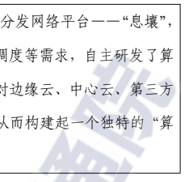
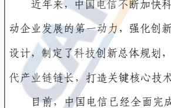

No.202320

电信业发展白皮书
——新时代高质量发展探索
(2023 年)
中国信息通信研究院 中国电信股份有限公司研究院 中国移动通信研究院(中移智库) 中国联合网络通信有限公司研究院 2023年12月

# 版权声明

本白皮书版权属于中国信息通信研究院、中国电信股份 有限公司研究院、中国移动通信研究院、中国联合网络通信 有限公司研究院,并受法律保护。转载、摘编或利用其它方 式使用本白皮书文字或者观点的,应注明"来源:中国信息 通信研究院、中国电信股份有限公司研究院、中国移动通信 研究院、中国联合网络通信有限公司研究院"。违反上述声 明者,编者将追究其相关法律责任。

# 前 言

当前,我国已经开启了全面建设社会主义现代化国家、以中国式 现代化全面推进中华民族伟大复兴的新时代新征程。电信业作为现代 化建设的先锋队,既要先行一步做表率,力争通过高质量发展,率先 实现自身现代化,又要高质量赋能数字经济社会,助力新型工业化, 以信息化驱动中国式现代化,为中国式现代化做出应有的贡献。

全球经济社会发展不确定因素增多,电信个人通信市场趋于饱和、
政企市场亟待拓展新业务方向,电信业面临深刻挑战。AI 重大突破 引领生活生产方式再次变革,数字中国、网络强国成为数字时代推进 中国式现代化的重要引擎,为电信业提供了难得的发展机遇。在此背 景下,电信业自身的高质量发展和国家的现代化建设变得更加紧密。

为了走好高质量发展这条路,电信业在不断地创新探索。

本白皮书因篇幅有限,重点从高质量赋能数字经济社会发展、高 质量建设新型数字基础设施、高质量推动数据要素价值化和高质量推 进科技创新四个方面,着重阐述、总结和发现电信业高质量发展创新 做法、成效,为行业内外提供参考借鉴。

在高质量赋能数字经济社会发展方面,电信运营企业成为推动数 字化发展的主力军。电信运营企业投入大量资源,健全组织体系,聚 合生态资源,增强供给能力,在推进数字红利普惠、拉动数字产业发 展、促进供需对接等方面发挥了重要作用,赋能广度和深度不断增强。

同时打造了电信业自身收入增长的"第二曲线",电信业"基础性、
战略性、先导性"的发展定位也被赋予了新时代下的新内涵。

在高质量建设新型基础设施方面,电信运营企业新型数字基础设 施建设"国家队"的战略定位持续巩固。深化网络覆盖,推进网络升 级,深化空天地一体泛在连接,落实"东数西算"工程,积极推进绿 色高质量算力网络建设,全面融入国家新型算力网络体系,支撑新时 代国家竞争力提升。打造通用大模型、专用模型等赋能平台,助力人 工智能、虚拟现实、区块链等新一代数字技术加速成熟和应用落地。

在高质量推动数据要素价值化方面,电信运营企业正处于从数据 资源化向资产化迈进关键期,探索数据要素价值释放路径。在数据质 量提升方面,投入大量资源,从制度、组织、平台、工具多方面开展 数据治理,基本实现数据资源化。在数据价值挖掘方面,不断丰富数 据内部应用场景,研发多元化的数据能力服务,探索打造隐私计算平 台,促进数据流通共享,为数据要素价值释放提供了新方案。

在高质量开展科技创新方面,电信运营企业争做科技型企业,着 力推动高水平科技自立自强。强化企业创新主体地位,不断健全完善 科技创新组织体系,围绕关键核心领域大力开展技术联合攻关和产品 自主研发,提升自身科技创新核心竞争力。同时积极发挥行业领军企 业和产业链现代"链长"主体支撑和融通带动作用,强化应用牵引和 供需协同,致力于带动产业链主体共同突破关键核心技术"卡脖子" 问题,为战略性新兴产业发展和科技强国建设做出贡献。

面向未来,我国电信业仍将不断丰富高质量发展内涵,积极把握 机遇、应对挑战,持续探索高质量发展新路径,巩固提升我国电信业 竞争优势和领先地位,为中国式现代化做出更大贡献。

|                                           | 目                                                                                                        |
|-------------------------------------------|-----------------------------------------------------------------------------------------------------------|
| 一、 从新时代要求中深刻认识高质量发展要求 |                                                                                                           |
|                                           | (一) 新时代电信业高质量发展内涵                                                                           |
|                                           | (二) 新时代电信业高质量发展着力点 .                                                                       |
| 二、 高质量赋能数字经济社会发展的实践探索 |                                                                                                           |
|                                           | (一) 全力支撑数字红利广泛渗透 .                                                                           |
|                                           | (二) 重点突破数实融合难点问题 .                                                                           |
|                                           | (三) 满足经济社会一体化服务需求                                                                           |
|                                           | (四) 增强数字化服务供给能力                                                                               |
| 三、 高质量建设新型数字基础设施的实践探索 |                                                                                                           |
|                                           | (一) 持续升级通信网络性能 .                                                                               |
|                                           | (二) 打造高质量算力供给 .                                                                                 |
|                                           | (三) 发展新技术基础设施                                                                                   |
| 四、 高质量推动数据要素价值化的实践探索 . |                                                                                                           |
|                                           | (一) 健全数据治理制度规范和组织流程                                                                       |
|                                           | (二) 研发送代数智治理工具和平台 .                                                                         |
|                                           | (三) 维进数据要素价值释放                                                                                 |
| 五、 高质量推进科技创新的实践探索         |                                                                                                           |
|                                           | (一) 坚定科技型企业战略定位 .                                                                             |
|                                           | (二) 形成体系化科技创新布局                                                                               |
|                                           | (三) 深入科技创新机制建设…                                                                                |
| 六、 电信业未来展望与建议                 |                                                                                                           |
|                                           | (一) 发展机遇 .                                                                                           |
|                                           | (二) 发展挑战                                                                                             |
|                                           | (三) 发展建议………………………………………………………………………………………………………………………………………………………………………………………………………………………………………………61 |

## 一、从新时代要求中深刻认识高质量发展要求 (一)新时代电信业高质量发展内涵

当今时代,世界百年未有之大变局加速演进,新一轮科技革命和 产业变革深入发展。与之同时,我国已经开启了全面建设社会主义现 代化国家、以中国式现代化全面推进中华民族伟大复兴的新时代新征 程。新时代新征程要求各行业发展必须始终围绕中国式现代化的理论 内涵和实践要求深入推进,服务好国家发展大局。

高质量发展是中国式现代化的本质要求,是全面建设社会主义现 代化国家的首要任务。电信业1作为现代化建设的先锋队,既要先行 一步做表率,力争通过高质量发展,率先实现自身现代化,又要高质 量赋能经济社会数字化发展,全面赋能新型工业化,以信息化驱动中 国式现代化,为中国式现代化做出应有的贡献。党和国家将数字中国、
网络强国作为数字时代推进中国式现代化的重要战略,使得电信业自 身的高质量发展和国家的现代化建设变得更加紧密。

习近平总书记指出"高质量发展,就是能够很好满足人民日益增 长的美好生活需要的发展,是体现新发展理念的发展"。本白皮书从 目标导向、路径、效果三个层面,认识电信业高质量发展的内涵。电 信业高质量发展是:以满足人民日益增长的美好生活需要为根本任务, 以持续增强信息化对中国式现代化的驱动引领作用为导向的发展;是 践行创新、协调、绿色、开放、共享新发展理念,推进发展质量变革、 效率变革、动力变革的发展;是实现自身转型升级与对外数智赋能协

1 备注:本白皮书中的电信业是指基础电信企业(电信运营企业或电信运营商)群体,电信业范畴不在本 白皮书研讨范围内。

1
同共进,不断巩固提升行业竞争优势和领先地位的发展。

## (二)新时代电信业高质量发展着力点

为推进高质量发展,电信业不断创新探索。在"十三五"末期、
"十四五"前期,我国电信业遵循国家战略、匹配时代特征,围绕高 质量发展目标任务,强化战略部署,践行创新、协调、绿色、开放、
共享新发展理念,推进发展质量变革、效率变革、动力变革,着力在 对外赋能、基础设施、数据要素、科技创新四个层面,探索转型升级。

一是全力赋能数字化发展,助力经济、社会、治理现代化,实现 电信业收入可持续、稳定增长。

"数字中国"要求电信业持续强化赋能经济社会数字化转型。

2023 年初中共中央、国务院印发了《数字中国建设整体布局规划》,
从党和国家事业发展全局和战略高度,提出了新时代数字中国整体战 略,强调推进数字技术与经济、政治、文化、社会、生态文明"五位 一体"总体布局深度融合,致力于发挥信息化驱动引领作用,推进中 国式现代化。但与之同时,经济社会数字化仍然存在一些堵点、卡点 问题,需求仍需进一步激发、融合标准体系有待健全、产业供给体系 有待建强、新业务和新业态商业模式不够成熟。

电信运营企业需要积极发挥信息基础设施、属地经营服务、产业 链生态位等优势,全力赋能生活、生产、社会数字化转型升级。并在 持续强化赋能经济社会数字化发展中,不断挖掘云计算、大数据、人 工智能等新业务、新市场、新模式,拉动专线、数据中心等传统电信 业务发展,保持电信业收入增长,实现行业自身可持续发展。

二是构建新型数字基础设施,落实网络强国战略要求,支撑电信 业转型升级发展。

加快新型数字基础设施建设是落实网络强国战略、构建现代化基 础设施体系的优先任务,是践行数字中国战略、赋能数字经济高质量 发展的重要基础,是贯彻落实总体国家安全观、维护网信安全的有力 保障,是助力我国在新一轮科技革命中抢占发展先机的必然要求。加 快新型数字基础设施建设,也是电信运营企业自身实现信息服务转型 的必然要求。

电信运营企业作为建设网络强国和数字中国、维护网信安全的主 力军,需要以前所未有的使命感责任感,着眼战略全局、抢抓发展机 遇,高水平建设与布局新型数字基础设施,支撑算网新产品新服务创 新,为巩固经济企稳回升势头、赋能经济社会全面数字化转型打造坚 实底座,满足智能社会对信息服务高效敏捷供应的更高需求。

三是深挖数据要素价值,对内支撑企业治理现代化,对外助力激 发数据要素活力。

数据是驱动经济社会发展的新型生产要素,当前基于数据在支撑 业务贯通、推动数智决策方面的作用日益凸显,要求丰富数据资源、 加快数据流通交易,继而通过数据资源化、数据资本化、数据资产化, 为经济社会生产创造更大价值2。党中央、国务院高度重视推进激活 数据要素潜能工作。"十四五"期间,《关于构建更加完善的数据要 素市场化配置体制机制的意见》《"十四五"数字经济发展规划》《关

2 参考资料:中国信息通信研究院,《数据要素白皮书(2022 年)》、《数据要素白皮书(2023 年)》
于构建数据基础制度更好发挥数据要素作用的意见》《数字中国建设 整体布局规划》等文件相继出台,统筹构建数据基础制度体系,加速 推进数据要素价值释放。

电信运营企业在日常经营中积累了海量的数据资源,日处理数据 在拍字节(PB)以上,具有发展大数据应用、开展数据要素价值挖 掘、创新数据场景化变现的天然条件3。电信业需要依托数据资源和 数据基础设施优势,承担数据价值挖掘的先行实践者责任,探索数据 赋能应用场景,创新数据服务产品,推进数据流通共享,助力数据要 素价值更广泛的释放。

四是强化科技创新,着力提升产业链供应链韧性和安全水平,提 高数智技术产品服务供给能力。

党的二十大提出"坚持科技是第一生产力、人才是第一资源、创 新是第一动力,深入实施科教兴国战略、人才强国战略、创新驱动发 展战略","强化企业科技创新主体地位,发挥科技型骨干企业引领 支撑作用"。电信运营企业作为国资央企,应该将强化科技创新作为 高质量发展的关键主线之一,全力突破关键核心技术"卡脖子"问题, 着力提升产业链供应链韧性和安全水平,以数字技术创新助力推动实 现高水平的科技自立自强,助力中国向创新型国家前列迈进。

从自身发展看,在基础电信业务全面普及、人口规模红利即将见 顶的大背景下,强化科技创新也是电信运营企业拓展新增长路径、提 高增长效率、增强核心竞争力的必然之举。以创新引导的数字基础设

3 资料来源:中国信息通信研究院,《电信业数字化转型发展白皮书(2022 年)》
施演进和业务产品升级,将积极助力电信运营企业在行业竞争中占据 优势地位,为可持续增长提供不竭动力。

二、高质量赋能数字经济社会发展的实践探索 面向经济社会广泛的数字化需求,我国电信运营企业以高质量发 展为导向,积极做出了全力赋能数字经济社会发展的战略转型,投入 大量资源,健全组织体系,聚合生态资源,增强供给能力,推进数字 红利普惠、拉动数字产业化发展、促进数字化供需对接,赋能经济社 会数字化的广度和深度不断增强,电信业成为推动数字化发展的主力 军。同时对于电信业自身来说,产业数字化业务成为电信业收入增长 的"第二曲线",电信业"基础性、战略性、先导性"的发展定位也 被赋予了新时代下的新内涵。

## (一)全力支撑释放数字发展红利

当前,数字化已经成为个人改善生活方式、企业提升市场竞争力、
政府提升服务能力的关键路径。数字中国战略统筹推进经济、政务、
文化、社会、文明生态千行百业的数字化转型。数字化呈现出广泛化 趋势,而且自主可控、安全可靠的要求不断增强。我国电信运营企业 充分利用信息基础设施能力、安全保障能力,以及大型企业的属地化、 规模化资源能力,全力支撑数字化广泛渗透,助力政府、传统产业数 字化转型,全面赋能新型工业化,消除数字鸿沟、促进大中小型企业 融通创新,助力数字红利普惠共享。

我国电信运营企业已经成为推进经济社会数字化转型发展不可 或缺的一支重要支撑力量。从我国电信运营企业数字化项目中标数据 5 来看,中国电信、中国移动、中国联通、中国广电,四家电信运营企 业 2023 年上半年在公开市场累计中标 52770 个项目,总金额近 1000 亿元4,涉及农村农业、工业能源、交通物流、教育、医疗卫生、文 化旅游、金融、公检司法、财税、应急管理等行业领域。其中,在数 字政府领域,电信运营企业的价值贡献尤为突出。在我国 2023 年上 半年数字政府项目中,中国电信、中国移动、中国联通三家电信运营 企业中标总数约 1.6 万个,项目数量占比 43%,核心内容包括网络服 务、云服务、热线、雪亮工程等5。

数字化转型产品和服务成为电信业收入持续稳定增长的关键驱 动。全力赋能数字经济社会发展的转型战略,带动专线、IDC、云计 算、物联网、大数据、ICT 集成等业务实现规模化发展。2023 年上半 年6,三家电信运营企业产业数字化业务收入同比增长 15.7%,主营业 务收入占比为 29.5%,较 2022 年同期提升 2.4 个百分点,主营业务收 入增长贡献为 68.3%7。

电信业赋能经济社会数字化拥有更深层次的成效体现,即"基础 性、战略性、先导性"发展定位被赋予新内涵。面向电信业数字化赋 能是否有必要深入核心环节,是否符合电信业的核心定位等行业困惑 问题,电信运营企业综合考虑经济、政治和社会责任,匹配国家战略 要求、经济社会需求,积极拓展服务范畴,及时将业务范畴从基于网 络基础设施提供通信普惠服务,向基于新型数字基础设施提供"云网

4 数据来源:数说 123 5 数据来源:赛立信通信研究部 6 数据来源:中国电信、中国移动、中国联通财报数据 7 备注:产业数字化业务收入包括中国电信财报口径中的产业数字化业务收入,中国移动财报口径中的政 企市场收入,中国联通财报口径中的产业互联网业务收入。
边端安"综合数智信息服务转型升级,发挥着新时代所需要的"基础 性、战略性、先导性"作用。

案例:中国电信广泛赋能数字乡村,助力乡村振兴8 中国电信基于物联感知设备、云网基础设施,创新人工智能、区 块链等数字技术体系,打造"农业农村大数据公共平台"基座,建立 数据、平台、安全、运维" 一套标准",构建数据采集、数据治理、 数据管理、技术支撑、技术分析、共享交换、"一张图"、服务门户 "八大数据能力",建设"村村享"数字乡村综合信息服务平台、"智 慧农业"平台、"乡村振兴"平台,提供乡村治理、乡村产业发展、 民生服务、乡村振兴等数字化应用解决方案,重点满足党建、村务、 政务、资产管理、人居环境治理、应急管理、综合治理等数字化需求。

截至 2023 年 9 月,中国电信已经服务了 1846 个涉农区县,覆盖 超过 35 万个行政村,52%的国家数字乡村试点县、66%的国家乡村治 理示范县,服务乡村产业经营主体超过 14 万家,参与建设乡村产业 项目超过 5 万个。

## 案例:中国移动全面助力各级政府数字化转型9

中国移动围绕"最可靠的交付运维者、最可信的数据运营者、最 开放的生态合作者"发展定位,综合运用自建、产投合作等方式构建 政务"一张网"、"一朵云"、OneCity10"一平台"、数据治理能力,

8 资料来源:中国电信,公开新闻信息 9 资料来源:中国移动,公开新闻信息 10 备注:OneCity 平台是中移系统集成有限公司(雄安产业研究院)自主研发的智慧城市运营管理平台。
以及泛在可及、智慧便捷、公平普惠的政务场景应用体系,提供顶设 咨询、集成交付、一体运维、数据运营、网信安全一体化支撑服务, 助力省、市、县、乡、街道社区各级政府决策科学化、社会治理精准 化、公共服务高效化,提升政府履职数字化、智能化水平,消除城乡 数字鸿沟。

根据公开信息,截至 2023 年 10 月,中国移动已累计为全国 31 省、超 300 个地市提供了智慧城市、公安、应急等重点领域政务信息 化服务和解决方案,全面助力政府治理能力现代化。承建了甘肃、黑 龙江、沈阳、保定等多个省市数字政府标杆项目。其中,甘肃数字政 府实现政务服务网办率超 98%;黑龙江数字政府形成全省政务数据资 源"一本账",建成以来提供数据共享服务超 50 亿次。

案例:中国联通面向中小制造企业提供数字化解决方案和服务11 加快中小企业数字化转型,是推进经济高质量发展关键着力点之 一。针对中小企业普遍面临的个性化需求与成本不能兼顾等数字化难 点问题,中国联通与金蝶国际软件集团在 2019 年共同投资成立了云 镝智慧科技公司,联合建设运营云镝工业互联网平台。

该平台针对中小制造企业的业财税一体化、供应链协同、智能制 造、设备协同四大需求场景,提供调研、咨询、诊断、培训、生产、
交付、管理、运维等全环节的数字化转型服务,打造"小轻快准"一 站式工具箱,拥有"云镝小豹"轻量型 SaaS 软件、镝虎 5G 工业智 能机等自主研发产品,帮助企业低成本、高成效地实现数字化迭代升 级。

云镝智慧科技公司目前已在全国落地 32 个工业互联网平台,赋 能装备制造、工程机械、电子信息、家电、汽车、服装纺织等细分产 业,服务上万家制造业企业。在 2021 年,云镝智慧科技公司获评深 圳市工信局的"专精特新中小企业"认证。

## (二)重点突破数实融合难点问题

5G、AI、大数据、云计算等技术深度融合,持续拓展数字化应 用融合创新想象空间。但是数实融合面临数字化价值效益不易显现、 技术供给服务生态仍待健全、转型数字化成本高等方面的难点问题, 需要部分企业发挥带头作用创新应用场景融合、建立融合标准体系、 带动产业链上下游成熟,通过先行先试,证明数字化应用的可信性和 价值性,推进数字化应用实现从"0"到"1"的突破、再从"1"到 "N"的规模化复制。为此,我国电信运营企业充分发挥产业生态位 优势,调动大量资源,创新千行百业数字化应用增量场景,打造一批 标杆示范项目,通过"点对点"、"以点带面"的方式,培育千行百 业数字化需求,拉动数字产业链和供应链成熟,推进新型工业化。

我国电信运营企业在 5G 发展中的价值贡献尤为突出。我国电信 运营企业作为 5G 应用发展的主力军,牵头创新 5G 应用解决方案, 成立 5G 创新中心,打造面向 5G 应用创新的共性技术平台。2022 年 第五届"绽放杯"中,电信运营企业参赛项目占比达到 61%12,拉动

12 数据来源:中国信息通信研究院,5G 应用产业方阵(5GAIA)、IMT-2020(5G)推进组,《5G 应用创新发 展白皮书——2022 年第五届"绽放杯"5G 应用征集大赛洞察》
5G 通用终端、行业定制终端数量和类型的不断丰富,推进 5G 融合 行业标准研究。

为实现在垂直行业领域的纵深发展,我国电信运营企业针对重点 领域、重点客户,采取成立的"军团"组织模式,整合内外部营销、 产品、技术、交付等资源能力,形成重点、难点问题集中突破的发展 模式和发展能力。截至 2023 年 7 月,中国电信面向卫健、应急、社 会治理大数据、乡村振兴、住建等领域成立了 12 个产业研究院;中 国移动相继成立了私有云、公安、全连接工厂、车联网、智慧医疗等 军团;中国联通面向装备制造、智慧矿山、智慧钢铁、服装制造、汽 车制造等领域,成立了 18 大军团13。

## 案例:中国联通创新 5G+工业互联网应用14

中国联通把 5G+工业互联网作为最重要的战略,致力于发挥 5G
技术和业务驱动者的重要作用,积极推进 5G 低时延、超大上行带宽、 高精度定位等技术特性在工业领域的应用与推广。截至 2022 年底, 中国联通 5G 全连接工厂项目超过 1600 个。2023 年 9 月,中国联通 格物 Unilink 工业互联网平台入选国家级"双跨"工业互联网平台。

中国联通与长城精工在 2022 年打造了全国首个 5G-Advanced
(5G 增强)柔性工厂试点,基于 5G 升级版的泛在万兆和千亿连接 能力,在国内首次验证了空口时延 4ms、稳定性 99.999%的性能指标, 助力精工自动化实现生产线机械臂的无线化作业,为 5G 全连接工厂

13 参考资料:《通信世界》,《 "军团"模式 能否打开 5G 行业市场的新天地? 》;《通信产业报》,
《运营商"军团":如何打?怎么赢?》
14 资料来源:中国联通,中国联通 2022 年度业绩推介材料,公开新闻信息
提供建设范例。

中国联通携手施耐德和华为在全国 9 个省市、26 家工厂进行多 园区5G专网建设,将5G与企业工业生产网络深度融合,通过5G LAN 承载 PLC 工业控制功能,实现"5G 进内网"和"5G 深入核心生产 环节",目前已经规模商用落地全球首个 5G PLC 南向柔性产线,积 极探索通信技术和信息技术、工业自动化技术深度融合,构建新型生 产业务模式与应用平台,实现产业数字化转型升级。

案例:中国移动打造 5G+车路协同示范15 中国移动把握汽车"新四化",即网联化、智能化、电动化、共 享化,以及道路"新基建"升维变革需求,充分发挥基础设施资源禀 赋优势,聚焦连接、信息服务、车路协同三个方向,融合"车路网云 图"产品能力,聚合产学研用生态合作伙伴,力争成为 ToV 市场信 息服务第一提供商16,积极助力车联网新型产业高速增长。截至 2022 年底,中国移动车联网连接数累计超 2 亿。

中国移动联合业内初步完成"中心-区域-现场"三级车路协同云 控平台,实现了"人-车-路-云"之间动态信息实时交互和协同。中 国移动逐步推进 5G 与 C-V2X 从关联到协同再到融合的演进发展, 实现车联网蜂窝网络与直连通信技术的相辅相成,将车路时延从 80 毫秒降到 20 毫秒。目前中国移动车路协同产业合作伙伴已经参与 4 个国家级先导区建设,累计落地标杆项目超 300 个,打造多个行业领

15 资料来源:中国移动,中国移动 2022 年度业绩推介材料,公开新闻信息 16 备注:ToV 指 To Vehicle-to-Everything,面向车联网市场

先示范项目。

中国移动与合作伙伴共同打造南京江心洲"5G+精准公共交通出 行"项目,开创性实现了全国首个 5G+V2X 融合组网技术落地,以 全岛跨域数据融合助力 5G 网联无人车、智慧远控、智慧道路预警与 管理、公交调度、5G 智慧路口、5G 智慧停车等多个应用场景,实现 了基础设施成本下降 37%,公共运营效率提升 27%,人均出行效率提 升 20%。

## (三)满足经济社会一体化服务需求

经济社会各类主体数字化需要整合连接 CT、信息 IT、数据 DT、
操作 OT 等诸多技术,复杂性高,数字化投入产出难以量化,企业数 字化存在"不愿转"、"不会转"、"不敢转"问题。在此背景下, 我国电信运营企业以总包、总集的角色承担数字化项目,发挥了积极 作用。基于其自身的品牌信誉、资金优势,满足经济社会对数字化供 应商资金保障、全生命周期项目管理保障和数字安全保障等实际需求, 与政企客户共同承担数字化过程中的风险,降低政府、企业数字化的 门槛;发挥大型企业作用,横向整合终端设备、基础设施、平台、软 件、数据、模型、服务等领域的数字化供给能力,纵向调动全国、省、 市县等层级资源能力,面向客户提供一体化服务,对数字化供需对接 起到一定促进作用。

为更好地整合生态资源能力,我国电信运营企业坚持有所为有所 不为,聚焦新型基础设施核心优势,不断强化自有云网核心能力,构 建行业云平台,面向具体细分应用场景,在终端、应用、模型、数据、
服务、内容等层面展开广泛合作。同时,创新生态合作模式,在产业 联盟、行业协会等传统生态合作模式基础之上,通过加强产投协同、 技术赋能、共建行业云等方式,与垂直行业领域的产学研用诸多主体 建立了紧耦合的合作关系。

案例:电信运营企业依托多样化合作模式强化生态合作 中国电信与央国企、行业龙头企业联合打造行业云,通过共营或 者共建的方式,整合内部系统和数据,服务产业链上下游企业,最终 带动整个行业一起"上云",共同赋能产业链上下游企业提质增效。

据不完全统计,截至 2023 年 4 月,中国电信打造了 24 朵央企行业云 平台,包括与中国航天科工集团共建 INDICS 军工行业工业互联网平 台,与国家电网等单位联合打造能源电力生态服务云,与中国南方电 网、中国电子共建新型智慧能源生态服务平台,与国家能源集团共建 煤炭行业国资云平台,与华润集团共建能源消费云,与中国华能集团 共建发电行业智能工业云,与中国中化共建化工行业云等17。

中国移动 2016 年 12 月成立了中移资本控股有限公司,该公司作 为中国移动股权投资和资本运作的集中管理平台,聚焦国家战略和中 国移动集团主业,坚持"价值贡献是底线、产投协同是基础、生态构 建是方向"的投资理念,通过直接投资、基金间接持股的方式,截至 2023 年,布局芯片与模组、云网基础设施、智能硬件、云网软件及 服务、人工智能与大数据技术创新、行业数字化、安全与信创、文创 与媒体等信息通信产业链上下游企业超过 500 家,投资规模超过 2300

17 资料来源:公开新闻信息
亿,推进产业链、创新链、资本链深度融合,降低合作成本、提高协 同效率,共同创造更大价值18。

中国联通与战略投资者、行业头部等合作伙伴加强战投赋能,深 化资本、产品和项目等多维度合作,共享产业红利。目前中国联通分 别与腾讯、阿里巴巴、网宿科技、金蝶、网龙、中国银行、奇虎 360 等企业合资成立了系列企业,包括提供智慧文旅产品服务的云景科 技、提供智慧城市产品服务的云粒智慧、提供边缘计算产品服务的云 际智慧、提供智慧教育产品服务的云启智慧、提供金融科技产品服务 的中联云链、提供数字安全产品服务的云盾等19。 

## (四)增强数字化服务供给能力

1. 变革组织体系 面向千行百业的数字化需求,电信运营企业相比产业数字化其他 类型供应商,拥有安全保障能力、属地化服务能力和信息基础设施能 力等核心优势。但与之同时,电信运营企业在面向垂直行业数字化领 域的专业化、规模化、一体化能力方面也存在短板和不足,包括营销 服务、产品研发、集成交付、运行维护、技术创新、组织运营等,尤 其是面向政企客户专业化的核心生产环节的产品和服务能力。

为此,我国电信运营企业以推进组织经营体系改革为抓手,加大 政企市场资源投入,充实政企市场人才队伍,构建产业数字化自有能 力,逐步提升自主能力在产业数字化服务收入中的占比。目前,我国 电信运营企业政企市场组织经营体系的主要调优点和方向路径:一是

18 资料来源:中国移动 19 资料来源:公开新闻信息
自上而下建立行业事业部,面向垂直行业打造一体化、专业化能力体 系;二是持续充实属地化经营队伍规模,提升属地化市场拓展、交付 服务能力;三是成立行业产业研究院、行业专业产品创新公司等组织, 补齐专业产品创新能力;四是成立专业集成公司,针对省级公司以传 统通信业务经营为主,而 ICT 专业能力不足的问题,组建属地化交付 团队,补齐集成交付、运行维护能力。

案例:电信运营企业构建政企一体化能力体系20 中国电信为强化面向垂直行业的一体化市场经营能力,在 2020 年将政企客户事业部提升为政企信息服务事业群,并面向 11 个重点 行业领域设立了 11 个行业事业部。为提升面向垂直行业的专业化产 品能力,中国电信在 2023 年面向教育、医疗、金融领域分别成立中 电信翼智教育科技公司、中电信翼康科技公司、中电信翼金科技公司。 专业公司将围绕专业产品研发和销售职责定位,承担自身能力收入、 利润、科技创新、直管客户产数业务收入、关联行业纵向产数收入、 省市公司支撑满意度等考核指标。依托专业公司相对独立运营的方式 和更加市场化的机制,推进产品能力提升。

中国移动为补齐属地化售前、售中、售后一体化市场经营能力, 建立了"总部、省、市(县)"三级服务支撑体系,在省、市(县) 补齐统筹管理单元、市场拓展单元、集成交付单元。另外,为了建强 面向专业领域的产品、交付能力,中国移动创新建立了"链长制", 聚焦行业整体解决方案、提升供给能力的行业运营机制,对行业发展

20 资料来源:中国电信,中国移动,中国联通,公开新闻信息
基本面负责。

中国联通聚力打造"一个联通、一体化能力聚合、一体化运营服 务"特色实力,为提升属地化产品能力和交付能力,成立了属地化产 业互联网公司。截至 2023 年 10 月,中国联通已经在全国建立了 28 家产业互联网公司。产业互联网公司主要由中国联通旗下联通数科公 司投资建立,具体人员由省分公司管理,实现面向属地化客户的技术、 产品和交付能力的整合、贯通。

## 2. 转变业务模式

与消费互联网业务规模化经营方式不同,产业数字化业务的个性 化、专业化、定制化属性强,产品和服务交付的边际成本较高。为此, 我国电信运营企业多以集成项目的方式,整合终端、网络、云服务、 平台、应用、运维等产品服务内容,面向政企市场提供服务,收取相 关费用,并且可以根据客户具体需求和商务事宜进行组合、调整。

但是,集成项目的方式对电信运营企业的专业能力、项目全生命 周期管理等提出了较高要求,而且对其人财物资源带来了较大压力。

因此,电信运营企业开始尝试通过打造行业云平台的方式,提高供给 服务效率和效能。充分利用云化、平台化技术,打造业务技术能力云 平台,持续推进项目经验和能力的标准化与云化,积累沉淀共性技术、 产品和数据能力,降低 ICT 服务边际成本,提高 ICT 供给能力,建立 供给、运营、服务新模式,持续提升数智化供给能力和产品服务交付 效率。

案例:中国移动基于 OneCtiy 平台提供灵活智慧城市交付模式21 OneCity 是中国移动面向各级政府,提供业务融合、数据融通、
AI 融智的城市发展新型基础设施。OneCity 产品主要由平台、应用与 服务三部分构成。其中,OneCity 平台包括城市大数据平台、集成平 台、城市 AI 平台,是统一的智慧城市智能化底座,实现城市数据交 换共享、AI 注智赋能、应用集成统管的一体化统筹管理;OneCity 应 用面向智慧城市领域提供高频与可选应用;OneCity 服务包含从顶设 咨询到系统运维的全流程、全周期服务。

基于 OneCity 平台,中国移动面向数字政府、智慧城市领域的业 务模式包括定制化集成 DICT 项目,以及模块化标准功能订购两种方 式,商业模式支持平台代建、购买服务等灵活方式,省市县可以根据 实际情况确定。目前 OneCity 平台已在 31 省落地。

## 三、高质量建设新型数字基础设施的实践探索

数字基础设施作为数字未来底座,正逐渐成为加速推进数字中国 建设、提升国家竞争力的重要支撑。数字基础设施包括信息网络基础 设施、算力基础设施、新技术基础设施、融合基础设施、信息安全基 础设施等22。建设新型数字基础设施既是电信业实现可持续发展的内 在要求,也是高质量赋能经济社会数字化转型的外在要求,是新时代 电信业承担的首要使命。

作为新型数字基础设施建设的"国家队",电信运营企业围绕网 络接入和传输性能提升,持续加大技术创新和资源投入,建成全球最

21 资料来源:中国移动 22 参考资料:中华人民共和国数字经济促进法(专家建议稿)第九条
大的 5G 网络和全光网络,提升网络智能化水平,为网络强国、数字 中国建设奠定高质量网络基础。同时,面向智能技术创新和全领域数 字化转型需要,快速布局绿色算力基础设施和新技术基础设施,加强 相关领域资源投入,提升数字服务能力和服务水平,支撑数字技术与 实体经济深度融合,赋能产业高质量发展。

## (一)持续升级通信网络性能

相比消费互联网,产业数字化对网络的可用性、可靠性、稳定性 提出了更高要求,需要通过完善基础设施建设、提升网络智能化水平、 加快网络融合步伐,持续不断地提升网络覆盖、速率、时延、安全性 等,满足产业数字化发展需要。近年来,以 5G、光网络为牵引,电 信运营企业不断推进移动网络和固定网络性能升级,并融合空天地网 络一体化发展,实现网络资源的广泛连接和传输能力的空前延伸。

1. 5G 基本完成有效覆盖,继续向 5G-A 持续演进 5G 技术正在加速融入经济社会各领域各环节,成为数据资源畅 通循环的关键支撑和引领产业智能化转型升级的重要引擎。2019 年 以来,电信运营企业大力推进 5G 精品网络建设,已经初步完成 5G
网络的规模化建设,推动我国成为全球 5G 领域引领者。截至 2023 年三季度,我国 5G 基站总数达 318.9 万个23,占移动基站总数的 27.9%,
5G 网络覆盖全国所有地级市、县城城区以及重点乡镇,正进一步向 其他乡镇和农村地区延伸。同时,我国还建成了全球首张、规模最大、
网速最快的 5G SA 共建共享网络,截止 2023 年上半年,5G 共建共

23 数据来源:2023 年前三季度通信业经济运行情况,工业和信息化部运行监测协调局
享基站超 173 万个24,实现高中低多频协同等技术突破,为全球 5G SA
部署提供了应用示范。依托共建共享实践,我国电信运营企业还主导 了 30 余项 5G SA 共建共享国际标准25,对于有效减少低层次重复建 设,推动全球新型信息基础设施向集约高效、绿色低碳加快发展做出 了应有贡献。

基于 5G 技术,面向行业打造专用网络,是 5G 发展的一个重要方 向。2020 年以来,国家出台多项政策大力支持 5G 专网建设,包括组 织 5G 专网试点、推广 5G 专网行业场景应用、完善 5G 专网部署模 式等。电信运营企业基于自身网络资源能力,分别形成了 5G 专网独 立运营品牌并开展商用推广,推动 5G 专网设备成熟和应用落地。其 中,中国电信的 5G 专网产品"致远、比邻、如翼",中国移动的 5G
专网产品"优享、专享、尊享",中国联通提供的 5G 虚拟专网、混 合专网、独立专网,大致对应了 5G 专网的三种部署模式——与公网 端到端共享的公网集成模式(PNI-NPN)、与公网部分共享的公网集 成模式、独立部署模式(SNPN),对于推动垂直行业 5G 创新应用、
拓展生产效能、提速数字化转型,助力数字经济繁荣发展起到了重要 作用。公开数据显示,截至 2023 年上半年,我国累计建成 5G 行业 专网超 1.6 万个26,三大电信运营企业 5G 行业商用项目累计均超过 2 万个27,服务客户数、签约收入等均呈现高速增长。

目前 5G 的主要应用仍是面向消费者市场提供基础通信服务,被

24 数据来源:工业和信息化部新闻发言人、总工程师赵志国在 2023 年 7 月 20 日国务院新闻办公室发布会 上公布的数据 25 数据来源:中国电信 26 数据来源:工业和信息化部 27 数据来源:中国电信、中国移动、中国联通 2023 年半年报
作为 4G 的升级网络,当前建设的 5G 专网以局域网为主,反映出 5G
全网端到端保障能力的局限性。为了解决 5G 在支撑大上行带宽、确 定性时延、高可靠性与高精定位等工业应用需求方面的能力差距, 5G-A 应运而生。我国电信运营企业积极参与 5G-A 标准工作,对 5G-A 核心网络架构做出重要贡献。5G-A(5G R17)标准已于 2022 年 6 月正 式冻结,其基础能力层面将实现泛在万兆体验和千亿连接,赋能垂直 行业能力将进一步增强。鉴于目前 5G 基础覆盖已经初步完成,而 6G
尚处于概念提出阶段,5G-A 将是未来 2-3 年移动通信网络升级的主 要内容之一。相比于传统 5G 基站,5G-A 基站具有更高的上下行速 度、更低的网络时延、更强的 AI 融合能力等特点,能够为各类智能 应用场景提供更强大的网络支持,高质量赋能行业数字化转型。

案例:中国移动试验 5G-A 万兆精品示范网28 杭州第 19 届亚运会期间,浙江移动联合华为在奥体中心建设 5G-A 智能亚运示范区,覆盖超 10 平方公里,打造全球最快网速示 范网。5G-A 基站采用多载波聚合、超级上传等多项创新技术,将 5G 频率的应用推向极致,大大延长了无源设备的通信距离和连接 传输效率,为亚运会期间创新智能应用提供强有力的网络保障。

基础网络服务方面,5G-A 网络覆盖区域路上无线网络峰值速 率超过 10Gbps,移动状态下超过 5Gbps,相比 5G 提升了十倍,为 亚运赛事高清直播提供确定性体验网络,给民众带来前所未有的畅 快网络体验。

28 资料来源:公开新闻信息
智能应用方面,一是发挥 RedCap 易连接、免光纤布线、低成 本、高可靠、低时延等优势,开通上百个 RedCap 基站,在亚运场 馆安防、交通管理、高清慢直播等场景部署 RedCap 摄像头,打造 视联之城。二是依托 5G-A 高速连接能力,打造全系列裸眼 3D 生 态,咪咕视频爱看版 APP 首个上线裸眼 3D 专区,通过云 AI 实时 将 2D 视频转成 3D,实现裸眼 3D 看亚运直播和点播。三是连片部 署 5G-A 无源物联基站,实现物流车辆智能调度、环境温度自动化 巡检,亚运场馆器材和办公资产高效盘点。四是依托 5G-A 通感一 体基站,通过划定电子围栏区域,实时感知无人机轨迹和预警,实 现低空安全管理。

2. 固网进入 F5G 成长期,全光网络夯实信息大动脉 光纤网络是经济社会发展的信息大动脉,是赋能数字经济发展, 助力千行百业数字化转型的重要基础设施。随着业务场景越来越丰富, 业务种类越来越多样化,特别是大流量业务的迅速发展,对网络接入 和传输能力也提出了更高要求。F5G(The 5th Generation Fixed Network)是以 10G PON、Wi-Fi 6、200G/400G 和 OSU-OTN 等技术 为代表的第五代固定网络。在网络强国战略指引下,电信运营企业持 续开展网络全光化升级,在骨干网、城域网、本地网建设中升级应用 高速大容量超长距传输、WSON、ROADM、大带宽接入 10/50G PON、 工业 PON 等技术,提升网络传输效率和带宽,初步建成了全球规模 最大的全光接入、全光交换、全光传输网络,建成低时延骨干光网络 底座。截至 2023 年三季度,全国光缆线路总长度达到 6310 万公里, 接入网光缆、本地网中继光缆和长途光缆线路所占比重分别为 62.3%、
35.9%和 1.8% ,光纤接入(FTTH/O)端口 10.8 亿个,占互联网宽带 接入端口的 96.3%,其中具备千兆网络服务能力的 10G PON 端口数 达 2185 万个,比 2022 年末净增 661.9 万个29。

电信运营企业在推进全光网络建设的过程中,始终围绕支撑国家 重大战略需要和市场需求,以全光网络支撑"东数西算"工程和全国 一体化大数据中心布局,不断满足人民群众对美好数字生活的向往。

一是围绕国家一体化大数据中心,构建低时延光缆网底座;二是扩大 面向行业的精品网络覆盖,满足枢纽节点间的直达互联需求,在集群 枢纽内数据中心间打造超高速、低时延互联通道,满足云计算多可用 区部署需求;三是与边缘数据中心协同,部署新型城域网和千兆光网, 支持云边算力的灵活调度和分发;四是持续推进网络扁平化,积极推 动国家级互联网骨干直联点建设,实现公众用户至区域内集群枢纽的 高效、低时延连接。

3. 云网融合深入推进,智能化赋能网络自智 从电信业自身发展角度来看,越来越复杂的网络结构,需要更加 智能、灵活的网络管理能力,提升基础运维效率,保障网络运行安全, 降低运营成本。从赋能经济社会的角度来看,行业数字化转型需求差 异化、复杂化、融合化,需要提升网络业务端到端开通、验收、质检 及主动性保障的自动化、敏捷化、智能化能力,提升敏捷交付体验。

在高效接入和高速传输的基础上,电信运营企业持续推进网络向

29 数据来源:2023 年前三季度通信业经济运行情况,工业和信息化部运行监测协调局
基于软件化的新型分层解耦转型,实现资源弹性分配、动态调度等新 特征,提高网络管理效率效益,支撑云网/算网进一步深度融合。目 前 5G 核心网和部分 4G 核心网已经实现模块化、软件化部署,正逐 渐从虚拟化和多制式向云原生和全融合持续演进。同时,电信运营企 业在推进承载网的 SDN 改造,目标是实现集中自动管控,包括网元的 集中纳管、网络拓扑自动发现、告警和日志的全量收集、分钟级完成 承载网段业务相关开通配置和扩编容等。以软件化、云化和集中自动 管控为基础,利用 SRv6 技术进一步夯实网络差异化服务底座,支持 基于多个因子约束的业务路径计算能力,以及超大规模网络路径计算、
故障收敛、流量质量等优化能力,并自动生成和配置 SRv6 policy, 实现云网业务的集中调度,提供差异化、确定性 SLA 保障。

基于软件化的新型分层解耦转型网络提高了网络的端到端保障 能力,也带来网络维护协同度复杂度的陡增,因此亟需通过智能化手 段全息感知网络变化,主动预测网络隐患,自动定位跨域故障,精准调 优网络参数,提前修复消除风险,保障网络可靠运行。以自动化与智能 化为核心特征,以实现网络提质增效、赋能行业数智化转型为目标, 逐渐成为 5G 及未来网络与人工智能深度融合的显著趋势。我国电信 运营企业持续引领自智网络创新实践,推动形成全球产业共识。2021 年以来,国内三大电信运营企业先后提出 2025 年达到 L4 等级自智网 络,带动泰国电信运营企业 AIS、法国电信运营企业 Orange、南非电 信运营企业 MTN 等国际电信运营企业纷纷设立 2025 年在高价值场 景或全网范围内达成 L4 等级自智网络的发展目标。

## 案例:电信运营企业建设自智网络30

中国移动从智能运维体系创新、网络智能化产品打造与自智网络 产业协同等方面,推动网络智能化技术与自智网络体系扎实、高效、
有序发展。2021 年发布首个面向全面实践的《自智网络白皮书》, 2022 年开展网络智能化规模应用,历经四年初步构建起集各方力量 统一运营支撑生产的新生态。

中国电信在云网融合战略中提出能力开放、智能敏捷、安全可信、
云网一体、绿色低碳等网络建设愿景,持续提升云网运营自智水平, 在云网端到端全程可视、质量端到端精确感知、业务端到端敏捷运营 等方面做出了有益探索。

中国联通加速推进新型信息基础设施建设与数字化转型,推动自 智网络与全专业、全生产环节的深度融合,按照自智评估、能力规建、 达标验收的方式,体系化、规模化地实施网络自智。

4. 网络走向空天地一体,泛在连接进一步延伸 随着 5G 非地面网络(NTN)技术逐渐成熟,空天地一体融合路径 愈发清晰,卫星互联网和地面网络系统的融合已经成为信息网络未来 趋势。电信运营企业正在积极创新布局空天地一体产业链,打造空天 地一体化融合架构,实现天星、地网资源统一运管,天地云网、业务、 应用一体化服务。

在移动卫星通信方面,电信运营企业推进"天星、地网、枢纽港、
云资源池"一体化布局,加快建设天通一号卫星移动通信系统民用设

30 资料来源:公开新闻信息
施,不断提升天通物联网能力,推动地面网络与卫星网络全系统融合, 部署北斗短报文融通系统,初步形成较为完备的卫星通信业务运营体 系,为国防、公安、交通、能源、应急等行业领域提供更高效、更安 全、更智能的通信服务。在大众市场,基于天通一号卫星,部分手机 已经开通直连卫星业务,提供接打卫星语音电话、接发卫星短信等服 务,推动融合通信达到新的高度。

5G 地空通信(5G-ATG)是基于 5G 技术,通过沿飞机航线设置 符合相应国际规则和国内规定的特殊基站及波束赋形天线,在地面与 飞机机舱间建立地空通信链路,使乘客在机舱内通过无线局域网接入 方式访问互联网。5G-ATG 是实现航空互联网高质量发展的重要技术 路径之一,也是 5G 等新技术在航空互联网领域的新应用和新业态。

电信运营企业发挥 5G 技术优势,积极推动在国内有关省份开展 5G-ATG 技术试验。中国移动联合中国飞行试验研究院开展国产大飞 机试飞数据宽带传输验证,实现试飞机型海量数据快速卸载、实时飞 机健康管理等应用。中国电信联合民航局完成 5G-ATG 用频方案的初 步确定,明确 5G-ATG 网络建设可研规划方向,统筹 5G-ATG 航空互 联网发展策略及运营方案,融合"高通量卫星+5G-ATG"构建天地一 体航空互联网,为规模发展奠定基础。中国联通高度重视 ATG 产业 发展,一直积极参与 5G-ATG 标准制定、推进产业链成熟及研究可行 组网方案,并计划在政策允许情况下,积极推进 ATG 试验并进行组 网验证。

## (二)打造高质量算力供给

随着各行业数字化转型升级进度加快,新一代数字技术加快普及 应用,全社会数据总量爆发式增长,数据资源存储、计算和应用需求 大幅提升,算力基础设施作为数字经济底座的战略作用越来越凸显。

算力基础设施是以数据中心、智算中心、超算中心等算力资源为主体, 同时包含云平台、算力调度平台等助力算力应用的数字技术,面向经 济社会数字化转型需要,提供算力生产、供给和服务的新型数字基础 设施。电信运营企业加快算力基础设施建设和算网融合步伐,布局绿 色算力,并依托算网资源打造自有云平台和算力调度平台,解决算力 普惠、弹性、协同供给,带动算网生态的繁荣发展。

1. 算力规模快速提升,供给结构持续优化 2022 年国家正式启动"东数西算"工程,推动构建全国一体化 大数据中心协同创新体系。电信运营企业全面承接国家战略,围绕全 国一体化大数据中心体系布局和"东数西算"工程,部署数据中心、
DCI 网络和云计算设施,布局算力网络,打造支撑"东数西算"发展 的算力调度体系和国家枢纽节点关键信息基础设施。经过一年多发展, 算力网络从概念原型进入产业导入期,技术标准规范从无到有,算网 基础设施规模达到领先,产品和应用有所突破。

数据中心梯次布局。三大电信运营企业均已明确多级数据中心/
云资源梯次布局,并逐年加大投资倾斜,数据中心能力覆盖国家"东 数西算"全部枢纽节点,算力规模保持高速增长。截止 2023 年 6 月 末,中国电信对外 IDC 机架规模达到 53.4 万架,算力总规模达到 8.4EFLOPS;中国移动对外可用 IDC 机架达到 47.8 万架,累计投产 算力服务器超 80.4 万台,算力总规模 9.4EFLOPS;中国联通 IDC 机 架规模超过 38 万架,数据实时处理能力达到万亿级31。在骨干网络建 设方面,电信运营企业大力推进 400G 高速光纤网络试点建设,打造
"东数西算"大动脉,大幅降低网内平均时延,形成多级算力时延圈, 推动实现"网络无所不达、算力无所不在、智能无所不及"。

智算发展进入快车道。电信运营企业纷纷加大智算布局,满足大 模型训练等更高阶的算力需求,目前三大电信运营企业均有计划、在 建、建成的大型智算中心项目,也在推进重点区域公共智算中心和省 级推理池的部署。公开数据显示,截止 2023 年上半年,中国电信、 中国移动智能算力规模分别达到 4.7EFLOPS、5.8EFLOPS32,强大的 智能算力基础设施正在为数字经济高质量发展持续赋能。

## 2. 深化云平台自研,提供高质量算力服务

与国际电信运营企业普遍放弃自研云平台不同,我国电信运营企 业作为国资央企,充分发挥科技创新、产业控制、安全支撑三大作用, 在云计算方面始终坚持自研投入,云平台规模和业务收入走在全球电 信业前列。

案例:电信运营企业打造自研云平台33 天翼云突破云操作系统、分布式数据库等关键核心技术,发布以 一体化云底座、分布式云能力、可信云平台为核心的天翼云操作系统,

31 数据来源:中国电信、中国移动、中国联通半年报 32 数据来源:中国电信、中国移动 2023 年半年报 33 资料来源:公开新闻信息

打造多个细分场景云解决方案,推出云电脑、云手机等云终端产品, 目前是全球最大的电信运营企业云、国内最大的混合云,广泛应用于 党务、政务、国务、军务上云。

移动云锻造全栈产品自研能力,推出磐石 DPU、COCAAI 算力 融通平台、"乌蒙"高性能网络(COCA-HPN)等,旨在重塑计算架 构、融通算力生态、提供海量 AI 算力,打造高性能算力基础设施。

联通云立足自主创新,主打"安全数智云"品牌形象,形成了"安 全可靠、云网一体、数智相融、专属定制、多云协同"的特色优势, 提供"联接+感知+计算+智能"的算网一体化服务,致力于打造数字 经济"第一算力引擎"。

3. 打造算力调度平台,提升算力供给效率 从需求侧来看,数字化带动了算力蓬勃发展,但也对算力的供给 质量提出了更高要求。从供给侧来看,算力基础设施向边端渗透,异 构芯片也让算力形态越发多元,需要建立以算力为核心,通过感知实 现匹配与调度的算力调度平台和服务。落实国家"东数西算"工程, 电信运营企业创造性提出算力网络概念,致力于打造算力调度平台, 实现全网算力资源的智能编排、按需调度,解决算力普惠、弹性、协 同供给,带动算网生态的繁荣。算力调度平台本质是一种算力资源服 务,向下拉通全域资源与能力,实现原子能力接入,提高云、边、端 协同工作效率;向上支撑全业务运营,满足不同类型用户对于极高性 能、便捷操作、最低成本、安全可靠等多样化算力服务的需求,实现 算网资源与业务需求的最佳匹配。

算网技术持续突破,算力原创技术策源高地正逐步形成。我国电 信运营企业牵头国内外近百个标准立项,主导的原创标志性技术"算 力路由"在国际权威标准组织 IETF 实现突破,依托全国性算力网络 试验网,汇聚一批合作伙伴,孵化了一批高辨识案例。但同时也要看 到,算力网络仍然处于发展的早期阶段,仍有诸多方向需要创新突破, 在标准研究基础上,还需引导产业界在演进路线等诸多问题上达成共 识。在技术和产业层面,算力调度同样存在技术标准不统一和产业协 同难题。在商业模式方面,算力网络的参与主体以及业主间相关资源 数据共享、企业商业秘密数据的保护、跨域管理等问题仍有待研究解 答。

## 案例:电信运营企业打造算力调度平台34

中国电信推出算力分发网络平台"息壤(ESX)",以"随愿算 网"的方式,对边缘云、中心云、第三方资源等全网算力进行统一管 理和调度,并联合中国信通院发布我国首个实现多元异构算力调度的 全国性平台—"全国一体化算力算网调度平台(1.0 版)"。

中国移动自主研发算网大脑"天穹"、算力并网平台,实现供给 范式、运营范式、服务范式变革,带来分钟级呈现、分钟级资源调度、 分钟级任务式应用开发的三个分钟级变化,支持"东数西算"、智算 超算、数据快递等上百种算网业务,在大规模数据灾备存储、影视渲 染、天文、医药研发等领域得到了应用,未来还将纳管更多资源、支 持更丰富的业务,向算网智脑升级。

34 资料来源:公开新闻信息
中国联通打造算网一体化编排调度产品体系,纳管包括自有骨干 云、MEC 边缘云、公有云等多样化异构算力,结合全国一体化跨域 跨网跨厂家 SDN 优势和纵深防御的云网安全能力,形成算、网、安 能力的统一汇聚、标准化纳管和能力适配。通过多层次的算网业务意 图识别、编排调度策略及算法,根据业务需求、运行状态等因素智能 调配算网资源,实现资源的跨层跨域高效调度和一体服务。

## 4. 践行生态发展理念,大力布局绿色算力

国家提出"双碳"目标以来,各行各业都在推动绿色化升级,算 力基础设施作为高能耗行业,需要在绿色低碳方面加强创新研究和应 用实践。根据国家发改委高技术司公布的数据显示,我国数据中心年 用电量已占全社会用电的 2%左右,且仍在快速增长,因此推动绿色 算力发展战略意义重大。

在规模化建设算力基础设施的同时,电信运营企业也在推动绿色 低碳技术革新,实现绿色算力。一是充分利用环境优势和可再生能源, 在自然冷源丰富、可再生能源富集区域,通过自建与合建相结合方式, 打造布局合理、定位清晰、层次分明的绿色数据中心。依托区域资源 优势,探索数据中心绿电应用方式,打造清洁能源可溯源绿色大数据 中心,探索"零碳"的实现路径,打造行业标杆,形成可推广、可复 制的典型案例。二是广泛采用间接蒸发冷水系统、自然冷源、湖水制 冷、水冷离心式空调系统、气流组织智能优化、中水循环技术、余热 回收技术、间接蒸发冷却技术等先进技术,打造数据中心极致 PUE。

## 案例:电信运营企业建设绿色算力35

中国移动投资建设呼和浩特智算中心,设备总功耗约 19600KW,
部署服务器总规模约 2950 台,其中液冷板式整机柜 GPU 服务器 1670 台、风冷普通 CPU/GPU 服务器 1280 台;部署机架总规模为 799 架, 其中 40KW 液冷整机柜 411 架、普通 10KW 机架 134 架、7KW 机架 254 架。算力能力达到 6EFLOPs,总投资超 20 亿。通过采用液冷等 先进节能降碳技术,全面降低智算中心能耗,实现绿色发展。

中国电信在青海建设了全国首个 100%清洁能源可溯源绿色大数 据中心,重新定义绿色大数据中心新标准和绿色能源显性化消费新模 式。目前已建成中国电信(国家)数字青海绿色大数据中心、云网大 数据中心、青藏高原数据灾备中心等 3 个全省高标准绿色算力"新高 地",拥有 8 个市州级绿色算力中心节点,共计 26 个资源池,并在 各区县和工业园区部署了边缘云计算节点,为青海绿色、高质量发展 注入强劲动能。

中国联通打造 AI 算力绿色节能调度系统,可对 AI 算力的 IT 系 统能耗进行全生命周期的细颗粒度管控,针对 AI 训练、AI 推理 AI
研发等场景对 AI 算力进行能耗压降。一是对底层的 GPU 物理资源进 行灵活共享、随取随用,解决了 GPU 资源利用率低造成的 IT 系统能 耗浪费等行业痛点问题。二是针对不同的 AI 任务场景,提出了 GPU 存算协同、AI 大模型压缩、分时调度等多项 AI 算力调度模型,旨在 提升 AI 算力的计算能效。

35 资料来源:公开新闻信息

## (三)发展新技术基础设施

面向云计算、人工智能、区块链等新一代数字技术,电信运营企 业依托网络、算力、数据资源优势,构建赋能平台,加速技术成熟和 应用。

1. 打造人工智能赋能平台,促进 AI 产业生态繁荣 人工智能赋能平台是基于人工智能基础软硬件建设的人工智能 产品和能力平台,提供人工智能应用创新所需的数据管理、算法仓、
行业 SDK 以及云边协同能力等,实现数据赋能、模型赋能、应用赋 能,助力 5G、人工智能、云与行业领域融合渗透,推动创新结果转 化落地,服务千行百业。在算力方面,部署遍布全国、支持统一调度 的 GPU 卡资源;在 PaaS 方面,自适应国内外主流 GPU,提供统一 前向推理框架,实现算法加载便捷高效;在应用方面,支持算法一站 式上架,支持算法编排及分时段分等级分区域实时调度和参数调整; 在数据处理方面,提供统一数据预处理范式,实现资源灵活订阅和数 据统一纳管;在 AI 生态建设方面,建立 OEM 供应商硬件生态体系、
ISV 应用集成商软件生态体系和 AS 渠道代理生态体系,促进上下游 产业融会贯通,促进 AI 产业生态繁荣。

同时电信运营企业聚焦行业应用,大力投入自研大模型,面向自 身业务经营场景和政企业务场景,充分发挥多要素融合创新优势,打 造新型核心能力,加强智能赋能,实现提质增效。

## 案例:电信运营企业 Ai 大模型探索36

中国移动成立"九天"特区,以"体系化人工智能"原创技术 体系为核心,在大模型领域持续自主技术攻坚,已实现全链路核心 技术掌控和自主创新,构建了"通用智能底座+行业大模型"体系。

一是打造通用智能底座,构建适用于泛场景的九天通用基础语言大 模型,训练数据规模超两万亿 Tokens,融合行业专业知识,叠加专 项训练和优化,具备供给侧增强、持续训练和异构软硬件灵活部署 等特色。基于九天通用语言基础语言大模型发布面向央企和行业龙 头共建共享的"九天·众擎基座大模型",得到众多企业支持。二 是在通用大模型基础上构建面向多领域的行业大模型。现已推出九 天·客服、九天·海算政务、九天·网络、九天·企业通话、九天·川 流出行等行业大模型,应用于数字政府项目、10086 客服、网络运 维等场景。

中国电信成立人工智能科技有限公司,积极开展大模型自主研 发,不断突破参数级别,打造出具有强大特征学习能力与跨领域泛 化能力的自研大模型。一是研发基础大模型,包括星辰千亿参数的 语义大模型和多模态大模型。其中,语义大模型拥有超 12 亿风格 数据、训练显存降低 50%、推理提速 4.5 倍,中文意象理解生成能 力提升 30%,语义细粒度生成效果提升 25%,"幻觉率"降低 40%,
同时以稳定、多样的大模型底座支撑及多样化工具辅助支持丰富多 元的应用场景;多模态大模型主要聚焦图文生成、图文理解,训练

36 资料来源:中国移动研究院、中国电信研究院
超过 12 亿的各类风格数据,支持写实、彩墨画、赛博朋克等接近 20 种绘画风格。二是研发行业大模型,目前试商用 12 个行业大模 型,包括星辰教育大模型、基层治理大模型、政务服务大模型、应 急大模型、医保大模型、交通大模型、住建大模型、金融大模型、 神农一号大模型、出行大模型、旅游导览大模型、矿山大模型。

中国联通发布面向增值业务的"鸿湖"图文大模型,该模型已 完成在联通在线 uniVerse 平台的落地应用,在战略性新兴产业人工 智能方向业务中产生了显著的提质增效效果。基于"鸿湖"图文大 模型及系列 AIGC 能力的应用,获得了数博会 2023 数博发布优秀 科技成果。此外,中国联通开发出超百亿参数的联通语言大模型和 多模态大模型,实现了同参数级性能业界先进,并面向内部网络、 客服、反诈、终端运营及外部政务、医疗、服装、物流等行业场景 布局了行业大模型。

2. 打造区块链赋能平台,促进区块链应用推广 2018 年国内三大电信运营企业联合牵头成立可信区块链电信应 用组,布局区块链产业,将区块链用于身份认证、共享征信、国际漫 游、共享计算和带宽、共享基站等五大场景。随着区块链应用的不断 扩大,区块链基础设施也成为电信运营企业研发建设的重点之一,通 过打造一站式区块链应用开发平台及服务,提供开发环境、运维监控、 区块链浏览器等功能,帮助客户及合作伙伴快速轻松的搭建各类业务 场景下的区块链应用,简化应用构建和管理工作,降低企业区块链使 用门槛,为供应链金融、文创溯源、可信数据存证、联合反诈等行业 应用提供可靠的区块链服务能力。

| 案例:5G                 |
|--------------------------|
| 共建共享区块链调度平台37 |

中国电信和中国联通 5G 共建共享区块链调度平台,天翼云、
联通云统一部署、跨云组链,实现了全球首个跨运营商安全、可信、 高效的区块链网络赋能应用。该项目是全球首创基于区块链的跨运
营商 5G 运营调度系统、跨运营商区块链 BaaS 联盟、跨运营商大数 据无线网精准规划,为共建共享各方提供了平等互信的信息基础, 开创全球首例 5G 全生命周期网络共建共享,为全球电信行业提供 了"中国经验"。 

## 四、高质量推动数据要素价值化的实践探索

数据作为新型生产要素,是各行各业实现数字化、网络化、智能 化发展的基础。数据要素基于数据资源化、数据资产化和数据资本化 三个发展阶段,通过业务贯通、数智决策、流通赋能实现三次价值释 放 38。构建国家数据管理体制机制,推动公共数据汇聚利用,释放商 业数据价值,畅通数据资源大循环,是夯实数字中国建设的基础。电 信运营企业拥有海量数据,目前正处于从数据资源化向资产化迈进的 关键阶段,在数据治理、价值挖掘方面形成了较为典型的创新实践案 例,同时也为自身生产经营效率的提升和企业治理的现代化提供了关 键工具。在数据质量提升方面,投入大量资源,从制度、组织、平台、
工具等方面系统推进数据治理,基本实现数据资源化。在数据价值挖

37 资料来源:公开新闻信息 38 参考资料:中国信息通信研究院,《数据要素白皮书(2022 年)》、《数据要素白皮书(2023 年)》
35
掘方面,不断丰富数据内部应用场景,开发创新多元化的数据能力服 务,为数据价值释放提供了新方案。探索打造隐私计算平台,构架数 据流通技术底座,支撑数据要素流通共享,释放更大价值。

## (一)健全数据治理制度规范和组织流程

基于自身经营分析需要,电信运营企业形成了较为成熟的数据资 源管理体系,通过建立数据治理制度规范、组织流程等,基本实现跨 层级、跨地域、跨系统、跨部门、跨业务的数据协同治理体系,保障 数据质量。

1. 制定数据治理制度规范,实现数据源头治理 一是形成数据管理办法,在集团、分公司、子公司的多层架构下, 制定包括总体管理办法、二级管理办法在内的数据治理管理办法。二 是建立数据标准体系,制定涵盖企业标准规范总册,以及分类、模型 等数据标准分册,配套制定系统建设的数据规范标准,形成一套完整 的数据标准体系。

2. 压实组织和流程责任,实现以用促治 确定组织流程责任,落实到人。电信运营企业基本形成了专职统 筹部门,如中国电信数据发展中心、中国联通数字化部、中国移动信 息技术中心,以及"业务部门主要负责、技术部门配合"横向协同的 组织体系。在数据治理全过程中,专职统筹部门负责数据治理总体统 筹,组织业务部门和技术部门做好分域数据治理,保障数据质量。其 中,业务部门作为所有数据资产的主责单元,需要明确业务定义,技 术部门需配合业务部门,明确数据定义、数据标准,以及所承载系统 数据库等,实现业务定义和数据定义协同匹配,确保数据资产目录质 量。

明确考核标准,保障责任压实。电信运营企业根据应用场景,确 定特定应用场景下的关键属性,制定评估维度和量化指标,依据量化 指标深度分析数据治理关键问题,形成数据治理提升清单。同步将数 据治理纳入考核体系,开展相应考核,促进数据文化的形成。

案例:浙江移动持续优化数据治理组织保障的实践39 浙江移动为持续深化数据治理,解决数据治理难点问题,成立数 据治理委员会,建立数据责任人制度。数据治理委员会负责公司数据 治理体系的顶层设计,下设数据治理办公室,统筹推进数据治理各项 工作。建立数据责任人制度,明确公司数据责任人和领域数据责任人 的职责。公司数据责任人负责制定数据治理规范标准,统筹各领域推 进信息架构管理、元数据管理和主数据管理等工作;领域数据责任人 负责本领域的信息架构管理、数据汇聚入湖支持、数据质量管理等工 作。

浙江移动组建数据治理专题组,在省公司组建市场、政企、网络、
规建、流程、信安法务六大数据治理专题组,在市公司明确地市的数 据接口人,以省市两级协同推进数据治理工作。同时建立了数据治理 跨部门联席会议工作机制,以解决跨部门的数据痛点难点问题。

浙江移动联合集团专业公司,组建省专协同推进工作组,从确立 协同管理机制、优化数据引入通道、建立数据资源目录和统一数据汇

39 资料来源:数治网,沙丘社区分析师团队,《Zed 案例ㅣ浙江移动:企业级数据治理体系建设实践》
聚开放四个方面,推进专业公司数据资产的盘点和引入,建成全网专 业公司数据目录,以高效支撑生产经营和决策运营。

## (二)研发迭代数智治理工具和平台

数据采集、流转的质量和效率是实现数据要素价值化的基础保障。

电信运营企业数据来自用户、市场、产品、云网、运营、管理等多领 域,规模庞大、类型复杂、结构不一、存储不统一等是电信运营企业 面临的重要问题,电信运营企业在实践中不断利用和创新数据治理工 具和平台,实现了数据治理能力的不断增强。

1. 系统优化数据采集、汇聚、处理工具 在数据采集阶段,电信运营企业采用数据集成工具,建立数据仓 库,实现多源数据的抽取、清洗、转换和加载,并建立数据质量管理 系统对数据进行监控和校验,保障数据采集质量和准确性。在数据汇 集阶段,综合采用 Hadoop 集群、MPP 数据库等工具,推进 BOM 域40、
日志数据等数据资源汇聚整合。在数据处理阶段,探索基于数据湖、
云原生数据仓库并存的"一湖多云"架构,解决数据孤岛、数据搬迁、 跨云协同管理等关键问题。基于"湖仓一体"、"分布式逻辑数仓", 实现大数据域全量数据仓库云化,提供透明访问能力,实现数据的高 效流通。

2. 研发数据资源自动盘点和智能梳理工具

基于机器学习、深度学习等技术,电信运营企业在数据关系识别

40 备注:B 域=business support system 的数据域,O 域=operation support system 的数据域,M 域=management support system 的数据域,特指电信行业大数据领域的三大数据域
等领域,构建数据血缘模型系统、数据资源管理平台等,实现数据资 源自动盘点和智能梳理,支撑数据资源目录的动态优化,实现数据资 源化。

研发数据血缘模型。面对数据中台数据多、数据流转逻辑关系复 杂等问题,电信运营企业利用 Spark、Hive 等技术,打造数据血缘系 统模型,自动侦测中台数据流转日志及流转逻辑,智能抽取分段数据 流转关系,实现跨数据源、跨存储,对数据资源进行全链路跟踪分析41。

打造数据资源管理平台,建立常态化盘点机制,实现数据资源的 自动化识别,持续扩展数据资源。面向数据使用人员,打造统一的数 据资源目录查询、展示等功能,可快速查找、定位数据资源,发起一 键入湖和订阅申请。与源端 IT 系统对接,实现数据资源新增与变更 的自动化识别,经过价值确认和字典完善后,纳入企业级数据资源目 录,实现数据资源目录常态化更新42。

3. 打造数据资源汇聚、拉通平台 电信运营企业打造数据中台,推进全域数据上云入湖,实现 B
域、O 域、M 域数据拉通、汇聚、共享,实现各系统、各业务数据全 面采集,并通过融合数据、算法、算力等多样能力,形成满足场景化 智能化运营的模型能力、共性标签,打造可复用的数据资源。例如, 中国联通通过 500 多个系统、2 万多个接口,每天采集超过 1000TB 数据,实现数据 100%上云入湖。

41 参考来源:TigerGraph,冯韩斌,联通数科,《基于图的数据治理,加速企业数字化转型》
42 资料来源:数治网,沙丘社区分析师团队,《Zed 案例ㅣ浙江移动:企业级数据治理体系建设实践》

## (三)推进数据要素价值释放

电信运营企业作为数据要素产业链的重要参与者,基于自身资源 能力,从多方面参与数据要素各环节建设,推动数据要素向资本化阶 段迈进。

1. 支撑业务贯通、数智决策,推进数据价值对内释放 基于数据治理工作和能力,电信运营企业加快推进大数据、AI
等数智技术在生产经营各环节的应用,对内提升企业管理效率和决策 效率,对外提升营销效率和服务水平。在生产经营方面,电信运营企 业通过用户数据分析,构建用户画像和标签,挖掘用户消费需求与通 信行为时空特征,提高通信产品和应用服务的适配性,提高营销成功 率,降低客户离网率。在企业治理方面,数据相关技术已经广泛应用 于电信运营企业党建、财务、人力、采购、内审等各个管理环节,推 动智慧党建、业财融合、精准用人、阳光采购、智慧审计等快速发展, 实现数据驱动企业治理体系变革43。

## 案例:中国移动建立大数据对内服务支撑体系44

中国移动围绕"大数据+"价值经营体系,建设全场景赋能、全 流程运营、全条线统筹的大数据对内服务支撑体系,推动数据、技术 要素在内部管理、业务营销、客户服务等企业生产经营全领域、各环 节的体系化应用,提升业务发展效率与效益。

科学决策方面,持续深化对 CHBN 四大市场全场景赋能,锤炼

43 参考资料:中国信息通信研究院,《电信业数字化转型发展白皮书(2022 年)》
44 资料来源:中国移动
一套精准好用的融合指标体系,搭建 BI+AI 的一站式对内智能用数工 作台,探索自动数据洞察能力,成为发现问题、风险预警、预测发展 的决策智库。

精准营销方面,基于 IOP45搭建全网事件协同中心,打造多要素 融合集中运营体系,聚焦权益、内容等营销热点,拉通全网标签及省 专触点,全方位提升协同营销作战能力。推动网格智慧运营系统升级, 搭建网格化的中小微类企业、家庭全息视图,创新网格运营效能评价。 企业致信驱动力升级,搭建中小企业沙盘,提升产品智能推荐、风险 预警能力。

智能服务方面,以智能调研为主要抓手,大音平台统观全貌,提 升服务调研的客户洞察力、行为预判力、服务生产力,"三力"齐发, 评测业务场景覆盖率大幅提升,助力客户满意度行业领先。

智慧管理方面,搭建业财融合、财管一体、审财结合的风险防控 体系,针对税务、资产、报账等维度搭建百余个财务风险预警模型, 构建风险数智化集中在线监测能力,赋能全网一线审计,实现专项审 计项目量大幅增长。

2. 多路径推进数据流通赋能,支撑数据价值广泛释放 基于自有数据资源,打造大数据服务产品。电信运营企业基于 其独特数据资源,如用户数据、网络数据、位置数据等,在保护个人 数据隐私和数据安全合规的前提下,面向金融、城市治理、应急救援、 文旅等领域,形成定制化的数据产品。

45 备注:Integrated Operations Platform,中国移动集中运营平台
案例:中国移动打造"大数据+"产品体系,赋能千行百业46 中国移动在保护个人数据隐私和数据安全合规的前提下,尝试构 建"大数据+"产品体系,结合数据优势、业务场景和垂直行业需求。 目前较为成熟的大数据产品,如下:
面向金融行业,打造基础数据标签、信用分等产品,主要应用于 金融行业中常见的实名反欺诈、信贷审核、贷后客户关系维护等场景。

面向应急救援,发挥电信运营企业独有的位置信令数据的时空连 续性优势,在水灾、地震等灾难发生时,可以提供用户分布、用户转 移、应急救灾分析等服务。

基于自有数据治理能力,提供数据治理服务。基于自身在平台建 设、数据治理等方面的实践经验和能力,提供数据治理服务,积极参 与企业数字化转型、数字政府建设、地方大数据交易平台建设与运营, 为央国企、地方政府提供数据治理咨询规划、方案设计、集成、安全 保障等服务,支撑政府、企业挖掘数据要素价值。

案例:中国联通支撑西藏自治区大数据中心建设数据中台,助力客户 提升客户数据治理能力47 2022 年联通数科公司支撑西藏自治区大数据中心建设了西藏自 治区第一个省级大数据平台,提升数据治理能力,横向联通各区直部 门业务系统,下联地(市)政务数据平台,形成多级联动、部门协同 的大数据应用管理体系,形成跨部门、跨区域、跨领域的数据共享共 用的格局,逐步形成支撑数字化综合应用的"数据底座"。

46 资料来源:中国移动 47 资料来源:联通数科公司
基于数据中台,自治区已对接了 135 家单位,汇聚 14 亿条数据, 开展基础库、主题库建设,资源目录发布数达到 2026 个。围绕西藏 的四件大事,构建"经济运行"、"公共安全"、"生态环保"、"兴 边富民"4 个数据应用主题,通过数据对多源数据的集中汇聚、存储 与组织、关联与分析、挖掘与可视化,联通各业务单元的数据资源, 发挥西藏大数据平台的底座能力,呈现信息化运行全貌,完善政府治 理水平、提升政府服务和监管能力。

案例:中国移动助力政府开展全域数据治理48 中国移动以"DAMA"数据管理知识体系为指引,以"DCMM"
数据管理成熟度为标准,基于梧桐大数据计算平台和数据治理工具产 品能力,结合政务数据要素发展情况,以全量数据"进得来、管得住、
看得见、用得好"为抓手,开展全域数据治理,助力政务数据从资源 向资产、资本转换。

以某省数字政府数管平台数据工程建设项目为例,中国移动为其 提供了从数据治理标准规范编制,到数据治理实施,再到数据价值挖 掘场景创新等一体化服务支撑。一是编制省级数据治理标准规范,完 善数据资产管理标准规范;二是实施省级数据治理工作,验证和优化 数据治理工具和规范,打造数据治理标杆案例,为后续厅局和地市数 据治理做好先行先试;三是梳理厅局数据架构,夯实数据治理底座; 四是探索省级数据交易场景,进一步验证数据交易的撮合、交易流通、
定价、监管等流程和机制,助力以政府为主导的数据要素市场化流通 和数据要素市场体系建设。

通过上述举措,助力客户发挥数据赋能作用,驱动生产方式、生 活方式、治理方式整体性变革,不断满足经济社会发展和人民群众对 数据的需求。

打造隐私计算平台,构架数据流通技术底座。数据基础设施是让 数据"供得出、流得动、用得好"的关键载体,让数据安全可信流通 才能实现数据的高效利用49。为此,电信运营企业尝试依托区块链、 隐私计算等数字技术,打造隐私计算平台,集成多个行业算子算法, 在保障数据本身不泄露的前提下实现多行业数据流通、共享,助力多 行业数据的互联互通。

案例:中国移动搭建"1+X"特色隐私计算技术平台50 在确保数据"可用不可见、可控可计量"的前提下,实现电信 运营企业与政府、企业等外部单位数据的安全流通,中国移动建成 了全国集中化"1+X"开放隐私计算平台,"1"为一个技术底座,
"X"为多个厂商算子算法,通过集成其它数据参与方或需求方的 算子算法实现平台开放互通。在平台应用方面,中国移动基于隐私 计算平台集成了富数、亚信、洞见等多个核心算法功能,快速推动 了金融、政务、医疗、汽车等围绕"运营商数据+第三方数据"的 隐私计算案例落地,形成了智能风控、精确营销、电信反诈、汽车

49 参考资料:人民邮电报,《国家数据局局长刘烈宏:让数据放心"供"出来 让更多数据"活"起来 让数据 安全"动"起来》
50 资料来源:公开新闻信息
客户增换购等多个可快速复制推广的解决方案。

## 五、高质量推进科技创新的实践探索

在新一轮科技革命和产业变革深入发展的背景下,电信运营企业 着力推动科技自立自强,争做科技型企业。经过多年探索实践,科技 创新已经成为电信运营企业支撑国家战略、驱动产业转型升级和推进 自身经营发展的重要动力,引领电信运营企业高质量发展不断迈上新 台阶。

## (一)坚定科技型企业战略定位

基于国家战略科技力量打造、行业技术创新和融合应用推进、自 身核心竞争力培育等背景,近几年,电信运营企业不断提升科技创新 的战略位置。当前,科技创新已经成为面向未来发展的核心竞争力之 一,三大电信运营企业先后提出建设"科技型企业"的发展愿景。

从定义上看,科技型企业是指产品的技术含量比较高,具有核心 竞争力,能不断推出适销对路的新产品,不断开拓市场的企业。具体 到电信运营企业,"科技型企业"从技术和产品服务创新、产业引领、 国家科技力量培育的角度,被赋予了更为深刻的内涵。

具体来看,创新领域方面,电信运营企业围绕新型数字信息基础 设施和数字化产品服务,聚焦主责主业。中国移动"世界一流信息服 务科技创新公司"的发展定位,聚焦打造新型信息基础设施和新型信 息服务体系。行业引领方面,电信运营企业的科技创新致力于培育新 的产业科技创新生态,当好产业基础能力的支撑者,带动产业链共同 突破关键核心技术"卡脖子"问题,不断增强产业链韧性和竞争力。

中国电信提出勇当原创技术策源地和现代产业链链长,把中国电信打 造成关键核心技术自主可控的服务型、科技型、安全型企业。国家科 技力量培育方面,电信运营企业落实国家、国资委、工信部等创新发 展要求和部署,强化企业科技创新主体地位,融入国家科技创新大局, 推进高水平科技自立自强,均提出要成为国家战略科技力量的要求。

围绕"科技型企业"这一战略方向性转变,电信运营企业从研发 投入力度、研发队伍建设、科技创新成果等方面提出一系列发展目标。

通过多年倾力建设,已经取得显著成效。财报数据显示,2022 年三 大电信运营企业研发投入达 460.2 亿元,研发投入强度达 2.6%,研发 人员占比超过 8.3%51。近年来,中国电信牵头完成超级上行增强、网 络覆盖提升、共建共享演进、非公开网络组网、系统干扰消除等 18 项 5G 技术标准制定,打造国际影响力52。中国移动获得国家级科技进 步奖 7 项,省部级科技进步奖 198 项,中国专利奖 32 项53。中国联通 获得中国专利奖 5 项,中国有效专利 7890 件,海外有效专利 26 件54。

三大电信运营企业均获得国资委"科技创新突出贡献企业"称号。

## (二)形成体系化科技创新布局

站在落实国家和产业科技创新要求、落实企业创新主体地位的角 度,电信运营企业作为行业领军企业,明确创新技术突破的核心领域 和创新部署至关重要。结合工信部《"十四五"信息通信行业发展规 划》、国资委"9 大战略性新兴产业"和"6 大未来产业"规划布局

51 数据来源:中国电信、中国移动、中国联通年报数据 52 资料来源:中国电信 53 资料来源:中国移动 54 资料来源:中国联通
要求,电信运营企业围绕光通信、毫米波、5G 增强、6G、量子通信、
云计算中心、物联网、工业互联网、车联网、人工智能等关键核心领 域,深入开展产业焕新行动和未来启航行动,加速推进技术实现和产 品研发突破。

结合业务和网络数字化转型发展趋势和建设重点,以及自身主责 主业,电信运营企业科技创新体现出对领域的不同侧重,以及在不同 领域创新中扮演不同角色,可以总结为两类创新部署。

## 1. 聚焦关键核心,主导技术和产品创新

在与主业紧密相关的关键核心领域,电信运营企业旨在统筹发展 与安全,实现自主可控,增强产业和国际科技影响力。

以自身为主体突破关键核心领域技术,并进一步实现产品创新转 化。围绕 5G-A、6G、自智网络、算网一体化、云操作系统、分布式 数据库等与主业紧密相关的关键核心领域,以研究院和专业公司为主 体开展技术研发,强化技术标准制定,引领重大技术方向,推进核心 技术自研。在自研的基础上加强与高校、外部企业的深度研发合作, 以合作加速创新,抢占科技前沿。进一步加快自主创新技术应用,选 择有影响力的示范项目先行开发验证,积累经验并复制推广。

|                                                            | 案例:中国联通   |
|------------------------------------------------------------|------------------|
|                                                            | 5G               |
|                                                            | RedCap           |
|                                                            | 商用模组55       |
| 频段,重点面向工业、电力及车联网等行业领域,满足行业客户对 |                  |

中国联通基于 5G OPENLAB 实验室 R17 端到端测试环境,完

成业界首款 5G RedCap 商用模组 NX307 研发,支持 5G 主流商用

55 资料来源:中国联通,公开新闻信息
轻量化 5G 模组的需求。NX307 模组集成了中国联通格物 DMP 平 台、智连 CMP 平台 SDK,推动"端网业"一体化发展;通过裁减 天线数量及冗余功能,提供 LCC+LGA、miniPCIe 等多种封装形式, 实现成本大幅下降;NX307 模组还可支持 USB2.0、PCIe、SPI、 UART、GPIO、IRIG-B 授时等接口,并内置丰富的网络协议,方便 终端客户进行外设扩展和 5G 应用快速部署。

依托技术研发成果,以研究院和专业公司为主体开展产品创新研 发,实现技术研发成果与业务和市场发展的对接。面向云、人工智能、
大数据、物联网、网络安全等领域,以技术为内核打造高质量的能力 平台和产品,通过优势平台引导产品创新,实现从技术向产品的转化。 对适合属地化运营的产品,产品能力平台预留标准开放接口。

## 案例:中国电信天翼云自主研发产品56

2021 年 12 月,中国电信发布天翼云 4.0,升级分布式云,实现 一云多态、一云多芯、一张云网、一致架构、统一调度、统一运维。

天翼云 4.0 直面客户业务场景多元化的需求,采用分布式技术 架构,推进天翼云"2+4+31+X+O"的层次化布局演进,让客户可 以将业务按需部署在客户现场、边缘云、中心云等节点上。天翼云 4.0 在分布式云数据库、云操作系统、弹性计算、云存储、云网络、
内容分发网络(CDN)等关键技术领域中取得的突破,实现公有云、
私有云、专属云、混合云、边缘云等多种形态云服务,做到"一云 多态""一云多芯"式的全场景覆盖。

同时,中国电信推出天翼云 4.0 算力分发网络平台——"息壤",
针对分布式应用、算力应用、算网融合调度等需求,自主研发了算 力分发网络,以"随愿算网"的方式,对边缘云、中心云、第三方 资源等全网算力进行统一管理和调度,从而构建起一个独特的"算 网大脑"。

不断强化面向市场端的创新型产品和应用。面向产业数字化业务 对个性化、专业化、定制化提出的更高要求,专业公司着力提升数字 化产品供给能力,有力支撑自身经营发展和市场开拓。省公司基于产 品和应用平台进行自研成果的二次开发和自主运维,进一步强化产品 创新与市场的对接和转化,做强创新产品交付。与此同时,电信运营 企业依托人工智能、大数据、云等技术,进一步提升服务智能化水平, 开展智能运维、智能客服等服务创新,通过专业化、精细化服务,更 好地支撑创新产品向市场的转化。

2. 聚焦底层创新,发挥产业牵引带动作用 受限于运营服务的经营属性,电信运营企业在产业底层技术研发 和基础研究开展中,更主要的是通过自身作为龙头的影响力,牵引带 动产业内外各方力量开展科技创新。

围绕关键器件、芯片、量子技术等信息通信业底层技术,带动产 业链创新。出于研发的复杂性和高度专业化,以及业务领域的相关度, 电信运营企业难以通过自主研发实现底层技术的创新突破。结合战略 性新兴产业发展和现代产业链"链长"职责,电信运营企业发挥主体 支撑和融通带动关键作用,深入开展产业链共链行动,主动对接上下 游相关重点企业,加强产业协同和联合技术攻关。在此过程中,电信 运营企业统筹梳理重点领域端到端产业链布局,明确制约产业链高质 量发展的堵点卡点,分步骤分阶段有序推进核心芯片/器件、操作系 统、数据库、中间件等关键技术攻关,通过国家级创新平台、5G 创 新联合体、"联创+"5G 开放实验室等,集聚产业链各类优质创新资 源。

## 案例:中国移动引领带动移动信息现代产业链创新57

近年来,中国移动践行共链融链,合力推动产业链融通发展取 得新突破。中国移动锚定世界一流信息服务科技创新公司的发展定 位,与产业各方一道,强化产业共治、多链协同,努力蹚出一条特 色鲜明的移动信息现代产业链融通发展新路径。

一是打造产业链高效协作平台,推动产业机制"建起来",推 出"十百千万"合作伙伴计划,发布 12 条产业支持政策,通过"串 珠成链",汇聚上链企业超 1300 家。GTI 国际产业合作平台已汇 聚全球 143 家运营商、256 家产业合作伙伴。

二是创新"雁阵式"协同攻关模式,实现关键技术"创出来",
与产业链伙伴一起,共同谋划 90 余项产业关键共性需求,建立 127 支攻关战队,实现了一系列卡点突破。协同产业链成功研发"破风 8676"芯片(5G 小站核心芯片),填补了国内空白。

三是促进多链条融合高效发展,确保科研成果"用起来",设 立 260 亿元链长基金,为超 1300 家产业伙伴提供 1300 亿元供应链

57 资料来源:中国移动
金融服务,助力孵化"专精特新"企业,推动创新链、资本链、供 应链融通发展。

案例:中国联通引领带动网络安全现代产业链创新58 中国联通坚持总体国家安全观,明确将"大安全"作为主责主 业,勇当网络安全现代产业链链长,以实际行动践行"国家队、主 力军、排头兵"的责任担当,构建数字经济"国家首席、政府首选、
人民首信"安全第一盾。

中国联通充分发挥网络安全现代产业主体支撑和融通带动作 用,集聚各类创新要素资源和推动产业链协同发展,联合众多合作 伙伴,进一步推动网络安全产业链生态建设提质深化,增强网络安 全产业链供应链韧性和竞争力。中国联通设立了相关产业创新基 金,未来将继续加大投入,持续推动产业链安全稳定发展。

在创新成果方面,通过联合产业链合作伙伴,中国联通推动了 全自主可控的基站设备研发,助力实现我国 5G 高质量发展,并积 极发挥企业创新主体作用,加强与国家及地方实验室合作,建立网 络安全创新体系,推动形成一批网络安全领域的"专精特新"企业。

## 案例:中国电信引领带动移动支付现代产业链创新59

中国电信勇当移动支付现代产业链链长,扎实推进牢固可信的 移动支付现代产业链建设,立足自身产业基础,牵头组建移动支付

58 资料来源:公开新闻信息 59 资料来源:公开新闻信息
产业联盟,携手产业链 200 余家合作伙伴,打造移动支付产业发展 共同体。

中国电信整合产业各类资源,形成以支付底座为基石的多样化 解决方案,目前已经与 52 家中央企业,连接支付场景超过 6 万个, 服务经济"稳增长、促消费"。中国电信引领制定多项产业链上游 标准,申请网络安全、区块链等移动支付技术专利超 300 项,自主 云平台每秒并发处理能力行业领先。同时,打造以翼支付平台为核 心的移动支付产业生态,实现移动支付产业从碎片化到整体作战的 发展转型,促进移动支付产业焕新升级。

另外,中国电信围绕央企共链行动要求,举办了战略性新兴产 业共链行动大会暨第三届科技节、"2023 数字科技生态大会"等专 题活动,探讨数字科技发展新未来,进一步共享创新资源,推动创 新要素聚集。

通过设立科研基金资助基础研究。电信运营企业通过资金支持, 吸引和集聚全国的优势科研力量,围绕产业发展中的紧迫需求,聚焦 关键技术领域中的核心问题开展基础研究,促进知识创新体系和技术 创新体系的融合。在这一过程中,电信运营企业从自身发展需求出发, 统筹资源"出题",形成技术布局体系和"产学研"合作体系。中国 移动与国家自然科学基金委企业创新发展联合基金、教育部基金、鹏 城基金 3 个国家级平台合作设立联合基金,支撑网络通信产业前沿科 学研究项目。

## (三)深入科技创新机制建设

为确保科技创新工作的顺畅推进,三大电信运营企业深入科创机 制建设,从组织体系、人才队伍、生态建设等方面入手,为科技创新 提供制度保障,激发创新活力。

搭建总部统领、全盘调度的组织体系。电信运营企业的组织架构 主要包括集团公司、省公司、专业公司和研究院,在科技创新中发挥 各自职能和优势,形成一体化科创组织体系。其中,集团公司发挥总 部统领作用,设置科技创新部或由相关部门明确科技创新规划和任务 部署,制定研发管理、考核激励等制度,总体牵头全集团科技创新工 作。研究院和专业公司结合自身所在领域,发挥技术攻坚主体作用, 开展产品研发和应用验证。省公司面向市场开展二次开发,针对运营 中实际存在的问题开发"小产品"。目前,三大电信运营企业科技创 新组织体系建设也基本采取这一模式。值得注意的是,中国联通在此 基础上进一步突破创新,瞄准行业创新构建"军团"模式,面向属地 创新成立产业互联网公司,同时强化省分公司内部科技创新职能设置。

## 案例:中国电信科技创新体系60

近年来,中国电信不断加快科技创新部署,把科技创新作为推

动企业发展的第一动力,强化创新在发展中的核心地位,加强顶层

 设计,制定了科技创新总体规划,明确了勇当原创技术策源地和现 代产业链链长,打造关键核心技术自主可控的科技型企业的愿景。

目前,中国电信已经全面完成 RDO 科技创新研发体系布局,
60 资料来源:中国电信,公开新闻信息

将网络、AI、安全、量子等关键核心技术贯通于应用基础研究、应 用技术研发和运营式开发,深入推进关键核心技术攻坚。具体来看, 应用基础研究(R)以研究院为主体,围绕主责主业开展云网数智 安重点领域的基础研究;应用技术研究(D)以专业公司为主体, 面向云、AI、物联网、视联网等专业能力,开展应用开发,提供专 业化产品能力;运营式开发(O)以省公司为主,开展自研成果的 二次开发。

案例:中国移动"一体五环"科技创新体系61 中国移动致力于深化科技创新,主动融入国家科技创新大局, 始终把科技创新摆在公司发展核心地位,统筹抓好创新布局,逐步 构建起"一体五环"科技创新体系和研发布局。形成了内环(所属 研究院)、中环(所属 17 家科技型专业公司)、外环(所属 33 家 省公司/区域公司以及粤港澳大湾区创新研究院等 4 家区域研发机 构)、合作环(34 家高校和企业联合载体)、海外环(海外研发机 构和国际组织)协同互动的总体布局。与时俱进补足研发力量,面 向工业互联网、智慧交通、智慧城市、智慧医疗等垂直领域,相继 设立上海、雄安、成都等产业研究院。围绕加快 5G 专网、无线云 网、人工智能、虚拟现实等技术研发应用,陆续成立广东、浙江、 江苏创新研究院及江西创新中心。

61 资料来源:中国移动

## 案例:中国联通科技创新组织体系建设62

科技创新组织体系方面,中国联通创新在省级深入推进。一方 面,在省公司层面成立科技创新部,直接承接科技创新工作和相关 指标,实现专人专职;成立一批以员工个人命名的工作室,针对运 营中的问题研发"小产品";推进省公司成立科技委、科协,发挥 专家咨询作用;鼓励省公司成立研发创新中心。另一方面,成立省 级产业互联公司,目前绝大多数省级产互公司已经建成,强化省级 产品开发能力。同时,特色化开展"军团"建设,把握行业需求切 入创新。中国联通已形成服务数字化网络化智能化的 16 大行业 18 大军团"军团矩阵",各军团根据行业特点和需求,开发产品,赋 能行业。

强化人才队伍建设。在电信运营企业向科技型企业转型的过程中, 必须打造具备一定规模、结构合理、能力匹配的研发人员队伍。当前, 电信运营企业的研发队伍与"科技型企业"仍有较大差距,人才培育 和激励尤为重要。一是加强人才梯队化建设,中国移动构建形成由战 略领军人才、高端核心人才、优秀骨干人才组成的"十百千"高层次 技术专家体系。二是发挥人才引入的倍增效益,通过外部人才引入带 动核心关键技术研发队伍能力水平的总体提升。三是为人才搭建平台, 通过揭榜挂帅、专项奖金等方式激发科技人才主动性,中国电信"揭 榜挂帅""总师制""翼云计划"等举措在多个科创领域和旗下公司 应用。

62 资料来源:中国联通
全面整合生态力量。在打造原创技术策源地、担当现代产业链链 长的责任下,电信运营企业科技创新整合行业内外、产业链上下力量, 共同构筑高质量科技创新。通过合作生态建设,电信运营企业积极发 挥链长作用,围绕产业核心技术攻关,带动高校/科研院所、大中小 企业等创新主体。进一步依托联合体机制,促进攻关成果复制推广, 加速规模应用进程,加快向生产力转化。

## 案例:中国联通科技创新合作体系63

中国联通加强产学研用联合创新,发布生态合作"火炬计划",
提出了"1+3+5+N"科技创新合作体系,围绕 1 张科创合作规划蓝 图,建立联合研发、战略投资、平台合作 3 种合作模式,通过示范 应用、规模推广、合作运营、研采协同、投业协同等方式提供 5 大 赋能,以产业联盟、联合实验室、产业示范基地、资本加持等 N 种 形式,加速落地运转。中国联通与鹏城实验室、北京微芯区块链研 究院、北京邮电大学、武汉大学、东方航空等业界领先科研单位、
高校建立了 7 个联合实验室,签署 7 个集团战略协议,积极有效地 开展科技创新生态建设。

## 案例:中国移动"联创+"研发合作体系64

中国移动以"两给两出"为基本原则,加速构建"以企业为主 导的产学研融合"体系,自 2020 年起通过"联创+"行动计划打造 研发合作体系,汇聚了超 300 家合作伙伴。与清华大学、西安交通

63 资料来源:公开新闻信息 64 资料来源:中国移动

大学、哈尔滨工业大学、南京大学、湖南大学等高校联合建立超 30 家联合研发载体,其中包括 5 家集团级联合研究院,9 家教育部联 合实验室/建设项目。与宁德时代、华为等企业设立 20 个企业合作 载体。

## 六、电信业未来展望与建议

在"十三五"期末和"十四五"前期,我国电信业从党和国家发 展新时代新要求中认识自身发展使命,探索实践高质量发展路径,为 未来发展奠定了良好基础设施优势、市场规模优势、企业战略优势和 数字人才优势。进入"十四五"中后期,我国电信业将继续贯彻新发 展理念,围绕落实国家战略、匹配时代特征,挖掘发展新机遇,不断 丰富高质量发展内涵,持续探索电信业高质量发展新路径,不断提升 我国电信业竞争优势、巩固领先地位,为中国式现代化做出更大贡献。 

## (一)发展机遇

一是国家战略部署机遇。政策引导不断增强,数字经济蓬勃发展, 为电信业高质量发展创造有利环境。《"十四五"数字经济发展规划》
《数字中国建设整体布局规划》等蓝图规划先后发布,提出加快推进 新型工业化,引导人工智能、云计算、数据要素等新业态快速发展, 鼓励加大数字基础设施建设和数字技术应用的投入,引导新型信息基 础设施、数字经济、数据要素市场建设等发展红利释放。数字政府、 智能制造、银行业保险业数字化转型、国有企业数字化转型等面向行 业、企业数字化转型的指导意见陆续发布,从中微观视角鼓励和指导 行业、企业加快数字化转型进程,推动数字经济发展进一步走深走实。

国家数据局成立,负责协调推进数据基础制度建设,统筹数据资源整 合共享和开发利用。数据流通使用的堵点难点问题将得到有序解决, 数据要素产业体系也将不断健全。在政策跨领域统筹推进下,数字中 国建设提档加速,数字经济发展红利持续释放,为电信运营企业深化 数字经济社会赋能、挖掘新业务方向创造有利条件。

二是数字消费进一步深化机遇。数字消费深度普及,全面数字素 养与技能提升,为电信业高质量发展奠定社会基础。我国是世界上最 大的单一市场,拥有 14 亿消费群体、4 亿个家庭、5000 万企业、数 百万家工厂。截止 2023 年 6 月底,移动用户总数高达 17.1 亿户,固 定互联网宽带接入用户总数达 6.14 亿户,移动互联网用户数达 14.9 亿户65,互联网龙头企业的主力产品月活用户数均在 5 亿以上66。数 字文化深入人心,用户规模体量庞大,既为企业提供源源不断的现金 流,也孕育行业创新场景和价值运营新机会。"人才是第一资源", 信息产业的蓬勃发展带动了相关专业人才建设,吸引培育了大量数字 技术人才。三大电信运营企业员工总数接近百万,本硕比例 75%左右67, 并且近年来一直致力于提升数字技术人才占比。高水平的数字技术人 才队伍,为电信业持续开展数字创新提供坚实的人才保障。

三是数字技术突破与实体经济融合机遇。科技创新不断提速,数 字技术持续演进,为电信业高质量发展提供动力支撑。国家聚焦加快 现代化产业体系建设,强调实现科技自立自强,突出企业科技创新主 体地位,着力培育壮大战略性新兴产业和未来产业,为电信运营企业

65 数据来源:2023 年上半年通信业经济运行情况,工业和信息化部运行监测协调局 66 数据来源:公开资料整理 67 数据来源:根据中国电信、中国移动、中国联通 2022 年报公布数据整理
强化科技创新提供政策支撑。新一代信息技术加快实现与实体经济的 深度融合,不断激发出新的数字化场景创新,新产品、新业务,并实 现规模化应用推广,创造赋能新型工业化新机遇,激发出数字化转型 新需求,增加信息服务市场新空间。5G-A、算力网络、生成式人工 智能等新一代信息技术持续演进升级,推动基础设施能力和新型信息 服务水平不断增强,支撑业务融合应用蓬勃发展和安全保障能力不断 增强,为电信业发挥好战略性、基础性、先导性作用夯实技术基础。

依托视频监控+AI、风控+大数据、物联网+区块链等数字产品功能和 价值升级,发挥大数据、AI 等技术应用优势,实现营销服务、网络 运维、经营决策支撑手段的智能化升级,推动企业经营效益效率提升 与治理能力增强。

## (二)发展挑战

数实融合进入深水区,挑战电信业传统发展模式。在产业数字化 市场,企业数字化转型方向、路径尚不明确,专业化、个性化、定制 化需求特征凸显,增量创新边际成本高。而且在经济社会发展不确定 性加大的大环境下,政府、企业对数字化投入存在较大不确定性,部 分数字化新业务、新模式无法建立有效的商业模式。因此,电信运营 企业深化数字经济社会赋能,深化产业数字化市场布局,需要改变传 统以资源驱动的发展模式,以创新驱动长效发展,不断强化产品、技 术、管理等层面的创新,持续推进产业数字化需求培育、场景创新、
产品研发、模式转型、产业链拉动。

跨网灵活调度需求,挑战电信业传统供给体系。消费互联网领域, 电信运营企业之间基于异网漫游、异网结算,满足了个人用户跨网通 信需求。产业数字化领域,AI、云计算、大数据等技术的不断演进, 激发了政企客户多元网络、算力、数据需求,网络统一管理、网间互 联互通、云网一体、算网灵活调用等需求愈发强烈,对我国电信业网 络互联网互通、算网协同供给、跨区域互联互通等提出了更高要求。

我国电信业应该加快推进算网供给体系变革,提升企业内部算网协同 调度、企业间算网协同调度能力,满足经济社会对网络、算力、数据 一体化供给的需求。

新技术新要素叠加应用,安全合规复杂性激增。分布式云化部署、
长链条数据采集传输、生成式人工智能等多种新技术和数据要素的集 聚应用,带来新的安全合规性、数据伦理性问题。此外,数据产权、 定价和流通机制不清晰,各行业数据要素价值化路径、模式尚不清晰。

如何促进数据要素价值加速释放的同时保障数据安全合规,是摆在电 信运营企业面前的新课题,电信运营企业必须投入更多资源为数据要 素价值化打造电信运营企业新方案。

电信业收入稳定增长存隐忧,高质量发展压力加大。国内网民规 模几近饱和,移动互联网流量增速放缓,存量赛道拥挤,电信业传统 业务增长疲软,新应用规模化显性不足,网络空载率高,国际化布局 受阻。同时,算力网络、车联网、人工智能、区块链等新技术演进升 级之下,业务创新、产品创新、基础设施建设、市场拓展成本较高, 收入规模化显性不足,电信运营企业仍需持续投入更多资源。因此, 电信运营企业兼顾经济、社会、政治责任,推进发展质量变革、效率 变革、动力变革,创新业务体系、培育新动能,转型升级压力加大。

业务结构愈发复杂,挑战电信运营企业组织管理能力。按照电信 运营企业当前的组织布局思路,省级公司承担着建设运营新型数字基 础设施和提供综合数智服务的关键职责,专业子公司、产业研究院等 承担着强化专业化产品和平台能力,不断深入到重点行业领域,满足 客户个性化需求的关键职责。省公司与专业子公司、产业研究院相互 依赖,却又相互独立,责权利存在模糊地带,造成客户需求反馈链条 过长,省专协作的堵点难点问题时有发生。如何实现各类组织的协同 互促是电信运营企业在深化数字经济社会赋能中面临更深层次的挑 战与问题。

## (三)发展建议

深化科技创新体系和能力建设,进一步增强创新主体作用。围绕 移动通信、算力网络、云计算、人工智能、安全等科技创新重点领域, 电信运营企业需要加快融入主流技术体系,有效推进成果转化,实现 科技创新对业务和网络优化升级的全面赋能,推进从技术到产品到产 业的体系性转化,支持战略性新兴产业发展,实现形成新质生产力。

加快推进行业技术标准制定,以技术进步推进产业升级,引领产业朝 着更高质量的方向发展;同时,提升产业国际影响力和话语权,进一 步迈向"主导者"定位。发挥统筹协调作用,绘制产业链科技创新蓝 图,进一步强化产学研用协同,促进资源优化配置和全过程互动印证, 以科技创新筑牢产业链供应链安全基石,有力促进战略性新兴产业发展。

繁荣数实融合创新生态,进一步增强内容应用创新。加强跨领域 合作,建立并发挥跨行业、跨区域的数智研究院所、协同创新中心、 标准协会等新型组织机构作用,强化面向垂直行业的数字化咨询规划、 政策研究、决策支撑、标准制定、监测认证、产业协同等能力建设, 有序推进开放与共享。通过优化数字化转型基础条件,加快行业数字 化转型升级,进一步释放数字化、网络化、智能化价值,努力挖掘新 业务、新产品方向。加强行业内外数据要素层面合作创新,联合制定 电信行业数据标准,探索数据价值挖掘场景,创新数据能力产品化方 向,打造数据要素流通共享基础设施,推动电信业数据要素市场建设。 联合生态合作伙伴,推进算力网络建设,发展新技术基础设施,持续 提升巩固新型基础设施全球竞争优势,面向客户提供网络统一管理运 维、算网协同调度、多元算力协同调度、数字技术能力即服务等新型 信息服务。

转变发展思维,构建以客户需求为中心的市场经营体系。转变传 统以网络为中心、以产品为中心的发展思维,建立以客户需求为中心 的组织运营体系,对标先进标杆,以更快、更好满足客户需求为核心 标准,调优营销服务、产品研发、业务支撑等流程、机制。健强数智 化赋能人才队伍体系,持续深化企业改革,进一步创新人才机制体系、 人才培育体系,优化人才结构,提升区县、市级公司基层人员专业化 能力。构建可灵活解耦的行业云平台体系,理顺平台关系,推进核心 技术能力的原子化、集成、封装和供给,加快业务模式从 DICT 集成 项目向能力组件调用等模式延伸,加快商业模式从获得集成服务费向 获得能力租用费转型,提升服务效率与效益。

附录:缩略语 2D,2-Dimension,二维

3D,3-Dimension,三维 5G,5th Generation Mobile Communication Technology,第五代移动通 信技术 5G LAN,5G Local Area Network,基于 5G 无线技术构建的局域网 5G **RedCap**,5G Reduced Capability,5G 降低功能版本 5G SA,5G Standalone,5G 独立组网 5G-A,5G-Advanced,增强版 5G 5G-ATG,5G Air To Ground,5G 地空通信 6G,6th Generation Mobile Communication Technology,第六代移动通 信技术 AI,Artificial Intelligence,人工智能 APP,Application,应用程序 AS,Android Studio,安卓集成开发工具 BaaS,Blockchain as a Service,区块链即服务 BI,Business Intelligence,商务智能 CDN,Content Delivery Network,内容分发网络 CMP,Campaign Management Platform,营销活动管理平台 COCA,Cloud Object Storage Access,云对象存储访问 COCA-HPN,Cloud Object Storage Access -High Pass Network,支持 云对象存储访问的高性能网络 CPU,Central Processing Unit,中央处理器 C-V2X,Cellular Vehicle-to-Everything,蜂窝车联网 DCI,Data Center Interconnect,数据中心互联互通 DMP,Data Management Platform,数据管理平台 DPU,Data Processing Unit,数据处理器 EFLOPS **(exaFLOPS)**,exa floating-point operations per second,每秒 百亿亿次浮点运算 F5G,The 5th Generation Fixed Network,第五代固定网络 FTTH/O,Fiber to the Home/ Fiber to the Office,光纤到户/光纤到办 公室 GPIO,General Purpose Input Output,通用输入输出 GPU,Graphics Processing Unit,图形处理器 Gbps,Giga bits per second,千兆 ICT,Information and Communications Technology,信息与通信技术 IDC,Internet Data Center,互联网数据中心 IETF,The Internet Engineering Task Force,国际互联网工程任务组 IRIG-B,InterRange Instrumentation Group-B,国际通用时间格式码 ISV,Independent Software Vendors,独立软件开发商 IT,Information Technology,信息技术 KW,KiloWatt,千瓦 LCC,Leadless Chip Carrier,无引脚芯片载体 LGA,Land Grid Array,平面网格阵列封装 MaaS,Model as a Service,模型即服务 MEC,Multi-Access Edge Computing,多接入边缘计算 MPP,Massively Parallel Processing,海量并行处理技术 NTN,Non-terrestrial Network,非地面网络 OEM,Original Equipment Manufacturer,原始设备制造商 OSU-OTN,Optical Service Unit-Optical Transport Network,基于光业 务单元的光传输网络 PB,PetaByte,拍字节 PaaS,Platform as a Service,平台即服务 PCIe,Peripheral Component Interconnect express,高速串行计算机扩 展总线标准 PLC,Programmable Logic Controller 可编程逻辑控制器 PNI-NPN,Public Network Integrated Non-Public Network,公有网络 集成的非公共网络 PON,Passive Optical Network,无源光纤网络 ROADM,Reconfigurable Optical Add-Drop Multiplexer,可重构的光 分插复用器 SaaS,Software as a Service,软件即服务 SDK,Software Development Kit,软件开发工具包 SDN,Software Defined Network,软件定义网络 SLA,Service-Level Agreement,服务级别协议 SNPN,Stand-alone Non-Public Network,独立部署的非公网络 SPI,Serial Peripheral Interface,串行外设接口 SRv6,Segment Routing IPv6, 基于 IPv6 转发平面的段路由 TB,Terabyte,太字节,计算机存储单位 Tokens,Token 的复数,令牌,代表执行某些操作的权利的对象 UART,Universal Asynchronous Receiver/Transmitter,通用异步收发 传输器 USB,Universal Serial Bus,通用串行总线 V2X,Vehicle-to-Everything,车联万物 Wi-Fi 6,Wireless-Fidelity 6,第六代无线网络技术 WSON,Wavelength Switched Optical Network,波长交换光网络

中国信息通信研究院 地址:北京市海淀区花园北路 52 号 邮编:100191 电话:010-68033649

传真:010-62304980 网址:www.caict.ac.cn